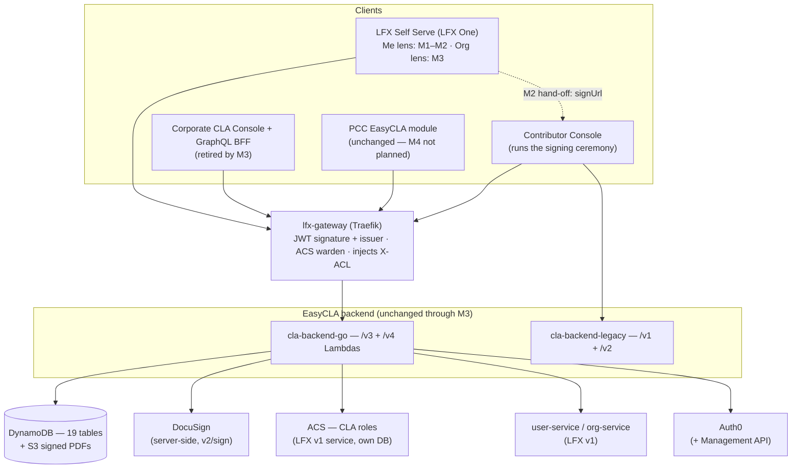

<!-- Copyright The Linux Foundation and each contributor to CommunityBridge.
SPDX-License-Identifier: CC-BY-4.0 -->

# EasyCLA Architecture — LFX Self Serve Migration (M1–M3)

**Scope**: the **target architecture** of the EasyCLA → LFX Self Serve migration through **M3** — cross-component
contracts, authorization, and external dependencies. Not EasyCLA's internal design: for that see
[CLAUDE.md](CLAUDE.md) (layout, build) and [docs/MY_CLAS_API.md](docs/MY_CLAS_API.md) (endpoint reference).

**This is a roll-up.** The reviewed decision record is
[architecture-proposal.md](docs/easycla-ss-migration/architecture-proposal.md) (P1–P10, reviewed 2026-07-20;
P10 approved 2026-07-28) and
[role-mapping-feasibility.md](docs/easycla-ss-migration/role-mapping-feasibility.md) (code-cited authorization
analysis). Where they disagree with this document, **they are the record and this is stale**.

**Milestone status.** "Implemented" means *merged and deployed behind a LaunchDarkly flag*, not serving
production traffic. The program aims to complete M1–M3; **M4 and M5 are not planned** ([below](#not-planned)).

| # | Milestone | Status | Retires |
|---|---|---|---|
| [M1](specs/001-easycla-ss-integration-fable/01-milestone-read-only-me-lens-fable.md) | Read-only "My CLAs" (Me lens) | **Implemented**, behind `my-clas-enabled` | — |
| [M2](specs/001-easycla-ss-integration-fable/02-milestone-sign-cla-fable.md) | Sign-CLA entry + My CLAs actions; hands off to the Contributor Console | **Implemented**, behind `my-clas-m2-enabled` (fail closed) | — |
| [M3](specs/001-easycla-ss-integration-fable/03-milestone-ccla-org-lens-fable.md) | CCLA management (Organization lens) | **In progress** (started 2026-09) | Corporate CLA Console **+ its GraphQL BFF** |

---

## 1. Shape of the system

**Strangler pattern (P1)**: Self Serve becomes a *new client* of the existing EasyCLA APIs. No business logic
is reimplemented in SS, and **enforcement — roles, approval lists, sanctions, PR gating — stays in EasyCLA**
through M1–M3. SS holds no CLA storage and caches no agreement data beyond request scope.

Two facts shape everything else:

- **Two API surfaces are in the blast radius.** `cla-backend-go` serves `/v3` (us-east-1) and `/v4`
  (us-east-2, LFX-Platform-integrated); `cla-backend-legacy` serves `/v1`+`/v2`, which contributor flows still
  call and which **stays until M5** (P7). Even a "UI-only" milestone touches two backends.
- **The Contributor Console stays load-bearing.** M2 shipped as a hand-off *to* the Console, which keeps
  running the signing ceremony; the PR-check remediation link is unchanged. Console and `easycla-landing-page`
  retirement is **deferred to a future product decision**, not attached to any milestone.

---

## 2. Authorization

**Layer 1 — lfx-gateway.** Validates the JWT's **signature and issuer only** (the **audience check is
explicitly disabled**), calls the ACS warden with username/path/method, 403s on denial, and injects a
base64-encoded `X-ACL` plus `X-Username`/`X-Email`.

**Layer 2 — v4 handlers.** As a general rule v4 does **no JWT validation of its own**: `SwaggerAuth`
base64-decodes `X-ACL` into an `authUser`, and handlers match the scope **type + ID** against the request's
project/company SFIDs — the part the gateway cannot do, since ACS only sees the URL. The scope's `Role` field
is never consulted.

Consequences for every client:

- **Authorization keys on the user's identity (LF username)**, not on which Auth0 client or audience minted
  the token — which is why SS needed no gateway, auth, or token-infrastructure change to call v4 (P3).
- **Handlers trust `X-ACL`**, so the gateway is the authorization boundary and v4's invoke permissions are what
  must keep it the only path. **This has not been audited** — the spike scoping those permissions was never
  run. Treat it as a requirement to verify, not an established property.
- **One exception** (P10): the My CLAs handlers re-verify the bearer against Auth0 JWKS in-handler, because an
  `azp` claim is only trustworthy on a signature the handler checked itself
  (`cla-backend-go/auth/trusted_caller.go`). That path is **inactive while its SSM parameter is unset** — the
  current state — so the general rule describes every deployed request today.

### Roles: bridge, don't migrate (P2)

CLA authority is **ACS role+scope tuples** (`cla-manager`, `cla-signatory`, `cla-manager-designee`) held in
ACS, an LFX v1 service with its own database. **No CLA object types exist in the OpenFGA model**, so V2 ReBAC
cannot express CLA authority; modeling it is deferred to M5.

SS therefore **bridges rather than copies**: it gates UI on the user's **self permission check**
(`POST user-service/v1/me/permissions/checks`) — the same ACS decision the gateway enforces, so UI gating and
API enforcement agree by construction — and handles 403s gracefully instead of out-predicting enforcement. SS
builds no permission-string evaluator. The endpoint has no decommission timeline (ARCH-406, 2026-07-31).

Three ACS properties leak into UX and cannot be designed away here: assignment is **asynchronous**, authorize
responses are cached **~30 minutes** (so revocations linger), and grants are **one-company-at-a-time**.
Separately, whether a **staff-admin scope** satisfies a check is **per endpoint, not a blanket rule** —
handlers pass `utils.ALLOW_ADMIN_SCOPE` or `utils.DISALLOW_ADMIN_SCOPE`, and ALLOW dominates (~79 call sites
vs ~10). Approval-list writes disallow it; most CLA writes do not. Clients must not assume it is excluded.

Rejected, for the record: copying CLA into OpenFGA now (non-enforcing, and a third eventually-consistent truth
on an async pipeline), and mapping org-admin to CLA-manager (`b2b_org#writer` has no project dimension).

### Tokens (P3)

SS calls EasyCLA with **user-scoped access tokens, never ID tokens**, via its existing api-gw-audience
refresh-token exchange. No M2M by default. The load-bearing claim is `http://lfx.dev/claims/username`, which
Auth0 stamps **only** on tokens whose audience matches `https://api-gw.(env.)platform.linuxfoundation.org/` —
a token minted for another audience reaches v4 without the username the whole chain keys on.

### Identity resolution for My CLAs

The contributors this serves are frequently **GitHub-only historical signers with no `lf_username`**, so
record-based verification alone wrongly returns empty. Resolution therefore lives **inside EasyCLA**: SS
forwards session-derived identity keys (LF username, verified emails, GitHub IDs/usernames) and EasyCLA
resolves, aggregates, deduplicates, and enforces ownership.

| Caller | Identity keys | Signature ownership |
|---|---|---|
| Untrusted (**SS today**) | every key verified against the caller's LF account via EasyCLA records, platform user-service, and the Auth0 Management API; unverifiable keys returned in `skippedIdentities` | enforced server-side; PDF route returns **404, never 403** |
| Admin / allow-listed `azp` | supplied directly, no per-key verification | enforced against the **supplied** set — such a caller can read another user's signatures and PDFs |

**The trusted-caller path (P10) is deployed but inactive, and cannot simply be switched on**: SS's
`apiGatewayToken` is the same token it hands every logged-in user as `v1Token` via `GET /api/profile/developer`,
so allow-listing its client ID would let any user assert any identity. Activating P10 needs a **distinct
server-only token** first. The `azp` mechanism is sound only while the client is confidential and its tokens
never reach a browser; at M5 it is meant to be dropped in favour of EasyCLA calling the auth-service NATS RPC
directly.

---

## 3. Cross-component contracts

### SS → EasyCLA (`/cla-service/v3|v4` through lfx-gateway)

All integration goes through **one SS server-side `cla` module**, so an M5 re-platform has a single adapter
to rework. The browser never sees raw EasyCLA user IDs.

| Endpoint | Milestone | Contract |
|---|---|---|
| `GET /v4/my-clas` | M1 | identity-parameterized list; aggregation, dedup by `signatureID`, computed validity/status, ownership enforcement |
| `GET /v4/my-clas/{signatureID}/pdf` | M1 | 15-minute presigned S3 URL, **ICLA only**; fetch on click, never on page load |
| `GET /v4/my-clas/identities` | M1 | resolved-identity introspection; not consumed by the shipped UI |
| `GET /v4/my-clas/{signatureID}/cla-managers` | M2 | managers of the CCLA covering an owned ECLA |
| `POST /v4/my-clas/{signatureID}/cla-manager-requests` | M2 | emails an approval/removal/contact request and returns a generated request ID; logs a best-effort audit event, persists **no request record**, and **never** signature state |
| `GET /v4/cla-group/search` | M2 | CLA group / project / linked-org name and repo-URL resolution (in-process cache, ~30 min) |
| `POST /v4/self-serve/prepare-sign` | M2 | verifies identity, creates the EasyCLA user record if missing, writes a one-day `active_signature:{userID}` session record, returns the Console hand-off `signUrl` |
| `POST /v4/self-serve/request-corporate-signature` | M3 | initiates CCLA signing; 400 unless both `authority_acked` and `embargo_acked` are set |

**M3's inventory is not yet complete.** Beyond the endpoint above, the org lens absorbs the Corporate
Console's existing v4 operations (approval-list CRUD, employee acknowledgements, CLA-manager
add/remove/designee, signed-CLA and activity views) plus the v3 org search and CLA metrics its BFF aggregates.
Those stay enumerated in the [M3 brief](specs/001-easycla-ss-integration-fable/03-milestone-ccla-org-lens-fable.md)
until settled.

Field-level detail: [docs/MY_CLAS_API.md](docs/MY_CLAS_API.md). The status a row shows and the actions each
status permits: [docs/MY_CLAS_STATUS_MATRIX.md](docs/MY_CLAS_STATUS_MATRIX.md) — the single source of truth
SS renders against.

### SS → Contributor Console (M2 hand-off)

SS resolves a CLA group, then hands off; the Console's decision screen owns the ICLA-vs-ECLA choice. GitHub
goes through `prepare-sign` (the server verifies the returned `githubId` matches the chosen linked account);
**Gerrit** redirects directly, signing under LF SSO; **GitLab-only CLA groups are blocked by design** — SS
cannot yet verify a GitLab identity. The return URL is host-validated.

### Guardrails that hold through M3

- SS runs **no signing ceremony** and makes **no signing-initiation calls**; `prepare-sign` only prepares the
  hand-off.
- SS makes **no invalidation writes of any kind** (legal decision, 2026-08). Invalidation is a CLA-manager
  action in the Corporate Console (`signature_approved = false`). **Sanctions screening is separate**: it sets
  the company's `is_sanctioned` flag, surfacing as **Revoked**, not Invalidated — the two must never share
  wording.
- **DocuSign never moves** (P4): envelope state, webhooks, and PDF storage stay in `v2/sign`; clients only
  fetch a `sign_url` and redirect. **Email-based CCLA signatory signing is preserved** (P8) — the signatory is
  never forced into SS or LF SSO.
- **Cutover is a config flip** (P5): LaunchDarkly flags for the lenses. Flag rollback is instant, and no
  milestone through M3 writes data a rollback would strand. The SSM PR-check redirect base is a *potential*
  lever, not an exercised one — **M2 deliberately left it unchanged**. **M3 still owes its own rollback plan**:
  retiring the Corporate Console changes routing and entry points (email, designee links) that a lens flag
  does not reverse.

### v1-ID dependency (P9)

v4 payloads still carry LFX **v1** user-service and org-service IDs. user-service deprecation is
anticipated (users collapse to email/username references); org-service has **no announced deprecation** —
the v2 model keeps true B2B orgs. Either way, SS must not
hard-depend on v1 IDs it cannot resolve later: users resolve via the `lfx.lookup_v1_user_sfid.by_username` /
`.by_email` NATS RPCs, orgs via the v1 org service on the api-gw secondary token.

---

## 4. External dependencies

| Dependency | Used for | Contract note |
|---|---|---|
| **lfx-gateway** (Traefik) | routing + layer-1 authorization | EasyCLA is already behind it; nothing to onboard |
| **ACS** (LFX v1) | CLA role+scope truth | async assignment; ~30-min authorize cache; one-company-at-a-time grants |
| **user-service / org-service** (LFX v1) | self permission checks; identity and org resolution | v1 IDs may not remain resolvable — see P9 |
| **Auth0** (+ Management API) | authentication; identity linking; JWKS | the `http://lfx.dev/claims/username` claim is audience-conditional |
| **DocuSign** | e-signature | server-side only, in `v2/sign` |
| **DynamoDB + S3** | 19 tables; signed PDFs | unchanged through M3; PDFs served as presigned URLs |
| **Sanctions Screening Service** | OFAC/embargo screening | sets **Revoked**; system-owned, never set by SS |
| **GitHub** (public org membership) | evaluating whether an ECLA is still covered by an Approved List | a lookup failure makes a row **unevaluable**, not invalid (`EvaluateUserApproval`) |
| **LaunchDarkly** | dark launch | `my-clas-enabled` (M1), `my-clas-m2-enabled` (M2, fail closed) |
| **Salesforce**, via LFX Platform APIs | project/company records | reached through the platform services, not directly |
| **Elasticsearch / Snowflake** | CLA metrics/analytics the Corporate Console's BFF aggregates | **M3 only** — inherited when the BFF is retired; audit usage before porting |
| **Email / notification services** | CLA-manager requests, designee and signatory invitations | **M3 only** for the Console's flows; M2's requests already send mail from v4 |

---

## 5. Known architectural tensions

Recorded because they constrain M3 design, not as a defect list:

- **Two stores of CLA-manager truth.** ACS scopes gate Approved List edits; the DynamoDB signature ACL
  (`CurrentUserInACL`) governs other paths. Written at different times by different code, they can disagree.
- **Enforcement is uneven across v4 write paths**, so SS must mirror v4's actual behavior rather than present a
  uniform permission model over it.
- **UI/enforcement drift is structural.** The ACS cache and async assignment mean a correct UI gate can still
  be followed by a 403. Handle the 403; do not predict it.
- **M3 is not "migrate a console."** It is an Angular 13/NgRx frontend (~161 components) *plus* a GraphQL BFF
  (~648 files, 20+ queries / 8 mutations) aggregating v4 REST, Salesforce, and analytics stores. The BFF's
  logic must be absorbed or replaced, not just its screens.

---

## Not planned

**M4 — EasyCLA administration in the Project lens.** Whether project-level admin moves to SS or stays in PCC
is an open product decision; PCC's EasyCLA module remains the only place project admins configure EasyCLA.
[Design option](specs/001-easycla-ss-integration-fable/04-milestone-project-lens-pcc-fable.md).

**M5 — EasyCLA API as an LFX V2 Kubernetes service** (optionally DynamoDB → Postgres). Where Heimdall,
NATS-native integration, OpenFGA modeling of CLA objects, and retirement of the Lambda/API-GW stack (including
the legacy `/v1`+`/v2` surface) would land. Separately gated.
[Design option](specs/001-easycla-ss-integration-fable/05-milestone-k8s-v2-api-fable.md).

Neither is committed scope and either may never be implemented. Anything above described as "until M5" should
be read as **indefinite**.
