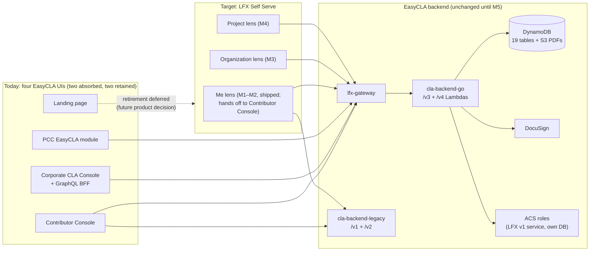

<!-- Copyright The Linux Foundation and each contributor to CommunityBridge.
SPDX-License-Identifier: CC-BY-4.0 -->

# EasyCLA → LFX Self Serve: Architecture Proposal

**Roll-up**: for the current target architecture through M3, see [ARCHITECTURE.md](../../ARCHITECTURE.md); this document is the reviewed decision record behind it and is kept as the audit trail.
**Status**: Reviewed by architecture (Eric Searcy, 2026-07-20) — feedback incorporated below (P2/P3 adjusted, P9 and one risk added). P10 subsequently approved 2026-07-28 and confirmed 2026-07-30 (see P10). **Revised 2026-09-01**: M1 and M2 are implemented (dark-launched); the former M2 (sign ICLA) and M3 (sign ECLA + retire Contributor Console) merged into one implemented M2 that hands off to the Contributor Console, and later milestones renumbered (old M4→M3, M5→M4, M6→M5). Contributor Console and landing-page retirement are no longer scheduled — deferred to a future product decision. The architecture proposals P1–P10 are unchanged apart from the renumbering.
**Owner**: Michal (engineering) | **Date**: 2026-07-20 (P10 updated 2026-07-30)

This document is self-contained for review purposes. Implementation-level specs (milestone scopes, acceptance criteria, M1 plan) live in [specs/001-easycla-ss-integration-fable/](../../specs/001-easycla-ss-integration-fable/spec.md) — linked below only for deep dives.

## 1. What the program is

Migrate EasyCLA user-facing functionality — the Corporate CLA Console (plus its Node/Apollo GraphQL BFF) and the PCC EasyCLA module, with contributor-facing Me-lens surfaces built additively — into **LFX Self Serve** under its Me / Organization / Project lenses. As revised 2026-09-01, the Contributor Console (and the landing page) are **not** retired: the implemented M2 hands contributors off to the Console for the signing ceremony, and retirement is deferred to a future product decision. The backend re-platform (M5: Lambda → Kubernetes V2 service, optional DynamoDB → Postgres) is a **separately gated decision**, not part of this proposal.

Current-state facts the proposal relies on (verified in code; details in the [feasibility memo](role-mapping-feasibility.md)):

- EasyCLA already routes through **lfx-gateway** (`/cla-service/v3|v4` → Lambda). It is behind the platform gateway today; nothing needs onboarding.
- **Two Go API surfaces**: `cla-backend-go` (`/v3`, `/v4`) and `cla-backend-legacy` (`/v1`, `/v2` — contributor flows still call it; the old Python backend is gone).
- **DocuSign integration lives server-side** (`v2/sign`): consoles only fetch a `sign_url` and redirect; webhooks/PDFs/state never touch the UIs.
- **CLA roles** (`cla-manager`, `cla-signatory`, `cla-manager-designee`) are ACS role+scope tuples (ACS is an LFX v1 component with its own database), assigned asynchronously. LFX V2 authorization is OpenFGA relations; **no CLA object types exist in the FGA model**.
- The PR status-check redirect URL is an **SSM parameter per environment** — contributor cutover is a config flip.

## 2. Milestones (context)

*(Renumbered 2026-09-01 — the former M2 and M3 merged into one implemented M2; old M4→M3, M5→M4, M6→M5.)*

| # | Milestone | Status | Retires | Effort |
|---|-----------|--------|---------|--------|
| [M1](../../specs/001-easycla-ss-integration-fable/01-milestone-read-only-me-lens-fable.md) | Read-only "My CLAs" (Me lens) | **Implemented** (dark-launched) | — | S |
| [M2](../../specs/001-easycla-ss-integration-fable/02-milestone-sign-cla-fable.md) | Sign-CLA entry + My CLAs actions in SS, hands off to Contributor Console (ICLA and ECLA via the Console decision screen) | **Implemented** (dark-launched) | — | M |
| [M3](../../specs/001-easycla-ss-integration-fable/03-milestone-ccla-org-lens-fable.md) | CCLA management (Organization lens) | **In progress** (started 2026-09) | Corporate Console + its BFF | XL |
| [M4](../../specs/001-easycla-ss-integration-fable/04-milestone-project-lens-pcc-fable.md) | EasyCLA admin (Project lens) — *decision-gated* | **Not planned** | PCC EasyCLA module | L |
| [M5](../../specs/001-easycla-ss-integration-fable/05-milestone-k8s-v2-api-fable.md) | API → Kubernetes V2 service (± Postgres) — *separately gated* | **Not planned** | Lambda/API GW stack | XL–XXL |

> The program aims to complete **M1–M3**. **M4 and M5 are not planned yet** and may never be implemented.

## 3. Already settled at the leadership review (2026-07-15) — context, not up for review

| # | Decision |
|---|---|
| L1 | **UI-first sequencing approved**: M1–M4 build on the existing EasyCLA APIs; M5 gated separately |
| L2 | Target timeline: **Q3 / early Q4 2026** |
| L3 | **M4 (formerly M5) is decision-gated**: PCC EasyCLA admin moves to SS *or stays in PCC* — open product decision (Kieran/Manish/Heather) |
| L4 | ~~EasyCLA **landing page retired**~~ — **superseded 2026-09-01**: retirement is no longer scheduled. It was part of the old-M3 decommission package, which was dropped when that milestone merged into the implemented M2; the landing page and the Contributor Console both stay, pending a future product decision |
| L5 | LFID account is a prerequisite for signing (already the status quo in the consoles) |
| L6 | Post-signing redirect to the SS profile (collect GitHub linking *after* signing, no friction before) |

## 4. Proposed architecture (for review)

| # | Proposal | Rationale (short) |
|---|---|---|
| P1 | **Strangler pattern: SS is a new client of the existing EasyCLA v4/v3 APIs.** One SS server-side `cla` module; no business logic reimplemented; enforcement (roles, approval lists, sanctions) stays in EasyCLA until M5 | One source of truth; follows the proven crowdfunding integration shape in SS |
| P2 | **Roles: bridge, don't migrate.** No CLA object types in OpenFGA before M5. SS gates UI via the user's **self permission check** (`POST user-service/v1/me/permissions/checks` — the same ACS decision the gateway enforces), handling v4 403s gracefully; the public manager-list endpoint supplies display data and post-assignment pending-state UX. Every write is still enforced by the gateway/ACS + v4 | Self-check guarantees UI gating and API enforcement agree by construction (review guidance); an FGA copy would be non-enforcing, with sync lag on an already-async pipeline; evidence in the [feasibility memo](role-mapping-feasibility.md). Endpoint-deprecation risk closed (Eric, 2026-07-31, ARCH-406): `/v1/me/permissions/checks` has no decommission timeline — it stays for as long as the v1 gateway/ACS exist, so the M3/M4 (~Q4 2026) dependency is safe |
| P3 | **Tokens: user-scoped access tokens (never ID tokens), via SS's existing api-gw-audience refresh-token exchange** — the same access/refresh authentication the me/project lenses use. No M2M by default, no token infrastructure work | The whole v4 chain keys on user identity, not client/audience — verified in code ([feasibility §4](role-mapping-feasibility.md)); one curl spike remains — the api-gw grant + secured-call token path. (The second, the role-less v4 read, was resolved by shipped M1 — see [feasibility §7](role-mapping-feasibility.md).) ID-token usage stays legacy-console-only; interim gateway/ACS/v4 support for both token types is acceptable during cutover. **Caller-identification + trust model for the "My CLAs" by-identity read endpoint: see P10.** |
| P4 | **DocuSign never moves in M2–M3.** As implemented in M2, SS never even reaches the `sign_url` step — it hands off to the Contributor Console, which fetches the `sign_url` from v4 as today. M3's signatory flow fetches a `sign_url` from v4 and redirects, exactly as the consoles do; no DocuSign bridge service | Webhooks, PDF storage, envelope state already live in `v2/sign`; duplicating them adds risk with no user value |
| P5 | **Cutover per milestone is a config flip** (lens feature flags; the SSM redirect base for the PR check remains an unexercised lever — M2 deliberately left it unchanged) — instant flag rollback | Reversibility is a program success criterion |
| P6 | **All three git platforms in scope** — revised: the per-platform sub-milestones fell away with the hand-off model (the Console runs the platform-specific ceremony). As implemented, M2's sign entry covers GitHub and Gerrit; GitLab-only CLA groups are blocked pending a GitLab identity-verification story | The original rationale (prevent Gerrit/GitLab slipping and blocking console retirement) is moot while Console retirement is deferred |
| P7 | **The legacy `/v1`/`/v2` Go surface stays until M5**, covered by parity/contract tests — contributor flows still call it | Second API codebase inside the blast radius even for "UI-only" milestones; absorbed/retired at M5 |
| P8 | **Email-based CCLA signatory signing is preserved** — the signatory signs via an emailed DocuSign link, never forced into SS/LF SSO | Documented product behavior; a distinct UX path that must survive M3 |
| P9 | **Audit v4 API payloads for v1 user-service/org-service IDs and plan the mapping lookups** (API shapes unchanged this phase). Users: resolve via the `lfx.lookup_v1_user_sfid.by_username` / `.by_email` NATS RPCs (lfx-v1-sync-helper); orgs: v1 org service via the api-gw secondary token | user-service deprecation is anticipated in the LFX v2 transition (users collapse to email/username references); org-service has **no announced deprecation** — the v2 model keeps true B2B orgs. Either way, SS UI must not hard-depend on v1 IDs it cannot resolve later |
| P10 | **"My CLAs" identity read: EasyCLA trusts an SS-supplied identity list rather than re-verifying per request.** SS builds the list server-side via the auth service `lfx.auth-service.user_identity.list` NATS RPC (session user's own token; never client params, never SS→Auth0-Management directly), and EasyCLA confirms the caller is SS via an **`azp` allow-list of SS confidential-client IDs**, checked in the v4 handler, with **in-handler JWKS re-verification** and **deny on missing/unparseable bearer**; the endpoint stays strictly read-only. **Transitional (revisit at M5):** once EasyCLA is on the K8s cluster it should call the auth-service RPC itself over NATS and drop both the trusted payload and the `azp` mechanism | Reviewed & approved by architecture (Eric Searcy, 2026-07-28). It's "SS-queried Auth0 vs. EasyCLA-queried Auth0" — same data, same source — so trusting SS's list is the same data with less machinery (EasyCLA has no NATS transit pre-M5 — confirmed by Eric 2026-07-30: it's a request/reply inbox subject, so EasyCLA would have to be a cluster consumer for the reply, over a cross-region us-east-1 ↔ us-west-2 WAN link; a federated NATS super-cluster is overkill — and it would otherwise need a tenant-wide `read:users` M2M client on a hot path). `azp` allow-listing is sound **only** because SS is a confidential backend client whose tokens never reach a browser; if that client ID were reused by a public/SPA client the boundary silently collapses. Verifying the current EasyCLA-record check (P-note): historical GitHub-only signers have no `lf_username`, so record-based verification wrongly returns empty — the Auth0-sourced list fixes this. Decision: linuxfoundation/lfx-self-serve#1216; follow-ups linuxfoundation/lfx-self-serve#1224 (EasyCLA) / linuxfoundation/lfx-self-serve#1225 (SS). **Implementation prerequisite (found 2026-07-31, verified empirically in dev):** the auth service today verifies JWTs against the Auth0 Management API audience only and reuses the caller's JWT as the bearer for its own Auth0 Management API lookups — so it rejects SS session tokens (`invalid audience`; they carry the LFX v2 API audience, as do impersonation tokens). A small `lfx-v2-auth-service` change must land first: accept the LFX v2 API audience as valid for verification, and for such tokens use the verified `sub` with the service's own M2M credentials on read lookups (write subjects unchanged). Which SS token is passed (session access token vs. the P3 api-gw-audience token) was pending Eric's confirmation on linuxfoundation/lfx-self-serve#1216. **Implementation status (2026-09-01): the EasyCLA side is deployed, but the trusted path is *not* activated for SS.** The `azp` allow-list mechanism is in the v4 handlers (trusted client IDs from the SSM parameter `cla-ss-trusted-client-ids-{stage}`) with in-handler JWKS re-verification as specified, and it is **disabled while that parameter is unset** — which is the current state. It cannot simply be switched on for the token SS sends today: `fetchMyClas` uses `gatewayFetch`'s default `req.apiGatewayToken`, and SS hands that same token to every logged-in user as `v1Token` via `GET /api/profile/developer`. Allow-listing its client ID would let any user assert any identity — the exact failure the verifier warns about in `cla-backend-go/auth/trusted_caller.go`. Activating P10 therefore requires SS to call this endpoint with a distinct server-only token first. Until then SS runs on the **untrusted** path, per-identity verification and all, which is what its code documents (`skippedIdentities` telemetry). In addition, EasyCLA's ownership check grew a third verification source: alongside the caller's own EasyCLA records and platform user-service identities, it can verify identity keys against the **Auth0 Management API from the EasyCLA side** (linuxfoundation/easycla#5172), reporting unverifiable keys in `skippedIdentities`. Full behavior in [docs/MY_CLAS_API.md](../MY_CLAS_API.md) |

## 5. Top risks

| Risk | Mitigation |
|------|-----------|
| Identity mapping gaps (LF account ↔ EasyCLA records, esp. pre-LF-login history) | M1 ships mapping + unmatched-user telemetry before any signing moves |
| `azp`-allow-list trust boundary (P10) silently collapses if SS's confidential-client ID is ever reused by a public/SPA client, or its tokens become browser-visible | Code comment stating the assumption at the check; removed at M5 when EasyCLA calls the auth-service RPC directly (P10); read-only endpoint bounds worst case to CLA-match read-disclosure |
| ACS role assignment is async, and warden responses are cached ~30 min (revocations linger too) | Server-side retries in SS; honest pending states; no synchronous-UX promises |
| M3 scope illusion: "migrate a console" hides a ~648-file GraphQL BFF | Sized XL; inventory-driven parity checklist is the contract with PM |
| Dual-console feature drift during migration | Freeze console feature work per area once its SS milestone starts |
| M5 rework of M3–M4 adapters | All SS↔EasyCLA integration behind one server module |
| CLA permissions are **invisible to the automatic docs generation** built on the OpenFGA + v2 Swagger sources of truth (raised at architecture review) | Document role-bridge behavior manually (M3 exit criterion); resolved when CLA enters OpenFGA at M5 |
