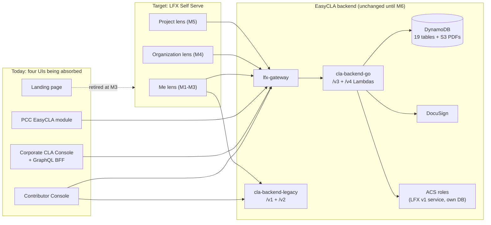

<!-- Copyright The Linux Foundation and each contributor to CommunityBridge.
SPDX-License-Identifier: CC-BY-4.0 -->

# EasyCLA → LFX Self Serve: Architecture Proposal

**Status**: Reviewed by architecture (Eric Searcy, 2026-07-20) — feedback incorporated below (P2/P3 adjusted, P9 and one risk added)
**Owner**: Michal (engineering) | **Date**: 2026-07-20

This document is self-contained for review purposes. Implementation-level specs (milestone scopes, acceptance criteria, M1 plan) live in [specs/001-easycla-ss-integration-fable/](../../specs/001-easycla-ss-integration-fable/spec.md) — linked below only for deep dives.

## 1. What the program is

Migrate all EasyCLA user-facing functionality — Contributor Console, Corporate CLA Console (plus its Node/Apollo GraphQL BFF), the PCC EasyCLA module, and the landing page — into **LFX Self Serve** under its Me / Organization / Project lenses. The backend re-platform (M6: Lambda → Kubernetes V2 service, optional DynamoDB → Postgres) is a **separately gated decision**, not part of this proposal.

Current-state facts the proposal relies on (verified in code; details in the [feasibility memo](role-mapping-feasibility.md)):

- EasyCLA already routes through **lfx-gateway** (`/cla-service/v3|v4` → Lambda). It is behind the platform gateway today; nothing needs onboarding.
- **Two Go API surfaces**: `cla-backend-go` (`/v3`, `/v4`) and `cla-backend-legacy` (`/v1`, `/v2` — contributor flows still call it; the old Python backend is gone).
- **DocuSign integration lives server-side** (`v2/sign`): consoles only fetch a `sign_url` and redirect; webhooks/PDFs/state never touch the UIs.
- **CLA roles** (`cla-manager`, `cla-signatory`, `cla-manager-designee`) are ACS role+scope tuples (ACS is an LFX v1 component with its own database), assigned asynchronously. LFX V2 authorization is OpenFGA relations; **no CLA object types exist in the FGA model**.
- The PR status-check redirect URL is an **SSM parameter per environment** — contributor cutover is a config flip.

## 2. Milestones (context)

| # | Milestone | Retires | Effort |
|---|-----------|---------|--------|
| [M1](../../specs/001-easycla-ss-integration-fable/01-milestone-read-only-me-lens-fable.md) | Read-only "My CLAs" (Me lens) | — | S |
| [M2](../../specs/001-easycla-ss-integration-fable/02-milestone-sign-icla-fable.md) | Sign ICLA in SS (a: GitHub, b: GitLab, c: Gerrit) | — | M |
| [M3](../../specs/001-easycla-ss-integration-fable/03-milestone-sign-ecla-fable.md) | Sign ECLA in SS (a–c per platform) | Contributor Console + landing page | L |
| [M4](../../specs/001-easycla-ss-integration-fable/04-milestone-ccla-org-lens-fable.md) | CCLA management (Organization lens) | Corporate Console + its BFF | XL |
| [M5](../../specs/001-easycla-ss-integration-fable/05-milestone-project-lens-pcc-fable.md) | EasyCLA admin (Project lens) — *decision-gated* | PCC EasyCLA module | L |
| [M6](../../specs/001-easycla-ss-integration-fable/06-milestone-k8s-v2-api-fable.md) | API → Kubernetes V2 service (± Postgres) — *separately gated* | Lambda/API GW stack | XL–XXL |

## 3. Already settled at the leadership review (2026-07-15) — context, not up for review

| # | Decision |
|---|---|
| L1 | **UI-first sequencing approved**: M1–M5 build on the existing EasyCLA APIs; M6 gated separately |
| L2 | Target timeline: **Q3 / early Q4 2026** |
| L3 | **M5 is decision-gated**: PCC EasyCLA admin moves to SS *or stays in PCC* — open product decision (Kieran/Manish/Heather) |
| L4 | EasyCLA **landing page retired** (added to the M3 decommission package) |
| L5 | LFID account is a prerequisite for signing (already the status quo in the consoles) |
| L6 | Post-signing redirect to the SS profile (collect GitHub linking *after* signing, no friction before) |

## 4. Proposed architecture (for review)

| # | Proposal | Rationale (short) |
|---|---|---|
| P1 | **Strangler pattern: SS is a new client of the existing EasyCLA v4/v3 APIs.** One SS server-side `cla` module; no business logic reimplemented; enforcement (roles, approval lists, sanctions) stays in EasyCLA until M6 | One source of truth; follows the proven crowdfunding integration shape in SS |
| P2 | **Roles: bridge, don't migrate.** No CLA object types in OpenFGA before M6. SS gates UI via the user's **self permission check** (`POST user-service/v1/me/permissions/checks` — the same ACS decision the gateway enforces), handling v4 403s gracefully; the public manager-list endpoint supplies display data and post-assignment pending-state UX. Every write is still enforced by the gateway/ACS + v4 | Self-check guarantees UI gating and API enforcement agree by construction (review guidance); an FGA copy would be non-enforcing, with sync lag on an already-async pipeline; evidence in the [feasibility memo](role-mapping-feasibility.md) |
| P3 | **Tokens: user-scoped access tokens (never ID tokens), via SS's existing api-gw-audience refresh-token exchange** — the same access/refresh authentication the me/project lenses use. No M2M by default, no token infrastructure work | The whole v4 chain keys on user identity, not client/audience — verified in code ([feasibility §4](role-mapping-feasibility.md)); two curl spikes remain. ID-token usage stays legacy-console-only; interim gateway/ACS/v4 support for both token types is acceptable during cutover |
| P4 | **DocuSign never moves in M2–M4.** SS fetches a `sign_url` from v4 and redirects, exactly as the consoles do today; no DocuSign bridge service | Webhooks, PDF storage, envelope state already live in `v2/sign`; duplicating them adds risk with no user value |
| P5 | **Cutover per milestone is a config flip** (SSM redirect base for the PR check; lens feature flags for org/project) — instant rollback | Reversibility is a program success criterion |
| P6 | **All three git platforms in scope** via per-platform sub-milestones, each with its own cutover switch and parity checklist | Prevents Gerrit/GitLab slipping and blocking console retirement late |
| P7 | **The legacy `/v1`/`/v2` Go surface stays until M6**, covered by parity/contract tests — contributor flows still call it | Second API codebase inside the blast radius even for "UI-only" milestones; absorbed/retired at M6 |
| P8 | **Email-based CCLA signatory signing is preserved** — the signatory signs via an emailed DocuSign link, never forced into SS/LF SSO | Documented product behavior; a distinct UX path that must survive M4 |
| P9 | **Audit v4 API payloads for v1 user-service/org-service IDs and plan the mapping lookups** (API shapes unchanged this phase). Users: resolve via the `lfx.lookup_v1_user_sfid.by_username` / `.by_email` NATS RPCs (lfx-v1-sync-helper); orgs: v1 org service via the api-gw secondary token | user-service and org-service are being deprecated in the LFX v2 transition (users collapse to email/username references; orgs to name/domain except true B2B orgs). SS UI must not hard-depend on v1 IDs it cannot resolve later |

## 5. Top risks

| Risk | Mitigation |
|------|-----------|
| Identity mapping gaps (LF account ↔ EasyCLA records, esp. pre-LF-login history) | M1 ships mapping + unmatched-user telemetry before any signing moves |
| ACS role assignment is async, and warden responses are cached ~30 min (revocations linger too) | Server-side retries in SS; honest pending states; no synchronous-UX promises |
| M4 scope illusion: "migrate a console" hides a ~648-file GraphQL BFF | Sized XL; inventory-driven parity checklist is the contract with PM |
| Dual-console feature drift during migration | Freeze console feature work per area once its SS milestone starts |
| M6 rework of M3–M5 adapters | All SS↔EasyCLA integration behind one server module |
| CLA permissions are **invisible to the automatic docs generation** built on the OpenFGA + v2 Swagger sources of truth (raised at architecture review) | Document role-bridge behavior manually (M4 exit criterion); resolved when CLA enters OpenFGA at M6 |
