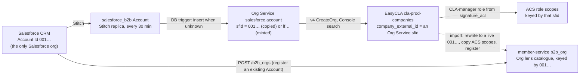
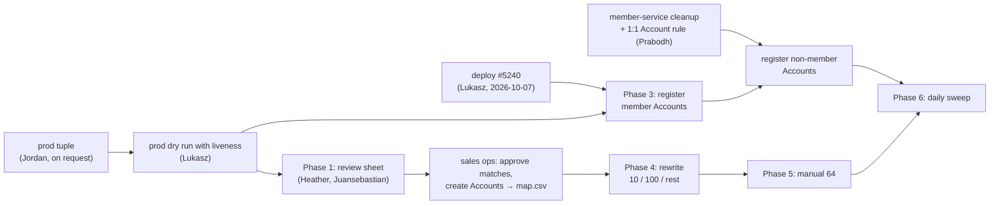
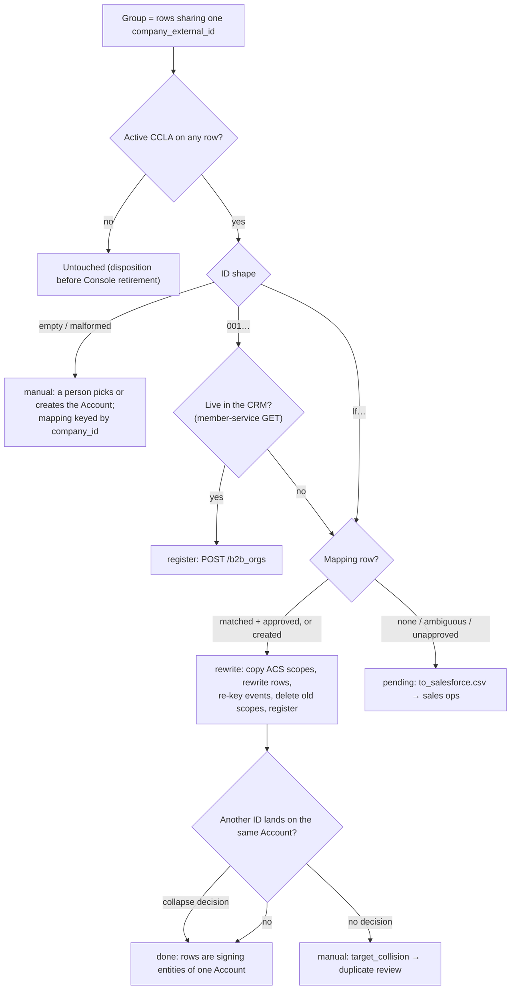

<!-- Copyright The Linux Foundation and each contributor to CommunityBridge.
SPDX-License-Identifier: CC-BY-4.0 -->

# M3: getting EasyCLA companies into Salesforce

**Status**: draft 2026-10-05 · **Owner**: Michal (engineering)
**Tickets**: [lfx-self-serve#2750](https://github.com/linuxfoundation/lfx-self-serve/issues/2750) (story) · [#2749](https://github.com/linuxfoundation/lfx-self-serve/issues/2749) (cleanup) · [#2751](https://github.com/linuxfoundation/lfx-self-serve/issues/2751) (orgs created without signing intent) · [#2054](https://github.com/linuxfoundation/lfx-self-serve/issues/2054) (unreachable companies) · [#3085](https://github.com/linuxfoundation/lfx-self-serve/issues/3085) (duplicate review) · [#2056](https://github.com/linuxfoundation/lfx-self-serve/issues/2056) (duplicate companies; post-import merges) · epic [#1968](https://github.com/linuxfoundation/lfx-self-serve/issues/1968)
**Related**: [m3-org-visibility.md](https://github.com/linuxfoundation/easycla/pull/5210) (earlier analysis, superseded here for the import) · Eric's [Consolidate-B2B-Backend proposal](https://github.com/linuxfoundation/lfx-architecture-scratch/tree/main/2026-09-Consolidate-B2B-Backend) · sales-ops thread [lfx-self-serve-ops#16](https://github.com/linuxfoundation/lfx-self-serve-ops/issues/16) · tool runbook [`cmd/org_import/README.md`](https://github.com/linuxfoundation/easycla/blob/dev/cla-backend-go/cmd/org_import/README.md) · manual cleanup runbook [`m3-org-cleanup.md`](https://github.com/linuxfoundation/easycla/blob/dev/docs/easycla-ss-migration/m3-org-cleanup.md)

This file is the single place for the plan and its decisions. Tickets carry pointers only. Append to the decision log (§7); do not rewrite history.

## 0. Summary

- **Goal**: every EasyCLA company with an active CCLA points at a live Salesforce Account (`001…`) and is registered in member-service, so it appears in the Self Serve Organization lens. Internal `company_id`s never change; the import deletes or merges no EasyCLA row.
- **Tool**: Lukasz's `org-import` ([linuxfoundation/easycla#5227](https://github.com/linuxfoundation/easycla/pull/5227) and [#5239](https://github.com/linuxfoundation/easycla/pull/5239), on dev; prod with the release PR [#5240](https://github.com/linuxfoundation/easycla/pull/5240)). Three routes per company group: `register` (ID already live), `rewrite` (dead `001…` or `lf…` → new ID from a reviewed mapping), `manual`.
- **Order** (§3): prod audit and review pack → dev pilot → prod `register` (member Accounts first) → prod `rewrite` tranches 10 / 100 / rest → manual set → daily sweep. Duplicate companies collapse onto one Account inside the rewrite tranches, after a human decision; row merges stay post-import.
- **Humans decide** (§3.8): every domain match, every collapse/distinct, every manual row, every new Account, and the disposition of companies without an active CCLA. The tool decides nothing about identity; it executes approved inputs. AI may propose candidates in the review sheet, labelled as proposals.
- **Blocked today**: the prod tuple for the tool (Prabodh cleared it 2026-10-06; writing it needs prod cluster access, request to Jordan Evans); the member-service qualifying rule for non-member Accounts (§6 item 5, gates non-member registration in prod); prod deploy ([#5240](https://github.com/linuxfoundation/easycla/pull/5240), planned 2026-10-07); the Phase 1 review sheet; sales-ops time for the mapping.
- **Not in M3**: switching v4 org creation to Salesforce (Eric's Option A, post-M3); row merges (#2056); deleting the ~1.4k companies without an active CCLA.

## 1. One Salesforce org, and where the IDs come from

What earlier notes called the "old platform org" is the **Organization Service's Postgres table**, not a second Salesforce.

| Store | What it is | Key | Written by |
| --- | --- | --- | --- |
| Salesforce (the CRM, "B2B") | The only Salesforce org | `001…` Id, assigned by Salesforce | Sales ops, Apex `JoinNowForm` |
| `salesforce_b2b."Account"` (platform Postgres) | Replica of the CRM, Stitch sync every 30 min | `Id` | Stitch |
| `salesforce.account` (platform Postgres, the **Org Service** table) | Heroku Connect copy of Salesforce until mid-June 2023 (Salesforce writes removed from the code 2023-04-04, first `lf…` org 2023-06-18); since then written by the Org Service only | `sfid`: `001…` copied from the CRM, or `lf…` generated by the Org Service | Org Service (`lf…`), a DB trigger (`001…`) |
| EasyCLA `cla-prod-companies` | CCLA company | `company_id`; `company_external_id` holds an Org Service `sfid` | EasyCLA v3/v4 |
| member-service `b2b_org` | The Organization lens catalogue | the `001…` Id | member-service (`POST /b2b_orgs`, backfill) |

Evidence:

- Org Service stopped writing Salesforce on 2023-04-04 (in prod by mid-June 2023, see §1.1) and mints its own IDs: [`organization/repository.go`](https://github.com/linuxfoundation/organization-service/blob/main/organization/repository.go) (`CreateOrganization`: "we are not using the SFDC integration to create or update account records", `platformSFID := common.GenerateID()`). `lf…` IDs come from [`lfx-kit/common/id.go`](https://github.com/linuxfoundation/lfx-kit/blob/main/common/id.go).
- The CRM → Org Service copy is a Postgres trigger, `salesforce.function_create_update_b2c_account` ([2023-08-10](https://github.com/linuxfoundation/lfx-core-platform-database-migrations/blob/main/db/migrations/20230810205345_salesforce-account-trigger-create.sql), [2023-09-05](https://github.com/linuxfoundation/lfx-core-platform-database-migrations/blob/main/db/migrations/20230905220112_account_b2b_procedure_updates.sql)). On insert or update of a replica row it looks for `salesforce.account WHERE sfid = new."Id"` only; no match → inserts a row with `sfid = new."Id"` and `sfid_b2b = new."Id"`. Live in prod (Eric, TECHNICAL.md §7.3, 2026-09-15).
- The domain-based linker `update_account_sfid_b2b_value()` is not scheduled, so `lf…` rows never get `sfid_b2b` (Eric, TECHNICAL.md §1).

What follows:

1. `sfid_b2b == sfid` for every CRM account because the trigger copies the Id. Latency CRM → Org Service ≈ 0–40 min (Stitch interval + trigger).
2. **Importing into Salesforce while keeping an existing ID is impossible.** Salesforce assigns Ids; nothing in LFX ever pushed one in (confirmed again with David, standup 2026-10-01). "Path A" in #2750 is dropped.
3. **Every company we create or match an account for gets a new `company_external_id`.** Only companies whose ID already resolves to a live CRM account stay untouched.
4. Creating an Account for a rewritten company adds a second Org Service row for the same organization: the trigger inserts the new `001…` and the old `lf…` or dead `001…` row stays (the domain linker is not scheduled, nothing deletes it). About 1,290 such pairs after the import, next to the 962 dead `001…` rows the Org Service already serves today. EasyCLA and the Corporate Console follow `company_external_id`, so the rewritten company itself is unaffected. The exposures are the two lookups that search the Org Service by name: the Corporate Console's create-company lookup (`GET /v4/company/lookup`) and the Contributor Console's company search (`GET /v3/organization/search`). Both can return the old row, listed without a CCLA; a user who picks it creates a second EasyCLA company with a dead ID (starting a CCLA creates the EasyCLA row from the Org Service record; until #5240 reaches prod, so does any company-by-external-ID read), and a contributor's CLA-manager request then reaches nobody. That company then shows up as a new group for the monthly batch (§3 Phase 6) and lands on the same Account with a `collapse` decision. Accepted for the parallel window, checked on samples in Phase 4; deleting or renaming orphan rows in the retiring Org Service is not planned. Fallback if ghosts appear: EasyCLA hides the IDs recorded in `previous_company_external_id` from these lookups and redirects the auto-create to the new company.

### 1.1 How we got here (checked against the prod Snowflake mirrors, 2026-10-02)

| When | What happened | Evidence |
| --- | --- | --- |
| 2008 → today | One Salesforce org, continuous: live CRM Accounts carry creation dates from 2008 on, about 1,000–2,400 per year | `FIVETRAN_INGEST.SALESFORCE.ACCOUNT`, `CREATED_DATE` by year |
| until mid-2023 | The Org Service table was a Heroku Connect copy of Salesforce (`salesforce.account`, `sfid`, `heroku_connect_id__c`), and the Org Service created organizations **in Salesforce** through its API user "Platform Service". Those Accounts got real `001…` Ids, which is why the Org Service and Salesforce share Ids | 18,539 of the 18,540 live CRM Accounts exist in the Org Service table under the same Id, 18,453 with the same creation timestamp |
| 2020 → 2023-06 | About 58,000 company Accounts created in Salesforce in that window (33k by "Platform Service", 22k by two bulk loads, the rest by sales users) are not in the CRM today: 11k from 2020, 12k from 2021, 22k from 2022, 7k from Jan–Jun 2023. They survive only as Org Service rows, last synced 2023-06-16. They are company accounts, not person accounts (57,871 of 57,887) | Org Service `001…` rows absent from the CRM, by `CREATEDDATE`, `CREATEDBYID`, `SYSTEMMODSTAMP` |
| 2023-04 → 2023-09 | The Org Service dropped its Salesforce integration (code 2023-04-04/07, first `lf…` org 2023-06-18). The Stitch replica `salesforce_b2b` and the `sfid_b2b` column arrived in April 2023 ("we assign the existing B2C account ID to the B2B account ID"), the CRM → Org Service trigger in Aug/Sep 2023. "B2B" is the name that replica got; it is the same Salesforce | migrations [2023-04-07](https://github.com/linuxfoundation/lfx-core-platform-database-migrations/blob/main/db/migrations/20230407205238_account-add-salesforce-id-column.sql), [2023-05-09](https://github.com/linuxfoundation/lfx-core-platform-database-migrations/blob/main/db/migrations/20230509184859_b2b-account-table-docs.sql), 2023-08-10, 2023-09-05; organization-service [#727](https://github.com/linuxfoundation/organization-service/pull/727) |
| 2026-06 | Direct Fivetran connector to the CRM (`FIVETRAN_INGEST.SALESFORCE`); the Stitch mirror in Snowflake is stale since 2026-06-24 | TECHNICAL.md §2 |

Two things this rules out. The CRM was **not** created recently by copying a subset of Org Service organizations: its Ids and creation dates go back to 2008, and nothing in LFX can write an Id into Salesforce. And the dead `001…` IDs in EasyCLA are **not** recoverable from the CRM: of EasyCLA's 3,014 distinct `001…` IDs, 1,639 are absent from the CRM mirror outright, none sit in the recycle bin and none carry a `MasterRecordId` (the whole mirror has 12 deleted Accounts and 6 with `MasterRecordId`). They were removed from Salesforce after June 2023 in a way the mirrors cannot see: sales ops removed them as non-B2B in the 2023 CRM project, and they cannot be reinstated (§6 item 10).

## 2. Populations (prod Snowflake mirrors, 2026-09-18/19; details in #2749)

| Active-CCLA companies | Count | Route |
| --- | ---: | --- |
| `001…` resolving to a live CRM account | 995 | Register in member-service only (§5 step 1) |
| `001…` in the Org Service, gone from the CRM | 962 | Domain-match a live account (374) else create; rewrite |
| `lf…` | 331 | Domain-match (57) else create (271); 3 without website → manual; rewrite |
| Resolves nowhere | 18 | Manual |
| No usable `company_external_id` (empty or malformed; 2026-09-29) | 43 | Manual: no Org Service row, so no website. 5 have an exact CRM name match; 28 have no ECLA. Listed in [#2054](https://github.com/linuxfoundation/lfx-self-serve/issues/2054) |

The tool's prod audit (Lukasz, 2026-10-01, live DynamoDB) gives the same picture with a small drift: 1,958 `001…` companies (1,954 distinct IDs) against 1,975 in the table, 332 `lf…` against 331, 43 manual, 1,390 without an active CCLA; the mirror is from 2026-09-18 and CCLAs are signed and invalidated in between. The 2026-10-06 dry run counts 2,339 eligible groups: 1,963 `001…`, 333 `lf…`, 43 manual. The audit, not this table, sizes the tranches.

Ingest predicate: **active CCLA** (`ccla` signature, `signature_reference_type = 'company'`, signed and approved) on any row of the `company_external_id` group, evaluated at run time; an eligible group is rewritten whole. ID shape decides the route, not eligibility. Companies without an active CCLA stay in EasyCLA untouched; their disposition before Console retirement is an exit criterion of #2750. Growth: ~16 new CCLA companies per month.

The excluded set is large because EasyCLA minted rows without signing intent: 1,380 of 3,689 prod companies (37%) have no active CCLA and 1,237 have no CCLA record at all (#2749, 2026-09-18). Most of those came from read paths — company search with signing entities, `GET /company/external/{sfid}`, the v4 lookups by SFID — that persisted a row for every organization a user merely looked at (#2751). The pure-read fix is on dev with #5227; prod gets it with #5240 (§3, Phase 0). Until then prod keeps growing that set.

### 2.1 What happens to each company

| Population (prod) | Count | Tool route | Who decides what | Phase (§3) |
| --- | ---: | --- | --- | --- |
| Active CCLA, `001…` live in the CRM | 995 | `register` | nobody per company (the Account exists); humans verify each tranche | 3 |
| Active CCLA, dead `001…`, website domain matches one live Account | 374 | `rewrite` | a human approves each match | 4 |
| Active CCLA, dead `001…`, no match | 588 | `rewrite` | sales ops create the Account from a reviewed list | 4 |
| Active CCLA, `lf…`, domain match | 57 | `rewrite` | a human approves each match | 4 |
| Active CCLA, `lf…`, no match | 271 | `rewrite` | sales ops create the Account | 4 |
| Same organization under several IDs (~30 groups, 78 rows; #3085) | — | `rewrite` with a `collapse` decision | a named reviewer marks each group `collapse` or `distinct` | 4 |
| Active CCLA, unresolvable: dead everywhere (18 `001…` + 3 `lf…`), empty or malformed ID (43); counts drift a little between mirror and live audit | 64 | `manual` → mapping keyed by `company_id`, or leave | a human per row | 5 |
| No active CCLA (incl. the rows created by reads) | ~1,400 | untouched | product: disposition before Console retirement | 7 |
| New CCLA companies after the import | ~16 / month | sweep `register`; new `lf…` groups → monthly rewrite batch | as above | 6 |

## 3. Plan

Replaces the step list of 2026-09-24 (tickets citing "§3 step N" mean that list: step 1 → Phase 5, step 2 → Phase 1, step 5 → Phases 0 and 3, step 7 → Phase 6). Status as of 2026-10-06.

Prod order of operations, who waits for whom:

### Phase 0 — prerequisites (in progress)

| Item | Owner | Status |
| --- | --- | --- |
| Tool merged and deployed to dev; pure-read company endpoints (#2751) verified on dev | Lukasz | done (`d0601e9`, 2026-09-30) |
| Dev access: Auth0 grant ([auth0-terraform#395](https://github.com/linuxfoundation/auth0-terraform/pull/395)), `team:global_org_admin` tuple, member-service Salesforce password | Michal / platform | done 2026-09-30 |
| Tool follow-up: report a GET 403 as `unregistered`, not `error`, and let the register POST decide (its 404 already routes the group to rewrite); the 15- and 18-character forms of one ID count as one Account. Blocked the dead-`001…` rewrite tranches: a dead ID has no tuples, so its GET answers 403 (§5) | Lukasz | done ([linuxfoundation/easycla#5239](https://github.com/linuxfoundation/easycla/pull/5239), merged 2026-10-06); when every Account answers 403 the tool stops classifying (all-403 guard) instead of guessing, which is what the 2026-10-06 prod dry run shows until the tuple exists |
| Tool follow-ups from the prod dry-run: merge overlapping duplicate groups; extend the shared-domain list (github.com, en.wikipedia.org, buymeacoffee.com, nonameaccount.com, localhost.localhost); match on the registrable domain; a suggested existing Account per row from the CRM through member-service; ACS roles per old ID | Lukasz | done (#5239, 2026-10-06): `audit.csv` gains `suggested_account` (up to three Accounts from member-service search by domain and name) and `acs_roles` (`role=count`); Org Service domains stay unused, EasyCLA only reads them for sanctions screening and never fills them |
| member-service: remove the shared Account qualifying rule (`accountsSOQLWhere`, "has a Membership asset") so `b2b_orgs` tracks every Salesforce Account 1:1 — backfill, CDC consumer and child lookups share it ([Ahmed, #2750, 2026-09-30](https://github.com/linuxfoundation/lfx-self-serve/issues/2750); Eric, 2026-10-05). Dev check: register a non-member Account, edit one field in Salesforce, confirm its `b2b_org` document survives | member-service team (Prabodh) | direction confirmed 2026-10-05; [assessment](https://docs.google.com/document/d/16Tdm0aThHnHmiN_6k8yEcQj5FXbpxYmTdyvDG1jbS7k/edit) 2026-10-05: one-file change plus a switch, about 10,300 more Accounts, excludes sanctions-screening, project and personal Accounts, follow-ups on family access, LFX One slug ties and a gradual rollout; no date; gates non-member registration in prod |
| Prod: SSM `cla-member-service-base-url-prod`, `cla-member-service-auth0-audience-prod`, `cla-org-import-report-emails-prod`; prod tuple `user:<cla-auth0-platform-client-id-prod>@clients member team:global_org_admin`; prod deploy through the release PR [#5240](https://github.com/linuxfoundation/easycla/pull/5240) (dev → main) | Michal / Prabodh / Lukasz | SSM done 2026-10-01 ([lfx-easycla-terraform#68](https://github.com/linuxfoundation/lfx-easycla-terraform/pull/68)); tuple: Prabodh agreed 2026-10-06 to write it now (OpenFGA port-forward, as in dev); that needs prod cluster access, so the request goes to Jordan Evans in #lfx-architecture, who wrote `team:crowdfunding_approvers` the same way; deploy: #5240 open, dev E2E 2026-10-07, then merge and deploy |
| Sales ops: agree the CSV hand-off (§4) and, separately, the Apex endpoint for the ongoing path | Michal / Mindy / Midhun | hand-off to agree; Apex not on the M3 critical path |

### Phase 1 — prod audit and review pack (now, read-only)

1. `STAGE=prod bin/org-import audit --no-aws-log --no-email` from a laptop: `audit.csv`, `unresolvable.csv`, `possible_duplicates.csv` (runbook §3.1). No member-service needed. **Done 2026-10-01** (Lukasz, [Slack](https://linuxfoundation.slack.com/archives/C0A8624SKV5/p1790851747101979)): counts match §2. Liveness did not run (no prod tuple), so every `001…` is `crm_unverified` until Phase 0 closes. Duplicates: 112 groups → 103 clusters; 20 clusters (46 CCLA companies) need a human merge/distinct decision, the other 83 hold at most one CCLA company. Unresolvable: 42 without ID, 18 dead in both, 1 malformed. `to_salesforce.csv`: the 332 `lf…` rows, no suggested Account yet; the dead `001…` join after liveness. **Re-run 2026-10-06** with #5239 ([Slack](https://linuxfoundation.slack.com/archives/C0BGU6YQC2F/p1791286894816259)), no writes: 3,735 company rows audited; dry run `eligible=2339`: 333 pending rewrite, 43 manual, 1,963 `001…` groups held by the all-403 guard until the prod tuple exists; `audit.csv` now carries `suggested_account` and `acs_roles`; reports emailed (`audit.csv`, `unresolvable.csv`, `possible_duplicates.csv`, `run.log`). This is the review material for item 3.
2. Domains and candidate matches, automated (read-only). In the tool since #5239: website → registrable domain, shared-domain list, member-service search by domain and name → `suggested_account`. Not in the tool, and only if the review leaves too many rows unmatched (Lukasz takes the CCLA domain approval lists next): for every dead `001…`, `lf…` and empty-ID group add the domains EasyCLA already holds: the CCLA's email-domain approval list (`domain_whitelist` on the signature), the CLA managers' emails (`signature_acl` → users), and the signatory email and company website in the CCLA signing form (the DocuSign XML/HTML kept with most CCLA signatures in the Snowflake signature raw/ingest table), shared domains excluded. The dead `001…` IDs cannot be mapped from data: the CRM mirror has no trace of them (not in the recycle bin, no `MasterRecordId`, §1.1), so the only exact mapping would be a sales-ops export from before the 2023 clean-up (§6 item 10); until then they follow the domain route. Join everything to live CRM Accounts by `Website` domain → proposed `matched` candidates (in the tool, which reads DynamoDB and the CRM through member-service live; Snowflake lags up to a day and serves only the overview); name-only hits get a Clearbit name-to-domain lookup (LF account) as a second opinion; everything else → to-create list. The same domains widen `possible_duplicates.csv` (today: normalized name or website domain) so duplicate groups are proposed by script too. The dry-run showed the website domain alone misfires: github.com, en.wikipedia.org and buymeacoffee.com appear as company domains, 11 rows keep a subdomain (startup.google.com, research.ibm.com), 3 have no website — hence the shared-domain list and registrable-domain matching (Phase 0, done in #5239).
3. One review sheet (Michal builds it from the 2026-10-06 reports) for Heather, Juansebastian and sales ops, tabs = §2.1 rows: *register* (information only), *proposed matches* (yes/no per row, reviewer), *to create* (sales ops), *duplicate groups* (collapse = one Account, the rows become its signing entities; distinct = separate legal entities such as NASA Ames / Goddard or SAP / SAP Labs Bulgaria; reviewer named; approved collapses feed the dry run, §5 step 3), *manual* (per row: Account to use, or leave), *no active CCLA* (later, Phase 7). Proposals are marked as proposals; nothing is approved until a person ticks it.
4. Monthly statistics for the standup: companies created per month, split by "has a CCLA" / "none", so the premature-row rate before and after the #2751 fix is visible.
5. Outputs: `map.csv` (§4), `decisions.csv` (runbook §4.1), the shared-domain list, the manual-set decisions recorded in #2749.

Done when: every `matched` and every collapse has a named reviewer (Heather, Juansebastian or anyone on the EasyCLA team), and sales ops have the to-create list.

### Phase 2 — dev pilot

`ingest --apply --ids …` on a handful of dev groups, both routes, with a dev mapping; runbook §5 verification (member-service GET, Org Service GET, ACS scopes moved, `cla-groups` lists the CCLA, events history intact, Console and lens show the company). Only the member-service GET proves the Account is live: the Org Service also serves IDs the CRM no longer has, and Heimdall answers 403 until the org's FGA tuples land, which is asynchronous after registration, so retry before treating a fresh registration as missing. Include Ahmed's non-member edit check once the member-service change is on dev. Confirm with Lukasz that a prod `register` run only POSTs groups whose liveness GET returned 200 while 403 groups wait.

### Phase 3 — prod `register` (995 groups, no Salesforce writes)

Prod deploy (#5240), prod tuple, prod dry run with liveness, then `ingest --routes register --tranche 10 --apply` → verify three groups → 100 → rest. Member Accounts first (their GET returns 200 today); non-member Accounts only after the member-service rule change (Phase 0), otherwise they drop out of the lens index on their next Salesforce edit. Registration has no API undo, so never without member-service and never for an ID the CRM does not serve.

Done when: a second run reports `failed=0` (the register route keeps no state and re-posts every live group, which also republishes a lost index or FGA message), and the three sampled companies are visible in the lens to a user who already holds a `b2b_org` grant. CLA-manager entry into the lens is the `cla_admin` relation ([m3-fga-model.md](https://github.com/linuxfoundation/easycla/pull/5210)), separate work.

### Phase 4 — prod `rewrite` (~1,290 groups, mapping CSV)

Sales ops create the Accounts on the to-create list (Data Loader; record type, `AccountSource = EasyCLA`, owner = integration user) and return `map.csv`; approved matches carry `approved=true`. Then `ingest --routes rewrite --mapping map.csv --decisions decisions.csv --state state.jsonl --tranche 10 --apply` → verify → 100 → rest (runbook §5). Groups landing on one Account need a `collapse` decision; the lens `cla-groups` endpoint lists every row behind one SFID (verified 2026-10-01, `GetCompanyClaGroups` with child companies included), so a collapse hides no CCLA in the lens. After the last tranche, one run without `--tranche` for the events recheck.

Done when: a repeat run reports `rewritten=0`, the events recheck lists nothing, every sampled CLA manager (an existing non-admin one included) can call the v4 endpoints on the new ID and still sees the company in the Corporate Console (it finds the user's company through the Org Service profile, `GET /v1/me`, not through role scopes), and a Contributor Console company search for a sampled rewritten company lists the new row with its CCLA and creates no ghost company under the old ID.

### Phase 5 — manual set (64 companies)

Per row from the review sheet: a live Account chosen or created by sales ops → mapping row keyed by `company_id` for empty/malformed IDs (runbook §4) and the normal rewrite; or *leave* with the reason recorded in #2749 (each *leave* is a recorded exception to the §0 goal, not a route). Rows with CCLAs or ECLAs are never deleted. `CFF Migration` (550 ECLAs, no ID) gets its own decision.

### Phase 6 — steady state until Option A

- Daily sweep, `register` route only (`org-import-sweep.yml`): after ≥10 clean manual runs set `ORG_IMPORT_SWEEP_PROD=dry-run`, read the reports for a week, then `apply`. Newly signed CCLAs on live Accounts appear in the lens within a day. On both paths an Account is created only after a CCLA exists, so no never-signed company reaches Salesforce (the #2751 concern).
- New `lf…` groups (v4 `CreateOrg` keeps minting them, ~16/month) show up as `pending` → one mapping batch per month through Phases 1 and 4, owner Michal.
- #2751 in prod stops the premature rows; the monthly statistics (Phase 1 item 4) confirm it.

### Phase 7 — after the import, before Console retirement

- **Row merges** (#2056): default is to leave duplicate rows unmerged and documented. Signed PDF keys embed `company_id` and ACLs, invites and ECLAs point at the row; a merge is a separate, dry-runnable procedure with unchanged CCLA/ECLA counts as its acceptance check.
- **~1.4k companies without an active CCLA**: proposal — leave them in EasyCLA until the Console is retired; then export and delete only rows with no signature of any kind (1,237), keep every row with CCLA or ECLA history (legal documents). Decided 2026-10-02 (Michal; Heather informed); the export format is agreed in #2749 before retirement.
- **Option A** (§6 item 3): the Self-Service backend creates the B2B org through member-service and the CCLA carries the `001…` id; EasyCLA stops minting `lf…` orgs and the monthly batch ends. Not in M3 because `CreateCompany` assigns ACS org scopes right after creating the org, and a Salesforce-created account is invisible to the Org Service, ACS and the Console for up to ~40 min; doing it properly means async role assignment or moving CLA-manager authorization off ACS (Eric's Member Service work).

### 3.8 Who decides what

| Step | Decided by | Tool's part |
| --- | --- | --- |
| An ID is live in the CRM | fact (member-service GET) | classifies, registers |
| A dead or `lf…` company equals an existing Account | a person, per match (`approved=true`, reviewer named) | suggests up to three Accounts (`suggested_account`, #5239); refuses unapproved matches |
| A new Account is created | sales ops, from the reviewed to-create list | none in M3 (Apex path off) |
| Several IDs are one organization | a named reviewer, per group (`collapse` / `distinct`) | refuses collisions without a decision |
| Unresolvable row | a person, per row | lists it with a suggested action |
| ACS copy, row rewrite, events re-key, registration | tool, idempotent, journaled, conditional writes | all of it |
| Row merges | a person, post-import, default none | never |
| Disposition of companies without an active CCLA | product, before Console retirement | never touches them |

The tool and AI (matching, drafting) propose; the sheet marks proposals as such; a person approves. Complex cases (shared domains, ambiguous names, legal-entity splits) are always a human call (Heather, standup 2026-10-01).

### 3.9 Clean up, merge, fix — what each means here

- **Fix** = make the company reachable from the lens: `register` or `rewrite`. The tool.
- **Merge** has two levels. *Account level*: several EasyCLA IDs land on one Account and become its signing entities (a `collapse`, inside Phase 4, human-approved). *Row level*: deleting an EasyCLA row and re-pointing its CCLA, ECLAs, ACL and PDFs (#2056, Phase 7, default not done).
- **Clean up** = the manual set (Phase 5), stopping new premature rows (#2751 in prod), and the disposition of companies without an active CCLA (Phase 7). Nothing is deleted before Console retirement.

## 4. Salesforce side (to agree with sales ops)

Two ways to obtain the new IDs. **M3 uses the mapping CSV**; the Apex endpoint is for the ongoing path.

- **Mapping CSV (M3 bulk, runbook §4)**: `to_salesforce.csv` from the dry run plus the tool's proposed matches (Phase 1) → sales ops confirm each match and create the rest in Data Loader with the field values below → `old_id,new_id,action,approved`. No Apex dependency, sales ops keep every CRM write in their hands, and a one-shot load needs no external-ID field (Eric's doubt in §6 item 7). Owner of the file: sales ops; owner of the review: Michal.
- **Apex find-or-create (ongoing)**: member-service's `POST /b2b_orgs` will create Accounts through it once the Self-Service backend creates B2B orgs (Option A, §6 item 3). The tool can call it too (`--use-apex`, off in M3; no `cla-salesforce-apex-base-url-*` parameters exist).

Apex details as agreed so far:

- **Mechanism**: a new Apex `@RestResource` in [`LF_SF_CICD_Setup`](https://github.com/linuxfoundation/LF_SF_CICD_Setup) that finds or creates an `Account` by domain (`Website`; Midhun, 2026-09-30). Sales ops asked for an Apex interface, not direct sObject create, and accept an AI-written contribution tested in sandbox (2026-09-17). `JoinNowForm` is not reusable: it matches on exact Name + Website and writes placeholder websites on domain clashes.
- **Contract**: `POST /services/apexrest/lfx/account` with `{ name, website, source: "EasyCLA", externalKey: <old company_external_id>, cclaSignedDate, dryRun }` → `{ id, action: "matched" | "created" | "ambiguous" }`. `ambiguous` means more than one Account has the domain: nothing is written and the org goes to manual. `dryRun` reports the action without writing. Domains on a shared-domain list (`github.com`, `nowebsite.com`, mail providers) never match; the tool sends those companies to manual instead (17 today). Idempotent on `externalKey` via a new unique External ID field on `Account` (e.g. `LFX_Org_Id__c`; a new field, Midhun 2026-09-30), set on create only; a repeat call for a matched Account matches it again by domain.
- **Field values** (both paths): `RecordTypeId` of the record type the Org Service serves (`01241000000bkf1AAA` = `Company_Account` in prod; Apex resolves it by `DeveloperName`), `Type`, `IsMember__c = false`, `AccountSource = "EasyCLA"` as the origin marker (Mindy's ask on the 2026-09-29 call; new picklist value confirmed by Midhun, 2026-09-30), `OwnerId` = the Salesforce integration user (`Linux Foundation (API) User`, Midhun 2026-09-30); it is also the Apex caller, so Apex leaves the owner at the default.
- **Signing entities**: one `Account` ↔ one or more `company_external_id`s. Rows that share an ID are rewritten together; IDs approved as a collapse (§3 Phase 1) land on the same Account. All of them become the Account's signing entities; `signing_entity_name` stays in EasyCLA. EasyCLA already keeps several rows behind one SFID; the lens lists all of them (§3 Phase 4). No child accounts in M3.
- **Bulk**: one Account decision per distinct `company_external_id` (at most ~1,300, in tranches). One dedupe path for bulk and sweep.

## 5. Per-company sequence (the ingest tool)

The tool runs once per distinct `company_external_id`. Several EasyCLA rows share one when an org has several signing entities; each step applies to all of them.

1. Skip if the predicate fails or the log marks it complete. If the ID resolves to a live CRM account and the tool never touched it (`previous_company_external_id` empty), do step 9 only: the member-service backfill covers Membership accounts only. Otherwise resume at the first incomplete step; every step is safe to repeat.
2. Read website from the Org Service (`GET /orgs/{company_external_id}`); works for `001…` and `lf…`. No website, or a shared domain (§4) → manual.
3. Dry-run the resolution for the tranche (mapping file in M3, Apex otherwise) and report it grouped by target Account. A human approves every `matched` (domain equality can link a signed CCLA to the wrong company) and every collapse — several IDs landing on one Account — against the duplicate review (§3 Phase 1); rejected and `ambiguous` go to manual.
4. Resolve `newId`. On the Apex path, if the action, or the ID of a `matched` Account, differs from the approved dry run, stop; the org goes to manual.
5. Wait until the Org Service serves `newId` (≤ ~40 min). Create the whole tranche first, then continue.
6. Copy every ACS scope that carries the old ID (any role; org and project|org scopes) to `newId`. EasyCLA authorizes lens and Console calls on the path SFID via ACS ([`utils_user_auth_lambda.go`](https://github.com/linuxfoundation/easycla/blob/dev/cla-backend-go/utils/utils_user_auth_lambda.go)), so the new scopes must exist before step 7.
7. Set `company_external_id = newId` on every row; keep the old value in `previous_company_external_id` (plain attribute, nothing reads it). Rewrite the company's events as well — `event_company_sfid` and the `company_sfid_*` composite GSI keys: the Console activity log and `GET /v4/company/{id}/project/{sfid}/events` query events by SFID ([`events/repository.go`](https://github.com/linuxfoundation/easycla/blob/dev/cla-backend-go/events/repository.go), `GetCompanyClaGroupEvents`), so pre-import history would disappear otherwise.
8. Delete the scopes on the old ID.
9. member-service `POST /b2b_orgs {sfid: <current ID>}`, which is `newId` after a rewrite (registers and indexes an existing account). Needs the tool's Auth0 client granted `lfx_v2_api` ([linuxfoundation/auth0-terraform#395](https://github.com/linuxfoundation/auth0-terraform/pull/395), applied to dev, staging and prod) and `user:<client_id>@clients member team:global_org_admin` in OpenFGA, written by hand per environment (team membership is hand-maintained; Eric, 2026-09-30).
10. Journal each completed step (the tool's state file): `old_id, key, new_id, company_ids, step, ts, status, err`.

No second SFID column in EasyCLA: nothing needs the old ID after step 8, and it would not avoid the ACS move.

Roles: step 6 is the whole of the import's role handling. CLA manager, CLA manager designee and CLA signatory are ACS scopes keyed by the company SFID (org or project|org) and the copy is role-agnostic; `signature_acl`, `company_acl` and the signatory name and email on the signature hold usernames and emails, not SFIDs. How the roles work in M3 is documented elsewhere: ACS stays the system of record and Self Serve mirrors v4 ([role-mapping-feasibility.md](role-mapping-feasibility.md)); CLA managers get `cla_admin` on the `b2b_org` for lens entry, designees and signatories get no relation ([#5210](https://github.com/linuxfoundation/easycla/pull/5210)); the signatory keeps the DocuSign-by-email flow ([M3_ORG_LENS_API.md](../M3_ORG_LENS_API.md)); how a signatory who is not a CLA manager reaches the lens is still open (#5210, `m3-org-visibility.md` §4.5).

Registration has no undo (no `DELETE /b2b_orgs/{id}`). `GET /b2b_orgs/{id}` returns 403 for every ID without `b2b_org` tuples (Heimdall checks `auditor` on that org), so a dead ID and a never-registered Account look the same to step 1; the tool reports both as `unregistered` and, when every Account answers 403, stops classifying (#5239). The register POST reads the Account from Salesforce directly, with no membership rule, so its 404 means the Account does not exist. Until the member-service qualifying rule is removed (§6 item 5), a registered non-member drops out of the lens index on its next Salesforce edit ([Luis, 2026-09-30](https://github.com/linuxfoundation/easycla/pull/5227#issuecomment-5919936125); [Ahmed, 2026-09-30](https://github.com/linuxfoundation/lfx-self-serve/issues/2750)). So the tool runs in dev only and registers member Accounts only until then. The tool must normalise IDs to 18 characters before the GET: Heimdall checks the raw path value and the tuples are 18-character.

Multi-row SFIDs after the import: the lens list (`GET /v4/company/external/{sfid}/cla-groups`, `GetCompanyClaGroups`) iterates every row and the follow-up calls key on each row's `company_id`. The project-scoped `GetCompanyProjectCLA` and `GetCompanyBySFID` still pick one deterministic row per SFID and log "remaining need a data merge" — Console and project paths, the #2056 remainder.

## 6. Open questions and post-M3

| # | Question | Owner |
| --- | --- | --- |
| 1 | Confirm the hand-off with sales ops: mapping CSV via Data Loader for the M3 bulk (§4), Apex endpoint for the ongoing path. Review of the Apex contribution (sandbox `rsmdev` access granted 2026-09-30) proceeds in parallel, off the critical path | Michal / Mindy / Midhun |
| 2 | Monthly `lf…` batch until Option A: who signs off the mapping each month (Michal proposes sales ops confirm matches, as in Phase 1) | Michal / sales ops |
| 3 | v4 creation post-M3: Eric recommends the Self-Service backend creates the B2B org through `POST /b2b_orgs` (Apex behind it) under its own M2M principal, and the CCLA carries the `001…` id; EasyCLA never calls it as a side effect ([gist](https://gist.github.com/emsearcy/1e3ad79bec685b23d21ee987201748d6), 2026-09-30; a recommendation). M3 relies on the sweep | us |
| 4 | Does ACS need the org in the Org Service when an org scope is created? Moot for the import (the tool waits for the Org Service first); test in the dev pilot anyway | us |
| 5 | member-service: widen the shared qualifying rule, not only the backfill filter (Ahmed, 2026-09-30); Eric: drop the Member-only restriction entirely and ingest all Accounts (2026-09-30). Gates non-member registration in prod (§5). **Confirmed 2026-10-05** (Eric, Slack): `b2b_orgs` tracks every Salesforce Account 1:1, whatever brought it there (membership, training, events, EasyCLA, prospects), so LFX sees an existing Account before it creates a duplicate; the v1 member service stays member-only for Org Dashboard and Enrollment. Prabodh's [assessment](https://docs.google.com/document/d/16Tdm0aThHnHmiN_6k8yEcQj5FXbpxYmTdyvDG1jbS7k/edit) (2026-10-05): the change is small and safe (one file, a switch, dev first); scope should be "all company Accounts", excluding about 200 sanctions-screening, 45 project and 2 personal Accounts; open follow-ups are the company-family access rule and LFX One slug ties (3 → 76); no date. Two points touch this plan: his EasyCLA counts (3,564 companies with a Salesforce ID, about 2,100 on v1-only Accounts) cover every EasyCLA company, while §2 counts the 2,333 with an active CCLA that the import touches, so the two sets are not comparable one to one and should be labelled when quoted; and an excluded Account will still answer the GET with 403 like a dead ID, so the tool must not read a 403 as proof the Account is gone; whether the register POST accepts an excluded Account is asked of Prabodh (2026-10-05) | member-service team (Prabodh) |
| 6 | Prod tuple for the tool's client: Prabodh (2026-10-06) says write it now, the `cleanup` of the global-org-admin migration ([linuxfoundation/lfx-v2-member-service#120](https://github.com/linuxfoundation/lfx-v2-member-service/pull/120)) deletes only the old team's tuples; still to confirm that no prod `plan` exists yet (membership edits between `plan` and `cleanup` make later phases exit 4). Jordan Evans writes it (prod cluster access). Finish that cleanup before registering non-members in prod (its census gate counts Membership Assets) | us / Prabodh / Jordan |
| 7 | `LFX_Org_Id__c`: not needed for the CSV bulk load; keep it only if the Apex path wants idempotency on `externalKey` (Eric doubts it is needed) | us / Midhun |
| 8 | Companies without an active CCLA: not imported; rows kept until Console retirement, then only rows with no signature history are exported and deleted (decided 2026-10-02, §3 Phase 7). Heather informed | Michal |
| 9 | Prod deploy of the M3 backend (pure reads + tool): release PR [#5240](https://github.com/linuxfoundation/easycla/pull/5240), dev → main, same tree as dev; approve 2026-10-06, Lukasz merges and deploys 2026-10-07 after the dev E2E | Lukasz / us |
| 10 | What happened in Salesforce to the ~58k platform-created Accounts that are gone since mid-2023 (bulk delete, merges, clean-up), and does an export or merge log from before that exist? Decides whether the 962 dead `001…` get an exact mapping or the domain route (§1.1). **Answered 2026-10-05** (Mindy, Tori): removed during the 2023 CRM project as non-B2B; the recycle bin keeps records about a month, so no reinstatement — they are reloaded with new SFIDs; sales ops may still have the 2023 files. Domain route it is; the files, if found, improve the matching | Michal / Mindy |

Post-M3, parked: new orgs are created by the Self-Service backend through member-service `POST /b2b_orgs` (§6 item 3), EasyCLA orgs never become OpenFGA entities, and CLA-manager authorization moves from ACS to FGA (Eric's proposal); CCLA signatures key on the Salesforce account directly; Salesforce merges propagate via the member-service CDC consumer; orphaned `lf…` Org Service rows die with the Org Service.

## 7. Decision log

- **2026-09-10** Architecture call (Eric, Michal, David Deal): CRM supports hierarchy; companies without a CCLA excluded; Eric prefers CCLAs keyed on the Salesforce account via the Member Service (post-M3); Eric "No" to importing with the same ID, then "let me look into that"; Salesforce team wants a new Apex class in `LF_SF_CICD_Setup`.
- **2026-09-17** Salesforce team: no objection in principle, confirming internally; Apex interface expected; AI-written contribution accepted.
- **2026-09-18** `sfid_b2b` identity and one-way direction measured from Snowflake; #2750 written around "Path A" (ID-preserving import).
- **2026-09-19** Ingest predicate set to active CCLA + real `001…`; `lf…` companies excluded, 331 flagged for a separate disposition (#2749).
- **2026-09-23** Lukasz asks on #2750 whether preconditions are confirmed.
- **2026-09-24** One Salesforce org; the "old platform org" is the Org Service Postgres; the sync is a DB trigger. Path A dropped. Every imported company is rewritten by the ingest tool; `lf…` companies join the ingest set; v4-creation switch moved post-M3 in favour of the sweep; no second SFID column.
- **2026-09-25** PR review ([linuxfoundation/easycla#5223](https://github.com/linuxfoundation/easycla/pull/5223)): a human approves every domain match, and the endpoint returns `ambiguous` for shared domains; all ACS scopes on the old ID are copied before the rewrite and deleted after; one call per `company_external_id`, key set on create only; the tool resumes unfinished orgs; the write must return the approved dry-run result; already-live accounts are registered with member-service.
- **2026-09-29** Duplicate shapes measured in the prod mirror: 3 SFIDs carry several active rows (#2056); 78 active rows (~30 groups) share a website domain or normalized name under different IDs, many of them distinct legal entities; 17 carry a shared domain (`github.com`, `nowebsite.com`) that would collapse them onto the wrong Account. The import does match + collapse only, every collapse approved by a human against a duplicate review; row merges move after the import and #2056 becomes their runbook; shared domains never match. Events are keyed by company SFID, so the rewrite covers them too. 43 active-CCLA companies have no usable `company_external_id` (#2054); they join the manual set, and the `CreateOrg` route proposed there is out.
- **2026-09-29** Lukasz's tool PR ([linuxfoundation/easycla#5227](https://github.com/linuxfoundation/easycla/pull/5227)) reviewed against this plan: same §5 sequence; sales-ops mapping CSV first, Apex behind a flag (accepted for the tranches); sweep registers only. #2751 moved from post-M3 into the plan: the lens already reads the auto-creating endpoint, so the pure-read change ships before the lens CLA tab (Lukasz keeps it in #5227 for time, tested on dev after merge); the shared `path-companyID` widening flagged on the PR.
- **2026-09-30** Midhun (Slack): new External ID field on `Account`; domain match on `Website` only; `EasyCLA` added as an `AccountSource` picklist value; created accounts owned by the integration user; sandbox `rsmdev` access granted.
- **2026-09-30** Access for the tool: Auth0 grant merged and applied to dev, staging and prod ([linuxfoundation/auth0-terraform#395](https://github.com/linuxfoundation/auth0-terraform/pull/395)); `team:global_org_admin` membership is hand-maintained, so the tuple is written directly in OpenFGA, dev first (Eric). Dev member-service Salesforce password rotated ([linuxfoundation/lfx-self-serve-ops#208](https://github.com/linuxfoundation/lfx-self-serve-ops/issues/208)). Luis's review of #5227 verified against member-service `main`: the liveness GET 403s for never-registered non-member Accounts and for 15-character IDs, and registration is one-way; dev only and member Accounts only until §6 item 5 lands, prod sequenced against member-service#120.
- **2026-09-30** Eric ([gist](https://gist.github.com/emsearcy/1e3ad79bec685b23d21ee987201748d6)): EasyCLA should not call `POST /b2b_orgs` as a side effect of creating an EasyCLA org; the Self-Service backend creates the B2B org and the CCLA carries the `001…` id (Option A); the backfill filter should go entirely; the legacy-id Account field may be unnecessary. A recommendation, not a mandate; the one-time import is unaffected.
- **2026-09-30** Dev tuple written by hand through an OpenFGA port-forward: `user:<client_id>@clients member team:global_org_admin` (client ID confirmed against the #395 apply log). OpenFGA `check` confirms `member` on the team and `auditor` on a registered org, so both tool routes are authorized in dev. Staging and prod tuples not written. Lukasz to rerun the dev dry-run; member Accounts only.
- **2026-09-30** #5227 merged (`d0601e9`) and deployed to dev; dev verification passed (reads create no rows, first signing creates one company and CCLA, contributors use the stored UUID). Ahmed ([#2750](https://github.com/linuxfoundation/lfx-self-serve/issues/2750)): a registered non-member Account drops out of the lens index on its next Salesforce edit because the CDC consumer, backfill and child lookups share the Membership-only `accountsSOQLWhere`; the fix is the shared rule, not the backfill; the daily sweep would mask it, not close it. Roughly half of the importable companies are affected. Follow-up tool PR [linuxfoundation/easycla#5236](https://github.com/linuxfoundation/easycla/pull/5236) (18-character normalisation).
- **2026-10-01** EasyCLA standup (Michal, Heather, Juansebastian): about a third of EasyCLA companies were created without signing intent by read paths (#2751; fixed on dev, not in prod); Salesforce cannot import with predefined IDs (David), so every migrated company gets a new ID; human review for complex cleanup cases, no AI-only decisions; plans live in MD files with diagrams, tickets point at them. Michal to produce the review CSV/sheet with Salesforce matches, the plan summary for Heather and Juansebastian, and monthly new-org statistics. This revision: §0 summary, §2.1 population matrix, §3 rewritten as phases with owners and status, §3.8 who decides what, §4 mapping CSV first and Apex for the ongoing path (reconciles the plan with the tool's runbook), diagrams in §1 and §5.
- **2026-10-01** Verified in code (`dev`): the lens list endpoint `GET /v4/company/external/{sfid}/cla-groups` (`GetCompanyClaGroups`) returns every row behind one SFID, so approved collapses hide no CCLA in the lens; `GetCompanyProjectCLA` and `GetCompanyBySFID` still pick one row (Console/project paths, #2056). Proposal for the ~1.4k companies without an active CCLA: leave until Console retirement, then delete only rows without any signature history (§6 item 8, Heather to decide).
- **2026-10-02** Michal: companies without a CCLA are not imported, their rows stay until Console retirement and only rows without any signature are deleted then. Domain discovery and duplicate detection are automated from data we already hold (approval-list domains, CLA-manager emails, the CCLA signing form in the Snowflake signature raw table, Clearbit as a second opinion) and a person confirms every match and merge; the reviewer can be Heather, Juansebastian or anyone on the EasyCLA team. Importing under the existing ID is not re-asked: Salesforce assigns Ids (Eric 2026-09-10, David 2026-10-01); instead the dead `001…` IDs were checked against the CRM mirror (`IsDeleted`, `MasterRecordId`): no trace, so they take the domain route unless sales ops hold a pre-2023 export (§6 item 10). The Org Service duplicate rows the import creates are recorded in §1 item 4 and accepted. member-service#120 merged 2026-10-01; the prod tuple waits for the cleanup run.
- **2026-10-02** History validated against the prod mirrors (§1.1): one Salesforce org since 2008; the Org Service copy was Heroku Connect and shares Ids because the Org Service used to create Accounts in Salesforce; the Org Service went standalone in mid-June 2023 (`lf…` IDs from 2023-06-18); about 58k platform-created Accounts from 2020–2023 exist only in the Org Service today. The CRM was not created by copying Org Service organizations, and the dead `001…` IDs have no merge trail in the mirrors.
- **2026-10-01** Lukasz: prod `audit` and dry-run from a laptop, read-only. Counts match §2; the live/dead `001…` split waits for the prod tuple; 20 duplicate clusters need a human decision; `to_salesforce.csv` lists the 332 `lf…` rows without a suggested Account (Phase 1 item 1).
- **2026-10-05** Michal: suggested Account matches come from the tool (live DynamoDB, CRM through member-service), not from Snowflake, which lags up to a day; tool follow-ups listed in Phase 0.
- **2026-10-05** Eric: `b2b_orgs` is a 1:1 mirror of Salesforce Accounts, not a member subset; Prabodh's assessment the same day: small change, scope all company Accounts, follow-ups in LFX One, no date (§6 item 5). Until it lands, Phase 2 registers member Accounts only.
- **2026-10-05** Tool on dev checked against the plan (review of #5223): a liveness GET on a dead or never-registered ID answers 403, because Heimdall checks `auditor` on the org, and the tool reports it as an error; #5236 did not change that. The 403 follow-up (Phase 0) now blocks the dead-`001…` rewrite tranches; the register POST reads the Account directly, so its 404 means the Account does not exist.
- **2026-10-05** Sales ops (Mindy, Tori): Data Loader confirmed for the one-time bulk; the ~960 Accounts removed in 2023 cannot be reinstated (recycle bin ≈ 1 month) and come back with new SFIDs; the 2023 files may still exist (§6 item 10).
- **2026-10-05** Luis: no prod cleanup of the global-org-admin migration run yet; away the week of 2026-10-06, Prabodh coordinates the prod tuple and cleanup (§6 item 6). SSM parameters confirmed applied in dev and prod; prod member-service chart 0.10.24 already checks `team:global_org_admin`. Roles note added to §5; Corporate Console `/v1/me` check added to Phase 4.
- **2026-10-06** Prabodh: write the prod tuple now, through an OpenFGA port-forward as in dev; cleanup deletes only the old team's tuples; no fga-sync cache bump needed, Heimdall checks member-service routes against OpenFGA directly and its prod check cache expires after 10 s; cleanup date "soon". Lukasz runs the prod audit and ingest dry-run (no writes); first register tranche after the tuple. Member Accounts do not wait for the cleanup, non-member Accounts do (§6 item 6).
- **2026-10-06** Lukasz: [#5239](https://github.com/linuxfoundation/easycla/pull/5239) merged and on dev (all four asks of 2026-10-05; Org Service domains stay unused); prod audit and ingest dry run re-run with it, no writes: 2,339 eligible groups, 333 pending, 43 manual, 1,963 `001…` groups held by the all-403 guard; `audit.csv` carries `suggested_account` and `acs_roles`; reports emailed. Release PR [#5240](https://github.com/linuxfoundation/easycla/pull/5240) (dev → main) up, dev E2E 2026-10-07, then merge and deploy. Prod client ID is SSM `cla-auth0-platform-client-id-prod`. Writing the tuple needs prod cluster access: request to Jordan Evans in #lfx-architecture, the way Efren got `team:crowdfunding_approvers` ([lfx-crowdfunding#303](https://github.com/linuxfoundation/lfx-crowdfunding/issues/303)). Phase 1 review sheet to be built from the 2026-10-06 reports for Heather and Juansebastian.
