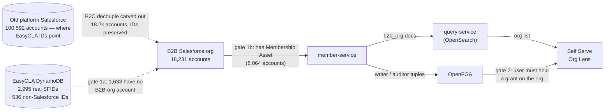
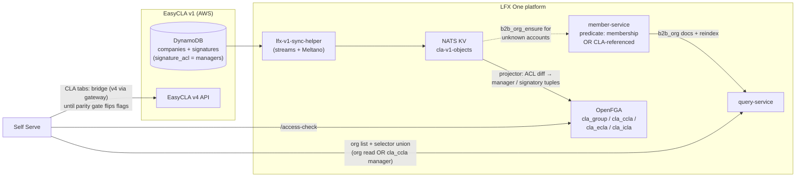

<!-- Copyright The Linux Foundation and each contributor to CommunityBridge.
SPDX-License-Identifier: CC-BY-4.0 -->

# M3 Org Lens: Why EasyCLA Companies Are Invisible, and What Makes Them Visible

**Status**: Updated after the 2026-09-10 architecture call · data re-measured 2026-09-10
**Owner**: Michal (engineering)
**Related**: [architecture-proposal.md](architecture-proposal.md) P2 · [role-mapping-feasibility.md](role-mapping-feasibility.md) §6 · [EasyCLA → LFX One recap](https://docs.google.com/document/d/1hyWZUE_kofeAjVSmeXsRXtPSxSsj7uWvRj3tTNgwdik/edit) (Luis, rev 5, 2026-09-10) — the CLA-service plan, spec package `specs/044-lfx-v2-cla-service/` on branch `044-lfx-v2-cla-service`

**The problem in one line**: the Self Serve Org Lens lists LF **member** organizations, most EasyCLA customers are **not** members, so most CLA managers would open Self Serve and see nothing.

---

## 1. Summary

Two independent gates keep EasyCLA companies out of the Org Lens, and they need different fixes:

| | Gate | Affected | Fix |
|---|---|---|---|
| **1a** | No account in the B2B Salesforce org at all | 1,633 of 2,995 (55%) | Ingest accounts (Eric's proposal — needs sales-ops approval) |
| **1b** | Account exists but has no Membership Asset | 314 | Widen the member-service `b2b_org` predicate |
| **2** | User holds no OpenFGA grant on the org | all CLA managers | CLA FGA types + tuples projected from `signature_acl` |

Gate 1a is the critical path: it depends on a sales-ops approval nobody on this team controls. Gates 1b and 2 are engineering work inside LFX.

**This document reverses a previously approved decision.** See §6 — the M5 deferral of CLA-in-OpenFGA is recorded in at least five documents, one of them an architecture-review-approved proposal.

**It also closes an open spike in the CLA-service plan.** Spec 044 rev 5 names the same membership-asset boundary as its "biggest dependency" and defers the sizing to spike item #4, *"catalogue-gap count"* — "CCLA-holding companies whose `company_external_id` is absent from the membership-asset accounts". §2 is that count, with the caveat that the naive form of the query overstates it by 536 (see §2.1).

---

## 2. The gap, quantified

Measured in Snowflake against prod on 2026-09-10. member-service reads the **B2B Salesforce org** (18,231 accounts, carved out of the old platform Salesforce with record IDs preserved) — not the old platform org (100,592 accounts) that EasyCLA's `company_external_id` values point at.

### 2.1 What EasyCLA actually stores

EasyCLA has 3,705 company rows; 3,537 carry a non-empty `company_external_id`, collapsing to 3,531 distinct values. **Those 3,531 are not all Salesforce IDs:**

| `company_external_id` shape | Distinct | In B2B org | Live in old platform org |
|---|---:|---:|---:|
| `001…` — a real Salesforce ID | **2,995** | 1,362 | 2,920 |
| `lf…` — an LFX-generated Org Service ID | **530** | 0 | 520 |
| other / malformed | 6 | 0 | 3 |
| *(empty — 168 rows, excluded above)* | — | — | — |

The 530 `lf`-prefixed values are the Org Service's own 18-character identifiers, [deliberately shaped to be drop-in compatible with a Salesforce ID](https://github.com/linuxfoundation/lfx-architecture-scratch/blob/main/2026-09-Consolidate-B2B-Backend/TECHNICAL.md). **They are not Salesforce IDs and can never match a B2B account by ID** — none of the 530 do. Any analysis that treats `company_external_id` as an SFID overcounts the population by 536.

> **Consequence for the ingest.** These 530 companies are not a lookup failure to be remapped — there is no Salesforce record to find. They need an account **created** (or domain-matched), exactly like the missing 1,633, and they are invisible to any SFID-keyed remediation. They are, however, in scope for Eric's domain-based sizing, because 520 of them still resolve to a live Org Service organization carrying a domain.

### 2.2 Visibility, among the 2,995 with a real SFID

| Metric | Count | Share |
|---|---:|---:|
| Distinct real SFIDs in EasyCLA | 2,995 | 100% |
| …with an account in the B2B org | 1,362 | 45% |
| ……member → **visible in Self Serve today** | **1,048** | **35%** |
| ……present but non-member (gate 1b) | 314 | 10% |
| …with **no B2B-org account** (gate 1a) | **1,633** | **55%** |
| ……still a live account in the old platform org | 1,559 | |
| ……dangling — resolves nowhere | 74 | |

Restricted to companies with an **active signed CCLA** — the population that actually matters for M3:

| Metric | Count | Share |
|---|---:|---:|
| Orgs with an active signed CCLA (real SFID) | 1,948 | 100% |
| …visible today (member in B2B org) | 808 | 41% |
| …invisible — non-member 180, absent 960 | **1,140** | **59%** |

Membership uses the exact gate member-service applies: a B2B-org `Account` having an `Asset` whose `Product2.Family = 'Membership'` (8,064 of 18,231 accounts qualify).

> **Basis note.** All counts are distinct IDs, not company rows — 3,537 rows collapse to 3,531 values, the duplicate-row problem tracked in [lfx-self-serve#2056](https://github.com/linuxfoundation/lfx-self-serve/issues/2056). B2B-org matching compares the first 15 characters, since Salesforce 15- and 18-character IDs denote the same record. Totals drift by a few rows between syncs as DynamoDB grows; percentages are stable.

### 2.3 How this relates to Eric's sizing

Eric's [ingest proposal](https://github.com/linuxfoundation/lfx-architecture-scratch/blob/main/2026-09-Consolidate-B2B-Backend/README.md) sizes the same problem a different way, and both results are correct — they answer different questions:

| | This document | Eric's proposal |
|---|---|---|
| **Question** | Which EasyCLA orgs can member-service resolve *today*? | How many Salesforce accounts must be *created*? |
| **Population** | 2,995 real SFIDs | 3,693 CCLA companies, less 258 with a missing/broken org reference → 3,435 |
| **Match key** | stored SFID present **by ID** in the B2B org | normalized **domain**, via the Org Service org (EasyCLA stores no domain) |
| **Already covered** | 1,362 | 1,725 |
| **Not covered** | 1,633 | 1,710 → **1,709 distinct orgs, +9.4%** on 18,181 |

The two "not covered" figures are close, but they are **not the same set**, and the difference is the operationally important part. Measured directly on the same rows:

- **374** orgs are absent from the B2B org by ID yet **domain-match an existing B2B account**. These need **linking**, not creating — and they still need an ID remap, because the account they link to has a different ID than the one EasyCLA stores.
- **11** orgs are present by ID but have no domain match, so Eric's method counts them as needing an account they already have. A negligible error bound on his figure, noted for completeness.
- Eric's population includes the `lf`-shaped and broken-reference companies that §2.1 separates out, which is why his totals run higher.

**Steady state after the backfill**: ~362 new CCLA companies/year, of which ~196 (~16/month) need a new account — flat over three years.

> **Caveat worth raising with Eric.** The 1,725 "already maps" and the 374 links above are *inferred from domain equality*, not verified identity. Shared or reused domains (subsidiaries, acquisitions, ISP-hosted sites) can mislink. Eric's staged review covers the records he *creates*; the links get no equivalent review pass, yet a mislink silently points a signed CCLA at the wrong company. Worth a review gate on the link set, not just the create set.

---

## 3. Why they are invisible — the two gates

1. **The org record does not exist**, in two layers. **(1a)** 55% of EasyCLA orgs with a real SFID have no account in the B2B Salesforce org — they were left behind in the old platform org during the B2C decouple. No predicate change can surface them; the accounts must be ingested. **(1b)** The 314 that do exist fail the Membership-Asset gate — predicate widening covers exactly these, and nothing else.
2. **The user holds no grant.** Org Lens eligibility is an OpenFGA relation on `b2b_org` / CLA objects. EasyCLA CLA-manager roles live in ACS and Org Service scopes; OpenFGA knows nothing about them.

> **ID remapping is a required work item.** Salesforce cannot create a record with a chosen ID, so every newly created account gets a **new SFID**. Combined with the 374 domain-links and the 530 `lf`-shaped IDs, EasyCLA's stored `company_external_id` will not resolve for most of the affected population. The ingest must produce an old-ID → new-ID map that EasyCLA (or the CLA service's mapping store) applies. Only the 1,362 already present in the B2B org carried their IDs over and need no remap. Eric's proposal supplies the ongoing mechanism — each CCLA organization gets a foreign key to its Salesforce Account ID and participates in future account merges, so the key follows the surviving record, "the part that does not exist today". Ordering and ownership are [open item 4](#5-open-items).

---

## 4. Direction agreed on the 2026-09-10 architecture call

**EasyCLA companies are B2B engagements — they become real Salesforce B2B accounts.** No separate "EasyCLA organization" entity, no new B2C org type, no parallel org catalogue. A CCLA attaches to a B2B account the same way a membership does.

Eric's written proposal — [Consolidate B2B backend, ingest EasyCLA companies as Salesforce accounts](https://github.com/linuxfoundation/lfx-architecture-scratch/blob/main/2026-09-Consolidate-B2B-Backend/README.md), tracked in [linuxfoundation/lfx-self-serve-ops#16](https://github.com/linuxfoundation/lfx-self-serve-ops/issues/16) — is published and going to sales ops. **That approval is the critical-path dependency for M3.** If sales ops pushes back, a different approach is needed (acknowledged on the call).

### 4.1 What this document depends on from that proposal

1. **CCLA signing is a recognized B2B onboarding path** — structurally parallel to member enrollment, minus the financial relationship. Consistent with Eric's earlier [organization-decoupling proposal](https://github.com/linuxfoundation/lfx-architecture-scratch/blob/main/2024-12%20Decoupling%20orgs%20and%20users/README.md#a-proposal-for-organization-decoupling) (2024-12), where B2B org records are created only when a user starts a B2B flow "like Member Enrollment or Corporate CLA", and the parallel LFX org database is sunset rather than extended.
2. **LFX creates the ~1,709 accounts**, staged and reviewable in tranches; Sales Ops approves the records and field semantics. `IsMember__c` stays **false** — which is precisely why the predicate widening in §4.2 is still required: ingested accounts would otherwise keep failing the Membership-Asset gate.
3. **The 258 companies with a missing or broken org reference are excluded** from the ingest and remediated in EasyCLA (§6 prerequisites). Since EasyCLA stores no company domain, the one credible signal is the CLA managers' email domains — a per-record exercise, not a query.
4. **Future CCLA onboarding routes through Salesforce account creation at signing time**, so the backfill is one-time. End-user UX does not change. *Which* service creates the account — a membership-free Apex endpoint that keeps matching policy in Salesforce, or LFX calling the standard Account API with its own domain dedupe — is an open governance question in Eric's proposal and does not need resolving here.

> **Mechanical note.** member-service's existing `create-b2b-org` (`POST /b2b_orgs`) **registers** an Account that already exists in Salesforce; it does not create one, and it performs no duplicate check ([TECHNICAL.md](https://github.com/linuxfoundation/lfx-architecture-scratch/blob/main/2026-09-Consolidate-B2B-Backend/TECHNICAL.md) §5). That is the same operation as `b2b_org_ensure` below — account creation happens upstream of it.

### 4.2 The technical shape, converging with spec 044 rev 5

- **Org catalogue** — member-service widens its `b2b_org` predicate from "has a Membership Asset" to "membership **or** CLA-referenced", plus an `lfx.member.b2b_org_ensure` request so an unknown account can be onboarded on demand, then a full `b2b_org` reindex. member-service remains the single Salesforce org service.
- **Permissions** — new FGA types per spec 044: `cla_group`, `cla_ccla` (`manager`, `signatory`), `cla_ecla`, `cla_icla`. Confirmed on the call as needed **in this milestone**, regardless of where the data plane lands. Manager grants derive from the signature row's `signature_acl` (the synchronous write), not from ACS; ACS roles feed a dry-run drift report only. Org admin ≠ CLA manager.
- **Lens entry** — the org selector becomes a union: org read (`writer`/`auditor` on `b2b_org`) **or** `manager` on any `cla_ccla`, with a CLA-only view for managers who hold nothing else. Never org-wide read for CLA managers.
- **Console cutover** — hard cut, no parallel operation of the Corporate Console and the Org Lens. That removes the need for a live ACS↔FGA dual sync; the drift report suffices. The earlier one-time ACS→FGA backfill predates the newly admitted accounts, so a fresh backfill pass over CLA roles is required (spec 044 section H, item 22 — the `--backfill-acs --roles cla --dry-run` drift report).

> **Open question — how a signatory reaches the lens.** Not a permissions gap: spec 044 computes `cla_ccla#auditor` as `manager or signatory or …`, and the agreement's query-plane gate is `#auditor`, so a signatory **can** read the agreement once inside. The gap is the **org selector**, whose union is "org viewer/admin **or** manages an agreement" — manager-only. A signatory holding no `b2b_org` grant therefore has no organization to select, and so never reaches the CLA data they are authorized to read. That does not square with the signatory flow M3 must deliver ([`spec.md`](../../specs/001-easycla-ss-integration-fable/spec.md) FR-030 lists CCLA signing initiation in the parity inventory; FR-031 ties org-lens access to "CLA-manager/signatory authority"). Either the selector union admits `signatory` — with relation-specific screen permissions, so it confers neither manager nor org-wide access — or the signatory flow enters by another route. Rev 5 lists "selector union + CLA-only view" as an open **Product + Architecture** decision, recommending the no-model-change option; the signatory case is not called out within it. For Luis and Eric; not decided here.

### 4.3 What changed versus the pre-call version

| Pre-call proposal | Now |
|---|---|
| New `cla_manager` relation on `b2b_org` | Superseded by dedicated CLA FGA types (`cla_ccla#manager` etc.), manager derived from `signature_acl` |
| Admit EasyCLA orgs "tagged non-member" | Sharpened: they become real B2B accounts (sales-ops approval pending), and the predicate widens |
| CLA tabs call v4 via gateway; no replication in M3 | Converges with spec 044's rollout: pages run on the bridge behind per-env flags, flipping to the CLA service only at zero parity differences |

### 4.4 Second-order effects of admitting these orgs

Admitting ~1,600 non-member companies to the org catalogue changes more than the catalogue. Spec 044's companion note ["What changes if every CLA-signing company becomes a real organization"](https://docs.google.com/document/d/1hyWZUE_kofeAjVSmeXsRXtPSxSsj7uWvRj3tTNgwdik/edit) raises five, none of which have owners yet. They are consequences of the decision this document argues for, so they belong in its scope:

| Effect | Why it matters | Needs deciding |
|---|---|---|
| **Company admins appear automatically** | EasyCLA records whoever creates a company as its administrator. The v1-sync-helper already imports company admins as **org admins** — but filters to member companies. Widen the catalogue and that filter decides whether every CLA requester becomes an org admin who can edit People and key contacts. | Import as admins, as viewers, or not at all — relying on the CLA-manager relation only. Product/legal, not technical. Work item sits in the sync helper. |
| **Staff read extends to them** | LF staff hold blanket read on every org; the new companies inherit it, exposing thousands of non-member companies and their CLA data. The blanket grant was reviewed for member companies only. | Re-confirm the grant covers non-member orgs; record it in the decision. |
| **"CLA-only organization" state** | Memberships, key contacts, ROI, meetings are all empty for a never-member company. Rev 5 covers the *user* who enters as a CLA manager, not the *company kind* — so even a full admin lands on empty pages. | An org-level CLA-only marker: hide or explain the membership sections. |
| **Volume** | The org list grows by roughly 9.4%. Affects the staff selector (may need search-first), full-rebuild time, and the Salesforce API budget. | Measure rebuild time before launch; adjust the selector if needed. |
| **Making onboarding stick** | `b2b_org_ensure` is a one-time event. A full rebuild starts from Salesforce again and **drops these companies** unless "referenced by a CLA" is stored durably. | Choose the durable signal — a field on the Salesforce account set by EasyCLA, or a marker LFX keeps — as part of the decision. |

The last one compounds the remap problem in [open item 4](#5-open-items): both are silent failures surfacing only as an org that quietly stops appearing.

---

## 5. Open items

1. **Sales-ops approval** — Eric Searcy (LFX architect) → Mindy (sales ops); the blocker for the catalogue change. The proposal is published and tracked in [lfx-self-serve-ops#16](https://github.com/linuxfoundation/lfx-self-serve-ops/issues/16); Eric is opening the conversation. Heather Willson is out the week of 2026-09-14, so her involvement follows. Note the ask is not only a catalogue change: 55% of EasyCLA orgs need an account **created or domain-linked**, and predicate widening alone covers only the 314 already-present non-member accounts.
2. **Architecture review of spec 044's four ADRs** — CLA FGA types, dedicated `cla-v1-objects` replica bucket, read-plane-first for an external system of record, and the catalogue boundary + selector rule. Gates the FGA model bump and the member-service PR; rev 5's own recommendation is to approve all four, with #4 being the member-service PR plus a full `b2b_org` reindex. This review is also where the reversal in §6 should be formally recorded, and where the second-order effects in §4.4 need owners.
3. **M3 sequencing** — the minimum is the catalogue change, the FGA model plus `cla_ccla` tuple projection/backfill, and the selector union — spec 044 epic items **5** (predicate + `b2b_org_ensure` + full reindex), **9** (`model.fga` v+1), **10** (KV projector) and **13** (selector union + CLA-only persona) — with CLA tabs shipping on the existing bridge. The full read-plane migration (search projections, activity log, My CLAs on the service) follows behind parity-gated flags and is not an M3 dependency.
4. **SFID remap: ordering, scope, and acceptance check.** The old-ID → new-ID map has a required position in the sequence: for every org newly created, domain-linked, or carrying an `lf`-shaped ID, the remap must be applied **before** `b2b_org_ensure`, before query-service indexing, and before `cla_ccla` tuple projection. An SFID-scoped API returns an empty result for an unknown company rather than an error, so an unapplied map **fails silently** — the org simply stays invisible with no signal. Eric's proposal supplies the ongoing mechanism, but ownership of producing and applying the map is unassigned, as is whether the key *is* `company_external_id`, a new EasyCLA field, or the spec-044 mapping store. Acceptance check before selector cutover: an old `company_external_id` resolves to the new SFID and the org appears in the lens.
5. **Bridge/FGA parity before cutover.** Through M3 the CLA tabs are served by v4 (enforcing via ACS) while lens entry is decided by FGA tuples projected from `signature_acl`. Different inputs, so they can disagree in both directions: a user passing the FGA selector but failing the v4 ACS check sees an empty or erroring tab; a user passing ACS but missing a tuple never reaches the lens. Spec 044's drift report covers detection; still needed is the required parity *behavior* at cutover — which side wins, and what divergence is acceptable when the flags flip.

---

## 6. Documents this supersedes

The 2026-09-10 call reversed the position that CLA object types enter the platform authorization model only at M5, gating M3 on the ACS permission bridge instead. That position is recorded in **five** documents plus an epic, and all of them now contradict this one:

| Document | Where |
|---|---|
| [`architecture-proposal.md`](architecture-proposal.md) | **P2** (line 90) — "Roles: bridge, don't migrate. No CLA object types in OpenFGA before M5"; also lines 57, 105, 110 |
| [`role-mapping-feasibility.md`](role-mapping-feasibility.md) | §0 (line 25), option B rejection (line 202), option C (line 204) |
| [`00-overview-fable.md`](../../specs/001-easycla-ss-integration-fable/00-overview-fable.md) | §3 item 3 (line 64); also lines 50, 89 |
| [`03-milestone-ccla-org-lens-fable.md`](../../specs/001-easycla-ss-integration-fable/03-milestone-ccla-org-lens-fable.md) | line 37 — "A for M3, B deferred into M5, C rejected" |
| [`spec.md`](../../specs/001-easycla-ss-integration-fable/spec.md) | line 223 — "deferred to M5 scope… no CLA object types in the platform authorization model" |
| Epic [lfx-self-serve#1968](https://github.com/linuxfoundation/lfx-self-serve/issues/1968) | same statement |

**P2 is not a passing mention — it is an architecture-review-approved proposal** (Eric, with the endpoint-deprecation risk closed 2026-07-31, ARCH-406). Reversing it means reopening that approval at the spec-044 ADR review (open item 2), not merely editing prose. Until these are updated, two incompatible authorization architectures are documented side by side.

Two further documents describe behavior that changes but are not "superseded" in the same sense:

- [`docs/M3_ORG_LENS_API.md`](../M3_ORG_LENS_API.md) documents per-endpoint **ACS scope** authorization for shipped endpoints. If CLA FGA types land in M3, this describes live behavior that changes — arguably a higher-stakes update than the planning specs.
- `spec.md` FR-032 pins role-assignment consistency to "the system of record used by EasyCLA's enforcement" (ACS), which an M3 FGA move puts in tension.

**What does not change**: FGA governs **lens entry and UI gating**; EasyCLA v4 via ACS remains the **enforcement** point for every write through M3. Two layers, not two systems of record — but see open item 5 for the parity requirement that makes this safe.

---

## 7. Prerequisites already tracked

Data cleanup needed regardless of the outcome ([parent story lfx-self-serve#2043](https://github.com/linuxfoundation/lfx-self-serve/issues/2043)):

- [lfx-self-serve#2054](https://github.com/linuxfoundation/lfx-self-serve/issues/2054) — companies with a missing or invalid SFID are unreachable under any design. This overlaps Eric's 258 excluded companies (168 empty plus 90 dangling references, counted against Org Service — hence the different total) and, more importantly, the **530 `lf`-shaped IDs** in §2.1, which are not malformed but simply are not Salesforce IDs. The ticket's scope should be checked against both sets.
- [lfx-self-serve#2055](https://github.com/linuxfoundation/lfx-self-serve/issues/2055) — legacy `POST /v1/company` still creates companies with no Salesforce link. Eric's proposal point 4 (account creation at signing time) makes closing this more urgent: that path would bypass the new flow entirely and keep generating the problem this document describes.
- [lfx-self-serve#2056](https://github.com/linuxfoundation/lfx-self-serve/issues/2056) — duplicate company rows per SFID break resolution.

---

## Appendix: reproducing the numbers

All figures in §2 come from Snowflake, measured 2026-09-10, read-only:

| Source | Table |
|---|---|
| B2B Salesforce org (what member-service reads) | `FIVETRAN_INGEST.SALESFORCE.ACCOUNT` |
| Membership gate | `…SALESFORCE.ASSET` ⋈ `…SALESFORCE.PRODUCT_2` on `FAMILY = 'Membership'` |
| Old platform org (where EasyCLA IDs point) | `FIVETRAN_INGEST.SFDC_CONNECTOR_PROD_SALESFORCE.ACCOUNT` |
| EasyCLA companies | `FIVETRAN_INGEST.DYNAMODB_PRODUCT_US_EAST_1.CLA_PROD_COMPANIES` |
| EasyCLA signatures | `…DYNAMODB_PRODUCT_US_EAST_1.CLA_PROD_SIGNATURES` |

Rules applied throughout: exclude `IS_DELETED`/`ISDELETED` and `_FIVETRAN_DELETED`; join B2B IDs on `LEFT(id, 15)`; treat `company_external_id` as a real SFID only when it matches `001%`. Active CCLA means a `CLA_PROD_SIGNATURES` row with `signature_type = 'ccla'`, `signature_reference_type = 'company'`, and both `signature_signed` and `signature_approved` true.

Eric's domain-matching figures are reproducible from [his scripts](https://github.com/linuxfoundation/lfx-architecture-scratch/tree/main/2026-09-Consolidate-B2B-Backend/scripts); the 374/11 overlap figures in §2.3 come from running his classification and the SFID-presence test over the same rows in one query.
