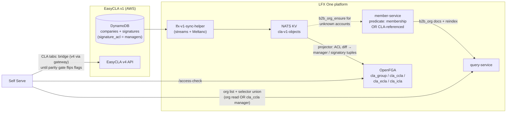

<!-- Copyright The Linux Foundation and each contributor to CommunityBridge.
SPDX-License-Identifier: CC-BY-4.0 -->

# M3 Org Lens: Why EasyCLA Companies Are Invisible, and What Makes Them Visible

**Status**: Updated after the 2026-09-10 architecture call and the 2026-09-11 proposal review · data re-measured 2026-09-11
**Owner**: Michal (engineering)
**Related**: [architecture-proposal.md](architecture-proposal.md) P2 · [role-mapping-feasibility.md](role-mapping-feasibility.md) §6 · [EasyCLA → LFX One recap](https://docs.google.com/document/d/1hyWZUE_kofeAjVSmeXsRXtPSxSsj7uWvRj3tTNgwdik/edit) (Luis, rev 5, 2026-09-10) — the CLA-service plan. Its spec package `specs/044-lfx-v2-cla-service/` (branch `044-lfx-v2-cla-service`) is not yet published in any `linuxfoundation` repo; the recap doc above is the citable source for every "spec 044" reference in this file.

**The problem in one line**: the Self Serve Org Lens lists organizations that have **held an LF membership**, most EasyCLA customers never have, so most CLA managers would open Self Serve and see nothing.

---

## 1. Summary

Two independent gates keep EasyCLA companies out of the Org Lens, and they need different fixes:

| | Gate | Affected | Fix |
|---|---|---|---|
| **1a** | No account in the B2B Salesforce org at all | 1,633 of 2,995 (55%) | Ingest accounts (Eric's proposal — needs sales-ops approval) |
| **1b** | Account exists but has no Membership Asset | 314 | Widen the member-service `b2b_org` predicate |
| **2** | User holds no OpenFGA grant on the org | every CLA manager without an independent `b2b_org` grant | CLA FGA types + tuples projected from `signature_acl` |

Gate 1a is the critical path: it depends on a sales-ops approval nobody on this team controls. Gates 1b and 2 are engineering work inside LFX.

**This document reverses a previously approved decision.** See §6 — the M5 deferral of CLA-in-OpenFGA is recorded in at least five documents, one of them an architecture-review-approved proposal.

**It also closes an open spike in the CLA-service plan.** Spec 044 rev 5 names the same membership-asset boundary as its "biggest dependency" and defers the sizing to spike item #4, *"catalogue-gap count"* — "CCLA-holding companies whose `company_external_id` is absent from the membership-asset accounts". §2 is that count, with the caveat that the naive form of the query overstates it by 536 (see §2.1).

---

## 2. The gap, quantified

Measured in Snowflake against prod on 2026-09-10. member-service reads the **B2B Salesforce org** (18,231 accounts, carved out of the old platform Salesforce with record IDs preserved) — not the old platform org (100,592 accounts) that EasyCLA's `company_external_id` values point at.

### 2.1 What EasyCLA actually stores

EasyCLA has 3,705 company rows; 3,537 carry a non-empty `company_external_id`, collapsing to 3,531 distinct values. **Those 3,531 are not all Salesforce IDs:**

| `company_external_id` shape | Distinct | In B2B org | Live in old platform org |
|---|---:|---:|---:|
| `001…` — a real Salesforce ID | **2,995** | 1,362 | 2,920 |
| `lf…` — an LFX-generated Org Service ID | **530** | 0 | 520 |
| other / malformed | 6 | 0 | 3 |
| *(empty — 168 rows, excluded above)* | — | — | — |

The 530 `lf`-prefixed values are the Org Service's own 18-character identifiers, [deliberately shaped to be drop-in compatible with a Salesforce ID](https://github.com/linuxfoundation/lfx-architecture-scratch/blob/main/2026-09-Consolidate-B2B-Backend/TECHNICAL.md). **They are not Salesforce IDs and can never match a B2B account by ID** — none of the 530 do. Any analysis that treats `company_external_id` as an SFID overcounts the population by 536.

> **Consequence for the ingest.** These 530 companies are not a lookup failure to be remapped — there is no Salesforce record to find. They need an account **created** (or domain-matched), exactly like the missing 1,633, and they are invisible to any SFID-keyed remediation. They are, however, in scope for Eric's domain-based sizing, because 520 of them still resolve to a live Org Service organization carrying a domain.

### 2.2 Visibility, among the 2,995 with a real SFID

| Metric | Count | Share |
|---|---:|---:|
| Distinct real SFIDs in EasyCLA | 2,995 | 100% |
| …with an account in the B2B org | 1,362 | 45% |
| ……has a Membership Asset → **visible in Self Serve today** | **1,048** | **35%** |
| ………of which hold a *current* membership | 691 | 23% |
| ………of which are lapsed — visible but not members today | 357 | 12% |
| ……present, no Membership Asset ever (gate 1b) | 314 | 10% |
| …with **no B2B-org account** (gate 1a) | **1,633** | **55%** |
| ……still a live account in the old platform org | 1,559 | |
| ……dangling — resolves nowhere | 74 | |

Restricted to companies with an **active signed CCLA** — the population that actually matters for M3:

| Metric | Count | Share |
|---|---:|---:|
| Orgs with an active signed CCLA (real SFID) | 1,948 | 100% |
| …visible today (has a Membership Asset) | 808 | 41% |
| ……of which hold a *current* membership | 529 | 27% |
| ……of which are lapsed | 279 | 14% |
| …invisible — no Membership Asset 180, absent 960 | **1,140** | **59%** |

> **"Member" here means *has ever held a membership*, not *is a member today*.** member-service's catalogue predicate is `Product2.Family = 'Membership' AND IsDeleted = false` with **no status filter** ([`account_repo.go:41-45`](https://github.com/linuxfoundation/lfx-v2-member-service/blob/main/internal/infrastructure/salesforce/account_repo.go#L41-L45)) — an `Expired` or `Invoice Cancelled` Asset qualifies exactly like an `Active` one. Across the whole B2B org, 8,065 accounts have a Membership Asset but only 4,595 hold a current one; the other 3,470 are lapsed and still in the Org Lens. This is why the Lens shows organizations that are not members — Heather observed this on 2026-09-11 and Eric traced the example to a 2020–2023 LFN membership. It is existing intended behavior, not a defect, but it matters here in two ways: it inflates what "visible today" means (of our 1,048, only 691 are current members), and it means **widening the predicate to "membership or CLA-referenced" is a smaller semantic change than it first appears** — the catalogue already contains non-members.

> **Basis note.** All counts are distinct IDs, not company rows — 3,537 rows collapse to 3,531 values, the duplicate-row problem tracked in [lfx-self-serve#2056](https://github.com/linuxfoundation/lfx-self-serve/issues/2056). B2B-org matching compares the first 15 characters, since Salesforce 15- and 18-character IDs denote the same record. Totals drift by a few rows between syncs as DynamoDB grows; percentages are stable.

### 2.3 How this relates to Eric's sizing

Eric's [ingest proposal](https://github.com/linuxfoundation/lfx-architecture-scratch/blob/main/2026-09-Consolidate-B2B-Backend/README.md) sizes the same problem a different way, and both results are correct — they answer different questions:

| | This document | Eric's proposal |
|---|---|---|
| **Question** | Which EasyCLA orgs can member-service resolve *today*? | How many Salesforce accounts must be *created*? |
| **Population** | 2,995 real SFIDs | 3,693 CCLA companies, less 258 with a missing/broken org reference → 3,435 |
| **Match key** | stored SFID present **by ID** in the B2B org | normalized **domain**, via the Org Service org (EasyCLA stores no domain) |
| **Already covered** | 1,362 | 1,725 |
| **Not covered** | 1,633 | 1,710 → **1,709 distinct orgs, +9.4%** on 18,181 |

The two "not covered" figures are close, but they are **not the same set**, and the difference is the operationally important part. Measured directly on the same rows:

- **374** orgs are absent from the B2B org by ID yet **domain-match an existing B2B account**. These need **linking**, not creating — and they still need an ID remap, because the account they link to has a different ID than the one EasyCLA stores.
- **11** orgs are present by ID but have no domain match, so Eric's method counts them as needing an account they already have. A negligible error bound on his figure, noted for completeness.
- Eric's population includes the `lf`-shaped and broken-reference companies that §2.1 separates out, which is why his totals run higher.

> **The "50% vs 75% gap" question, resolved.** Eric [raised this on 2026-09-10](https://github.com/linuxfoundation/lfx-architecture-scratch/blob/main/2026-09-Consolidate-B2B-Backend/README.md): his scripts report a ~50% gap while the architecture call discussed ~75%, and he correctly identified the cause — he matches against **all** B2B accounts, whereas the Org Lens additionally filters to accounts holding a Membership Asset. Both numbers are right at their own gate, and the difference *is* gate 1b. In this document's terms: 45% of EasyCLA's real SFIDs resolve to a B2B account (Eric's gate), but only 35% clear the membership filter as well (the Lens gate). His conclusion that the membership constraint must also be removed is the same change as the predicate widening in §4.2 — the two proposals agree, and neither is sufficient alone.

**Steady state after the backfill**: ~362 new CCLA companies/year, of which ~196 (~16/month) need a new account — flat over three years.

> **Caveat worth raising with Eric.** The 1,725 "already maps" and the 374 links above are *inferred from domain equality*, not verified identity. Shared or reused domains (subsidiaries, acquisitions, ISP-hosted sites) can mislink. Eric's staged review covers the records he *creates*; the links get no equivalent review pass, yet a mislink silently points a signed CCLA at the wrong company. Worth a review gate on the link set, not just the create set.

---

## 3. Why they are invisible — the two gates

1. **The org record does not exist**, in two layers. **(1a)** 55% of EasyCLA orgs with a real SFID have no account in the B2B Salesforce org — they were left behind in the old platform org during the B2C decouple. No predicate change can surface them; the accounts must be ingested. **(1b)** The 314 that do exist fail the Membership-Asset gate — predicate widening covers exactly these, and nothing else.
2. **The user holds no grant.** Org Lens eligibility is an OpenFGA relation on `b2b_org` / CLA objects. EasyCLA CLA-manager roles live in ACS and Org Service scopes; OpenFGA knows nothing about them.

> **ID remapping is a conditional work item — it depends on how the ingest creates accounts.** A standard Salesforce insert cannot choose a record ID, so accounts created that way get a **new SFID** and EasyCLA's stored `company_external_id` stops resolving for the affected population (compounded by the 374 domain-links and the 530 `lf`-shaped IDs, which never resolved). But the B2B→old sync provably *does* preserve record IDs across orgs, so the mechanism the ingest uses decides the outcome:
>
> - **Path A — the import preserves existing SFIDs** (working assumption, pending Mindy's confirmation): no remap, no crosswalk, no EasyCLA or ACS rewrites. Already true today for the 995 synced active-CCLA companies.
> - **Path B — the import mints new B2B IDs**: an old-ID → new-ID map is required, but **only for the ingested set**, applied at the Self Serve bridge rather than by rewriting the EasyCLA DB.
>
> Do not plan identity or scope rewrites until this is settled — see [open item 5](#5-open-items) for the measurements and [lfx-self-serve#2750](https://github.com/linuxfoundation/lfx-self-serve/issues/2750) for the Path A/B decision. Eric's proposal supplies the ongoing mechanism either way — each CCLA organization gets a foreign key to its Salesforce Account ID and participates in future account merges, so the key follows the surviving record, "the part that does not exist today". Ordering and ownership are [open item 5](#5-open-items).

---

## 4. Direction agreed on the 2026-09-10 architecture call

**EasyCLA companies are B2B engagements — they become real Salesforce B2B accounts.** No separate "EasyCLA organization" entity, no new B2C org type, no parallel org catalogue. A CCLA attaches to a B2B account the same way a membership does.

Eric's written proposal — [Consolidate B2B backend, ingest EasyCLA companies as Salesforce accounts](https://github.com/linuxfoundation/lfx-architecture-scratch/blob/main/2026-09-Consolidate-B2B-Backend/README.md), tracked in [linuxfoundation/lfx-self-serve-ops#16](https://github.com/linuxfoundation/lfx-self-serve-ops/issues/16) — is published and going to sales ops. **That approval is the critical-path dependency for M3.** If sales ops pushes back, a different approach is needed (acknowledged on the call).

### 4.1 What this document depends on from that proposal

1. **CCLA signing is a recognized B2B onboarding path** — structurally parallel to member enrollment, minus the financial relationship. Consistent with Eric's earlier [organization-decoupling proposal](https://github.com/linuxfoundation/lfx-architecture-scratch/blob/main/2024-12%20Decoupling%20orgs%20and%20users/README.md#a-proposal-for-organization-decoupling) (2024-12), where B2B org records are created only when a user starts a B2B flow "like Member Enrollment or Corporate CLA", and the parallel LFX org database is sunset rather than extended.
2. **LFX creates the ~1,709 accounts**, staged and reviewable in tranches; Sales Ops approves the records and field semantics. `IsMember__c` stays **false** — which is precisely why the predicate widening in §4.2 is still required: ingested accounts would otherwise keep failing the Membership-Asset gate.
3. **The 258 companies with a missing or broken org reference are excluded** from the ingest and remediated in EasyCLA (§6 prerequisites). Since EasyCLA stores no company domain, the one credible signal is the CLA managers' email domains — a per-record exercise, not a query.
4. **Future CCLA onboarding routes through Salesforce account creation at signing time**, so the backfill is one-time. End-user UX does not change. *Which* service creates the account was an open governance question in Eric's proposal; per the 2026-09-17 sales-ops meeting (open item 1), the expected direction is a membership-free Apex endpoint that keeps matching policy in Salesforce, not direct sObject create access from LFX.

> **Mechanical note.** member-service's existing `create-b2b-org` (`POST /b2b_orgs`) **registers** an Account that already exists in Salesforce; it does not create one, and it performs no duplicate check ([TECHNICAL.md](https://github.com/linuxfoundation/lfx-architecture-scratch/blob/main/2026-09-Consolidate-B2B-Backend/TECHNICAL.md) §5). That is the same operation as `b2b_org_ensure` below — account creation happens upstream of it.

### 4.2 The technical shape, converging with spec 044 rev 5

- **Org catalogue** — member-service widens its `b2b_org` predicate from "has a Membership Asset" to "membership **or** CLA-referenced", plus an `lfx.member.b2b_org_ensure` request so an unknown account can be onboarded on demand, then a full `b2b_org` reindex. member-service remains the single Salesforce org service.
- **Permissions** — new FGA types per spec 044: `cla_group`, `cla_ccla` (`manager`, `signatory`), `cla_ecla`, `cla_icla`. Confirmed on the call as needed **in this milestone**, regardless of where the data plane lands. Manager grants derive from the signature row's `signature_acl` (the synchronous write), not from ACS; ACS roles feed a dry-run drift report only. Org admin ≠ CLA manager. **A simpler M3 slice is proposed in [m3-fga-model.md](m3-fga-model.md)**: one `b2b_org#cla_admin` relation and no new object types until the types actually enforce (M5 — all four dedicated CLA types land together in that milestone under the companion model, so no intermediate model bump or tuple backfill is required at M4). Both are on the table for the ADR review (§5 item 3). Under either shape, v4's own two-tier enforcement is replicated unchanged for M3 — company-wide reads, per-agreement writes. Product has confirmed the company-wide read is intended and must be preserved at M5, not narrowed; see [m3-fga-model.md](m3-fga-model.md) §6 — which also records that **neither variant as currently specified carries that guarantee into M5**, since spec 044's `cla_ccla#auditor` is per-agreement while the read it must preserve is company-wide.
- **Lens entry** — the org selector becomes a union: org read (`writer`/`auditor` on `b2b_org`) **or** `manager` on any `cla_ccla`, with a CLA-only view for managers who hold nothing else. Never org-wide read for CLA managers.
- **Console cutover** — **staged, not a hard cut.** The 2026-09-10 call framed this as a hard cut; the rollout trackers have since superseded that. Epic [linuxfoundation/lfx-self-serve#1968](https://github.com/linuxfoundation/lfx-self-serve/issues/1968) retires the Console only after production rollout and further validation, and [lfx-self-serve#2750](https://github.com/linuxfoundation/lfx-self-serve/issues/2750) step 7 requires a **few-week parallel window** with both UIs live before decommissioning. What the original point got right is the narrower claim it was making: no live **ACS↔FGA dual sync** is needed, because CLA tuples are projected from `signature_acl` for newly admitted accounts exactly as for existing ones — the same source for initial backfill and ongoing projection (spec 044 item 10, the KV projector), so **no grant is ever derived from ACS**.

  Note the distinction this collapses: ACS is not reduced to reporting. **Every bridged v4 call remains ACS-authorized** for the whole M3→M5 period — that is the "FGA gates the UI, ACS gates the APIs" split. ACS's read-only role is specifically in **validating the FGA projection**: the drift report (section H, item 22 — `--backfill-acs --roles cla --dry-run`) compares ACS `cla-manager` roles against the tuples and is expected to show divergence where ACS is stale, rather than to correct anything. Enforcement and drift-reporting are separate jobs ACS holds at the same time.

> **Open question — how a signatory reaches the lens.** Not a permissions gap: spec 044 computes `cla_ccla#auditor` as `manager or signatory or …`, and the agreement's query-plane gate is `#auditor`, so a signatory **can** read the agreement once inside. The gap is the **org selector**, whose union is "org viewer/admin **or** manages an agreement" — manager-only. A signatory holding no `b2b_org` grant therefore has no organization to select, and so never reaches the CLA data they are authorized to read. That does not square with the signatory flow M3 must deliver ([`spec.md`](../../specs/001-easycla-ss-integration-fable/spec.md) FR-030 lists CCLA signing initiation in the parity inventory; FR-031 ties org-lens access to "CLA-manager/signatory authority"). Either the selector union admits `signatory` — with relation-specific screen permissions, so it confers neither manager nor org-wide access — or the signatory flow enters by another route. Rev 5 lists "selector union + CLA-only view" as an open **Product + Architecture** decision, recommending the no-model-change option; the signatory case is not called out within it. For Luis and Eric; not decided here. **See also §4.5** — if CCLA signing starts from a dedicated CLA landing page rather than the Org Lens, as Eric has proposed, a signatory never needs selector access and this question narrows to signatories who must *review* an existing agreement.

### 4.3 What changed versus the pre-call version

| Pre-call proposal | Now |
|---|---|
| New `cla_manager` relation on `b2b_org` | Superseded by dedicated CLA FGA types (`cla_ccla#manager` etc.), manager derived from `signature_acl` |
| Admit EasyCLA orgs "tagged non-member" | Sharpened: they become real B2B accounts (sales-ops approval pending), and the predicate widens |
| CLA tabs call v4 via gateway; no replication in M3 | Converges with spec 044's rollout: pages run on the bridge behind per-env flags, flipping to the CLA service only at zero parity differences |

### 4.4 Second-order effects of admitting these orgs

Admitting ~1,600 non-member companies to the org catalogue changes more than the catalogue. Spec 044's companion note ["What changes if every CLA-signing company becomes a real organization"](https://docs.google.com/document/d/1hyWZUE_kofeAjVSmeXsRXtPSxSsj7uWvRj3tTNgwdik/edit) raises five, none of which have owners yet. They are consequences of the decision this document argues for, so they belong in its scope:

| Effect | Why it matters | Needs deciding |
|---|---|---|
| **Company admins appear automatically** | EasyCLA records whoever creates a company as its administrator. The v1-sync-helper already imports company admins as **org admins** — but filters to member companies. Widen the catalogue and that filter decides whether every CLA requester becomes an org admin who can edit People and key contacts. | Import as admins, as viewers, or not at all — relying on the CLA-manager relation only. Product/legal, not technical. Work item sits in the sync helper. |
| **Staff read extends to them** | LF staff hold blanket read on every org; the new companies inherit it, exposing thousands of non-member companies and their CLA data. The blanket grant was reviewed for member companies only. | Re-confirm the grant covers non-member orgs; record it in the decision. |
| **"CLA-only organization" state** | Memberships, key contacts, ROI, meetings are all empty for a never-member company. Rev 5 covers the *user* who enters as a CLA manager, not the *company kind* — so even a full admin lands on empty pages. | An org-level CLA-only marker: hide or explain the membership sections. |
| **Volume** | The org list grows by roughly 9.4%. Affects the staff selector (may need search-first), full-rebuild time, and the Salesforce API budget. | Measure rebuild time before launch; adjust the selector if needed. |
| **Making onboarding stick** | `b2b_org_ensure` is a one-time event. A full rebuild starts from Salesforce again and **drops these companies** unless "referenced by a CLA" is stored durably. | Choose the durable signal — a field on the Salesforce account set by EasyCLA, or a marker LFX keeps — as part of the decision. |

The last one compounds the remap problem in [open item 5](#5-open-items): both are silent failures surfacing only as an org that quietly stops appearing.

### 4.5 The entry-point question this raises (Heather / Eric, 2026-09-11)

Reviewing the ingest proposal, Heather Willson asked two questions that this document's data does not answer and that bound its scope. Recorded here because they gate what M3 should build, not because they are settled:

1. **Must a company be a B2B account before it can sign a CCLA?** Under this proposal, yes — CCLA signing creates the account. Eric's position is that this is true regardless of where B2B orgs are stored, and is already the case in v1: if the Org Service organization does not exist, the signing flow has to create one. The change is *what gets created* (a Salesforce account instead of an Org Service record), not *whether* something is.
2. **What do non-B2B (B2C-only) organizations see in the Org Lens?** Today, Insights routes such users to a dead end. The options split on what the user is meant to *do* there: a read-only view can be built from CDP attestation data alone and needs no account; anything transactional — signing a CCLA, joining as a member — routes through account creation regardless. Eric's framing: there is no meaningful "view-only org" action for a company with no memberships, no committee seats, and no project logo.

Eric also questions whether CCLA signing should start from the Org Lens at all — the alternative being a single CLA landing page that disambiguates ICLA/ECLA/CCLA, carries the user through org creation, and hands off to the Org Lens only once there is an org to land in (the pattern already used for Member Enrollment, which does not live in the Org Dashboard). **If that is the chosen flow, the signatory-selector problem in §4.2 largely dissolves** — a signatory would never need to enter the Lens to sign. That makes this a product decision with direct architectural consequence, not a sequencing detail.

A related unresolved question: how a user's Org Lens is determined for attested (non-CCLA) organizations — by email domain, by work-history employer, and what happens with generic email domains or multiple concurrent employers. Eric considers these foundational to the engagement model rather than edge cases. Out of scope for M3 as scoped here, which keys on CCLA signatures rather than attestation, but it constrains any later "every employee sees their employer" ambition.

---

## 5. Open items

1. **Sales-ops approval** — Eric Searcy (LFX architect) → Mindy White (sales ops); the blocker for the catalogue change. The proposal is published and tracked in [lfx-self-serve-ops#16](https://github.com/linuxfoundation/lfx-self-serve-ops/issues/16). **Update 2026-09-17**: met with the Salesforce team; no objection in principle, but they want to confirm internally with Dolan/Stephanie before committing effort this close to renewal season — answer expected the week of 2026-09-21. Three takeaways: (a) they expect LFX to go through an Apex-exposed interface, not direct sObject create access (see §4.1 item 4); (b) they will accept an AI-written contribution to their repo, tested in sandbox, to accelerate the work; (c) they are motivated to close this out before their renewal-season load increases. Note the ask is not only a catalogue change: 55% of EasyCLA orgs need an account **created or domain-linked**, and predicate widening alone covers only the 314 already-present non-member accounts.
2. **Product decision on the CCLA entry point** (§4.5) — does CCLA signing start from the Org Lens, or from a dedicated CLA landing page that creates the org and hands off? Raised by Heather Willson and Eric Searcy on 2026-09-11; David Deal's position is that product should drive these requirements. This is upstream of the selector-union question in §4.2 and can eliminate it. Unowned as of this writing.
3. **Architecture review of spec 044's four ADRs** — CLA FGA types, dedicated `cla-v1-objects` replica bucket, read-plane-first for an external system of record, and the catalogue boundary + selector rule. Gates the FGA model bump and the member-service PR; rev 5's own recommendation is to approve all four, with #4 being the member-service PR plus a full `b2b_org` reindex. This review is also where the reversal in §6 should be formally recorded, and where the second-order effects in §4.4 need owners.
4. **M3 sequencing — conditional on which FGA model is selected.** The common minimum is the catalogue change, an FGA model bump plus tuple projection/backfill, and the selector union — spec 044 epic items **5** (predicate + `b2b_org_ensure` + full reindex), **9** (`model.fga` v+1), **10** (KV projector) and **13** (selector union + CLA-only persona) — with CLA tabs shipping on the existing bridge. **What item 9/10 actually project depends on the model decision in [`m3-fga-model.md` §7](m3-fga-model.md):**
   - **Variant A (spec 044's dedicated CLA types)** — item 9 adds `cla_group`/`cla_ccla`, item 10 projects `cla_ccla` tuples. No member-service change.
   - **Variant B (single `b2b_org#cla_admin` relation, the companion doc's M3 proposal)** — item 9 adds one relation to the existing `b2b_org` type and item 10 projects `b2b_org:<org>#cla_admin` from `signature_acl`. This variant carries **an extra, blocking work item the list above does not name**: member-service must add `cla_admin` to the `ExcludeRelations` of its `update_access` message, or fga-sync's full-sync semantics silently reap every projected tuple on the next org write ([`m3-fga-model.md` §4.1](m3-fga-model.md)). That change must deploy **before** the projector, and it is owned by a different team. Variant B additionally needs consumer-side work in `lfx-self-serve` — the selector classifies only `writer`/`auditor`, and the CLA BFF route's gate accepts only a roster grant or `b2b_org#auditor`, so a `cla_admin`-only manager reaches neither ([`m3-fga-model.md` §4.2](m3-fga-model.md)). So Variant B's sequence is longer than Variant A's and spans three repos, despite the smaller model diff.

   **Sequencing note — the B2B→old sync is one-way.** Companies created through v4 or the Corporate CLA Console land in the old platform org and never propagate to B2B, so they acquire no `b2b_org` object and cannot appear in the lens until the ingest covers them. While both UIs run in parallel ([lfx-self-serve#2750](https://github.com/linuxfoundation/lfx-self-serve/issues/2750) step 7), Console-created companies keep arriving on the wrong side of that sync — so the ingest is not a one-shot backfill that can run before cutover and be done. Either Console company-creation is closed off early, or the ingest repeats until it is. Raised by Luis Moriguerra, 2026-09-21.

   The full read-plane migration (search projections, activity log, My CLAs on the service) follows behind parity-gated flags and is not an M3 dependency under either variant.
5. **SFID remap: ordering, scope, and acceptance check.** The old-ID → new-ID map has a required position in the sequence: for every org newly created, domain-linked, or carrying an `lf`-shaped ID, the remap must be applied **before** `b2b_org_ensure`, before query-service indexing, and before CLA tuple projection (`cla_ccla` or `b2b_org#cla_admin`, per item 4). An SFID-scoped API returns an empty result for an unknown company rather than an error, so an unapplied map **fails silently** — the org simply stays invisible with no signal. Eric's proposal supplies the ongoing mechanism, but ownership of producing and applying the map is unassigned, as is whether the key *is* `company_external_id`, a new EasyCLA field, or the spec-044 mapping store. Acceptance check before selector cutover: an old `company_external_id` resolves to the new SFID and the org appears in the lens.
   **A fourth system needs the map, not just three.** Existing CLA-manager ACS roles are created against `company.CompanyExternalID` at grant time ([`v2/dynamo_events/cla_manager.go:144`](../../cla-backend-go/v2/dynamo_events/cla_manager.go#L144), which calls `assignCLAManager` → [`orgService.CreateOrgUserRoleOrgScopeProjectOrg(..., companySFID, ...)`](../../cla-backend-go/v2/dynamo_events/cla_manager.go#L205)), while every API call authorizes against the SFID the caller passes in the request ([`v2/company/handlers.go:134`](../../cla-backend-go/v2/company/handlers.go#L134), `IsUserAuthorizedForOrganization(ctx, authUser, params.CompanySFID, ...)`). After an org's SFID changes, an existing manager's ACS scope stays pinned to the old SFID: FGA admits them to the lens (their `cla_admin` tuple re-projects fine from `signature_acl`), but v4 may return 403 on every call.

   **Whether an ACS migration is actually needed is conditional on the bridge's ID-translation contract, and that contract is the thing to settle first** (the same fork as [`m3-fga-model.md` §7](m3-fga-model.md) item 2):

   - **Under Path A** ([linuxfoundation/lfx-self-serve#2750](https://github.com/linuxfoundation/lfx-self-serve/issues/2750), the working assumption) the import preserves existing old-org SFIDs, no ID changes, and none of this arises.
   - **Under Path B, if the bridge translates new→old** before calling v4, the ACS scope stays valid as written and **no re-grant is required** — the translation is the migration.
   - **Under Path B with untranslated pass-through**, the 403 above is real and an ACS org/project-scope migration to the new SFID becomes mandatory, with a named owner.

   So this is a work item to *scope*, not one to assume. Under whichever branch applies, cutover acceptance should include: an existing non-admin CLA manager, not just a fresh admin, can call the endpoints for their org.
   **Update 2026-09-18: the map already exists as live data — the old org's `Account.sfid_b2b` crosswalk.** Measured in Snowflake (appendix): every B2B account, including all 1,045 created since the 2026-06 carve-out, is referenced by exactly one old-org account's `sfid_b2b` (1,045 B2B accounts → 1,045 join rows → 1,045 distinct old-org rows, an exact 1:1); the pointer is never stale (every one resolves to a live B2B account). More than a pointer, it is an **identity**: in 100% of pairs (17,303 carve-out + 1,045 post-carve-out) the old-org account's own SFID equals its `sfid_b2b` — the sync preserves record IDs across orgs (which also explains the copied `CreatedDate`s), so for every synced account the old-org SFID, the org-service SFID, and the B2B record ID are the same string. Org-service already reads and exposes it as `SalesforceB2BAccountID`, with a `hasb2baccountid` filter ([organization-service `organization/repository.go`](https://github.com/LF-Engineering/organization-service/blob/main/organization/repository.go), the `sa.sfid_b2b` column). So the answer to "where does the map live" may be **none of the three candidates above** — **but only for the subset this actually covers.** For a company whose stored `company_external_id` *is* a real old-org SFID, EasyCLA keeps it untouched and anything needing the B2B ID joins through the old-org account, so ACS scopes never need carrying forward and the Corporate Console keeps working unchanged for as long as it runs.

   **Two populations are outside that guarantee and still need an explicit mapping or remediation path, whatever the ingest does with IDs:**

   - **The 530 `lf`-shaped IDs (§2.1).** There is no Salesforce record to preserve, so ID preservation is vacuous for them. `sfid_b2b` proves identity only where an old-org account exists *and* EasyCLA stores that account's SFID; neither holds here. They need an account **created** and `company_external_id` **rewritten** — they are invisible to any SFID-keyed remediation.
   - **The 374 domain-linked orgs (§2.3).** These link to an existing B2B account whose ID differs from the one EasyCLA stores, so the stored value cannot address the target account no matter which path the ingest takes. They need a translation or a rewrite.

   Path A therefore removes the remap for the *SFID-resolvable* population, not for the whole affected set. The mapping work item shrinks; it does not disappear. Coverage today: 995 of 1,957 active-CCLA companies (51%) resolve old SFID → `sfid_b2b` → live B2B account; the 962 that don't are the ingest set, and 18 active-CCLA companies point at SFIDs absent even from the old org (cleanup input). Two caveats: (a) the sync is **one-way, B2B→old** — of new old-org accounts since June, only the ~30–42%/month that are shadow rows of B2B-created accounts have `sfid_b2b`; accounts created in the old org (which is what v4's `CreateOrg` and both Corporate Console creation paths mint) never flow to B2B on their own, so newly signed CCLA companies stay invisible in the lens until the ongoing ingest mechanism sweeps them or v4 creates B2B accounts directly; (b) the shadow rows' `CreatedDate` is copied verbatim from the B2B record (identical to the second on all 1,045 pairs), so replication latency and mechanism are unmeasurable from the data. Confirmation path (status 2026-09-18): **Mindy is first confirming whether EasyCLA orgs can be imported into the B2B org at all**; once that lands, the follow-up is whether the import can create B2B accounts **preserving the companies' existing old-org SFIDs as the B2B record IDs**, the way the ongoing sync does (standard Salesforce inserts cannot choose record IDs, so the sync mechanism is special) — if yes, `company_external_id` stays valid in the B2B org for every company **that stores a real old-org SFID** (already proven for the 995 synced active-CCLA companies) and no remap is needed for that population — the 530 `lf`-shaped IDs and 374 domain-links still need rewriting either way; if the import mints new B2B IDs instead, a remap/crosswalk is needed only for the ingested set. **Working assumption while we wait: IDs are preserved (Path A in [lfx-self-serve#2750](https://github.com/linuxfoundation/lfx-self-serve/issues/2750)).** Separately, ask Eric what the B2B→old write-back latency is after a new B2B account is created — it gates switching v4 org creation to the B2B path. Record-type check: 1,019/1,045 shadow rows share the record type of the accounts EasyCLA resolves today (`01241000000bkf1AAA`); 23 use `012QP000002OBQzYAO` and 3 use `01241000001E1xlAAC`, both of which should be confirmed against org-service's `ORG_SERVICE_RECORD_TYPE_ID` allow-list.
6. **Bridge/FGA parity before cutover.** Through M3 the CLA tabs are served by v4 (enforcing via ACS) while lens entry is decided by FGA tuples projected from `signature_acl`. **Both ultimately derive from the same `signature_acl` write** — the ACS CLA-manager role is granted from the same DynamoDB event ([`v2/dynamo_events/cla_manager.go:144`](../../cla-backend-go/v2/dynamo_events/cla_manager.go#L144)) that the tuple projection keys on. They can still disagree in both directions, because they are **two independent asynchronous projections into separate stores**: either can lag, fail, or be reaped (§4.1 of [m3-fga-model.md](m3-fga-model.md)) without the other noticing. That is the failure mode the parity rule has to handle — drift between two copies of one source, not two systems reading different inputs. Concretely: a user passing the FGA selector but failing the v4 ACS check sees an empty or erroring tab; a user passing ACS but missing a tuple never reaches the lens. Spec 044's drift report covers detection; still needed is the required parity *behavior* at cutover — which side wins, and what divergence is acceptable when the flags flip.

---

## 6. Documents this supersedes

The 2026-09-10 call reversed the position that CLA object types enter the platform authorization model only at M5, gating M3 on the ACS permission bridge instead. That position is recorded in **five** documents plus an epic, and all of them now contradict this one:

| Document | Where |
|---|---|
| [`architecture-proposal.md`](architecture-proposal.md) | **P2** (line 90) — "Roles: bridge, don't migrate. No CLA object types in OpenFGA before M5"; also lines 57, 105, 110 |
| [`role-mapping-feasibility.md`](role-mapping-feasibility.md) | §0 (line 25), option B rejection (line 202), option C (line 204) |
| [`00-overview-fable.md`](../../specs/001-easycla-ss-integration-fable/00-overview-fable.md) | §3 item 3 (line 64); also lines 50, 89 |
| [`03-milestone-ccla-org-lens-fable.md`](../../specs/001-easycla-ss-integration-fable/03-milestone-ccla-org-lens-fable.md) | line 37 — "A for M3, B deferred into M5, C rejected" |
| [`spec.md`](../../specs/001-easycla-ss-integration-fable/spec.md) | line 223 — "deferred to M5 scope… no CLA object types in the platform authorization model" |
| Epic [lfx-self-serve#1968](https://github.com/linuxfoundation/lfx-self-serve/issues/1968) | same statement |

**P2 is not a passing mention — it is an architecture-review-approved proposal** (Eric, with the endpoint-deprecation risk closed 2026-07-31, ARCH-406). Reversing it means reopening that approval at the spec-044 ADR review (open item 3), not merely editing prose. Until these are updated, two incompatible authorization architectures are documented side by side.

Two further documents describe behavior that changes but are not "superseded" in the same sense:

- [`docs/M3_ORG_LENS_API.md`](../M3_ORG_LENS_API.md) documents per-endpoint **ACS scope** authorization for shipped endpoints. If CLA FGA types land in M3, this describes live behavior that changes — arguably a higher-stakes update than the planning specs.
- `spec.md` FR-032 pins role-assignment consistency to "the system of record used by EasyCLA's enforcement" (ACS), which an M3 FGA move puts in tension.

**What does not change**: FGA governs **lens entry and UI gating**; EasyCLA v4 via ACS remains the **enforcement** point for every write through M3. Two layers, not two systems of record — but see open item 6 for the parity requirement that makes this safe.

---

## 7. Prerequisites already tracked

Data cleanup needed regardless of the outcome ([parent story lfx-self-serve#2043](https://github.com/linuxfoundation/lfx-self-serve/issues/2043)):

- [lfx-self-serve#2054](https://github.com/linuxfoundation/lfx-self-serve/issues/2054) — companies with a missing or invalid SFID are unreachable under any design. This overlaps Eric's 258 excluded companies (168 empty plus 90 dangling references, counted against Org Service — hence the different total) and, more importantly, the **530 `lf`-shaped IDs** in §2.1, which are not malformed but simply are not Salesforce IDs. The ticket's scope should be checked against both sets.
- [lfx-self-serve#2055](https://github.com/linuxfoundation/lfx-self-serve/issues/2055) — legacy `POST /v1/company` still creates companies with no Salesforce link. Eric's proposal point 4 (account creation at signing time) makes closing this more urgent: that path would bypass the new flow entirely and keep generating the problem this document describes.
- [lfx-self-serve#2056](https://github.com/linuxfoundation/lfx-self-serve/issues/2056) — duplicate company rows per SFID break resolution.

---

## Appendix: reproducing the numbers

All figures in §2 come from Snowflake, measured 2026-09-10, read-only:

| Source | Table |
|---|---|
| B2B Salesforce org (what member-service reads) | `FIVETRAN_INGEST.SALESFORCE.ACCOUNT` |
| Membership gate | `…SALESFORCE.ASSET` ⋈ `…SALESFORCE.PRODUCT_2` on `FAMILY = 'Membership'` |
| Old platform org (where EasyCLA IDs point) | `FIVETRAN_INGEST.SFDC_CONNECTOR_PROD_SALESFORCE.ACCOUNT` |
| EasyCLA companies | `FIVETRAN_INGEST.DYNAMODB_PRODUCT_US_EAST_1.CLA_PROD_COMPANIES` |
| EasyCLA signatures | `…DYNAMODB_PRODUCT_US_EAST_1.CLA_PROD_SIGNATURES` |

Rules applied throughout: exclude `IS_DELETED`/`ISDELETED` and `_FIVETRAN_DELETED`; join B2B IDs on `LEFT(id, 15)`; treat `company_external_id` as a real SFID only when it matches `001%`. Active CCLA means a `CLA_PROD_SIGNATURES` row with `signature_type = 'ccla'`, `signature_reference_type = 'company'`, and both `signature_signed` and `signature_approved` true.

The membership gate deliberately applies **no** `ASSET.STATUS` filter, matching member-service's SOQL. The current-vs-lapsed split in §2.2 adds `STATUS IN ('Active','Purchased','At Risk')`; the remaining statuses in the data are `Expired`, `Invoice Cancelled` and `Associate Cancelled`. Re-measured 2026-09-11: the §2.2 and §2.3 totals reproduce exactly, with active-CCLA counts drifting by one row (1,949/809) as DynamoDB grows — the drift the basis note describes.

Eric's domain-matching figures are reproducible from [his scripts](https://github.com/linuxfoundation/lfx-architecture-scratch/tree/main/2026-09-Consolidate-B2B-Backend/scripts); the 374/11 overlap figures in §2.3 come from running his classification and the SFID-presence test over the same rows in one query.

The crosswalk figures in open item 5 (measured 2026-09-18, read-only) come from the same sources plus the old-org mirror's `SFID_B2B` column: coverage joins `SALESFORCE.ACCOUNT` to `SFDC_CONNECTOR_PROD_SALESFORCE.ACCOUNT` on `LEFT(sfid_b2b, 15) = LEFT(id, 15)`; the one-way-sync finding compares monthly counts of new old-org accounts carrying `sfid_b2b` against monthly B2B account creations; the latency non-finding compares `CREATEDDATE` across the join (delta is 0 minutes for all 1,045 post-carve-out pairs — copied, not independent); EasyCLA coverage extends the §2 company join through `sfid_b2b` to a live B2B row, split by the active-CCLA rule above. Note the Dynamo mirrors store rows as a `DATA` variant column, so company/signature fields are read as `DATA:company_external_id::string` etc.
