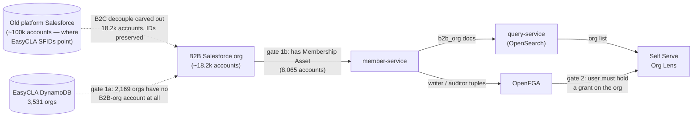
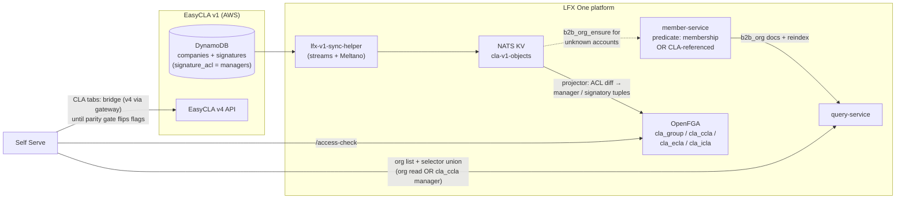

<!-- Copyright The Linux Foundation and each contributor to CommunityBridge. -->
<!-- SPDX-License-Identifier: CC-BY-4.0 -->

# M3: EasyCLA Orgs in the Self Serve Org Lens — Visibility & Access

**Status:** Updated after the 2026-09-10 architecture call · aligned with `specs/044-lfx-v2-cla-service/` (rev 5)
**Problem:** The Self Serve Org Lens only shows LF **member** organizations. Most EasyCLA customers are **not** members — so most CLA managers would open Self Serve and see nothing.

## The gap, quantified (prod data, Snowflake)

member-service reads the **B2B Salesforce org** (~18.2k accounts, carved out of the old platform Salesforce with record IDs preserved) — not the old platform org (~100k accounts) that EasyCLA's `company_external_id` values point at. Measured against the B2B org:

| Metric | Count |
|---|---|
| EasyCLA companies with a Salesforce ID (SFID) | 3,531 |
| …with an account in the **B2B Salesforce org** | 1,362 (39%) |
| ……of those, member → **visible in Self Serve today** | **1,048 (30%)** |
| ……present in B2B org but non-member | 314 |
| …with **no account in the B2B org at all** | **2,169 (61%)** |
| ……of those, still a live account in the old platform org | 2,082 |
| Orgs with an **active signed CCLA** | 2,278 |
| …visible today (member in B2B org) | 808 (35%) |
| …invisible: present-but-non-member / absent from B2B org | **180 / 1,290 (65% combined)** |

Membership uses the exact gate member-service applies: B2B-org `Account` having an `Asset` with `Product2.Family = 'Membership'` (8,065 accounts qualify). These figures line up with Eric's B2B-ingest ticket (~1,700 accounts to bring in; ~50% domain-matching to existing accounts): his ingest population ≈ the 2,169 absent accounts after domain-matching some to existing B2B accounts.

## Why they are invisible — two independent gates

1. **The org record does not exist** — in two layers. (1a) 61% of EasyCLA orgs have **no account in the B2B Salesforce org** — they were left behind in the old platform org during the B2C decouple. No member-service predicate change can surface them; the accounts must be ingested (Eric's proposal). (1b) The 314 that do exist fail the Membership-Asset gate — the predicate widening covers exactly these.
2. **The user has no grant.** Org Lens eligibility is an OpenFGA relation resolved against `b2b_org` / CLA objects. EasyCLA CLA-manager roles live in ACS/Org Service scopes — OpenFGA knows nothing about them.

> **ID remapping consequence:** accounts newly created in the B2B org get **new SFIDs** (Salesforce cannot create a record with a chosen ID). For those 2,169 orgs, EasyCLA's stored `company_external_id` will no longer resolve — the ingest must produce an old-ID → new-ID map, and EasyCLA (or the CLA service's mapping store) must apply it. The 1,362 already present carried their IDs over and need no remap.

## Direction agreed on the 2026-09-10 architecture call

**EasyCLA companies are B2B engagements — they become real Salesforce B2B accounts.** There will be no separate "EasyCLA organization" entity, no new B2C org type, and no parallel org catalogue. A CCLA attaches to a B2B account, the same way membership does. Eric is drafting the proposal to sales ops (Mindy) to approve ingesting the non-member CLA companies as B2B accounts — tracked in his "Consolidate B2B backend, ingest EasyCLA companies as Salesforce accounts" ticket. **This approval is the critical-path dependency for M3.** If sales ops pushes back, a different approach is needed (explicitly acknowledged on the call).

The technical shape converges with the CLA-service plan (spec 044, rev 5):

- **Org catalogue:** member-service widens its `b2b_org` predicate from "has a Membership Asset" to "membership **or** CLA-referenced", plus a `lfx.member.b2b_org_ensure` request so an unknown account can be onboarded on demand; full `b2b_org` reindex afterwards. member-service remains the one Salesforce org service.
- **Permissions:** new FGA types per spec 044 — `cla_group`, `cla_ccla` (`manager`, `signatory`), `cla_ecla`, `cla_icla` — confirmed on the call as needed **in this milestone** regardless of where the data plane lands. Manager grants derive from the signature row's `signature_acl` (the synchronous write), not from ACS; ACS roles feed a dry-run drift report only. Org admin ≠ CLA manager.
- **Lens entry:** the org selector becomes a union — org read (`writer`/`auditor` on `b2b_org`) **or** `manager` on any `cla_ccla` — with a CLA-only view for managers who hold nothing else. Never org-wide read for CLA managers.
- **Console cutover:** hard cut, no parallel operation of the Corporate Console and the Org Lens (agreed on the call). That removes the need for a live ACS↔FGA dual sync; the drift report suffices. The earlier one-time ACS→FGA backfill predates the newly admitted accounts, so a new backfill pass over CLA roles is required (spec 044 story H).

### What changed vs. the earlier version of this proposal

| Earlier proposal (this doc, pre-call) | Now |
|---|---|
| New `cla_manager` relation on `b2b_org` | Superseded: dedicated CLA FGA types (`cla_ccla#manager` etc.), manager from `signature_acl` |
| Admit EasyCLA orgs "tagged non-member" | Confirmed and sharpened: they become real B2B accounts (sales-ops approval pending); member-service predicate widened |
| CLA tabs call v4 via gateway; no replication in M3 | Converges with spec 044's own rollout: pages run on the bridge behind per-env flags and flip to the CLA service only at zero parity differences |

## Open items

1. **Sales-ops approval** — Eric → Mindy; the blocker for the catalogue change. Heather and Michal to be invited to that conversation. Note the ingest is not only a catalogue change: 61% of EasyCLA orgs need an account **created** in the B2B org (new SFIDs → EasyCLA `company_external_id` remap required), and only the 314 already-present non-member accounts are covered by predicate widening alone.
2. **Architecture review of spec 044's four ADRs** — CLA FGA types, dedicated `cla-v1-objects` bucket, read-plane-first for an external system of record, catalogue predicate + selector rule. Gates the FGA model bump and member-service PR.
3. **M3 sequencing** — the minimum for M3 is the catalogue change, the FGA model + `cla_ccla` tuple projection/backfill, and the selector union (spec 044 stories A, B, C9, D), with the CLA tabs shipping on the existing bridge. The full read-plane migration (search projections, activity log, My CLAs on the service) follows behind the parity-gated flags and is not an M3 dependency.

## Prerequisites already tracked

Data cleanup, needed regardless of the outcome ([parent story](https://github.com/linuxfoundation/lfx-self-serve/issues/2043)):

- [lfx-self-serve#2054](https://github.com/linuxfoundation/lfx-self-serve/issues/2054) — 230 companies with missing/invalid SFID are unreachable under any design
- [lfx-self-serve#2055](https://github.com/linuxfoundation/lfx-self-serve/issues/2055) — legacy `POST /v1/company` still creates companies with no Salesforce link
- [lfx-self-serve#2056](https://github.com/linuxfoundation/lfx-self-serve/issues/2056) — duplicate company rows per SFID break resolution
