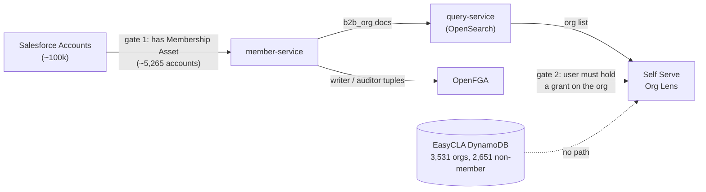
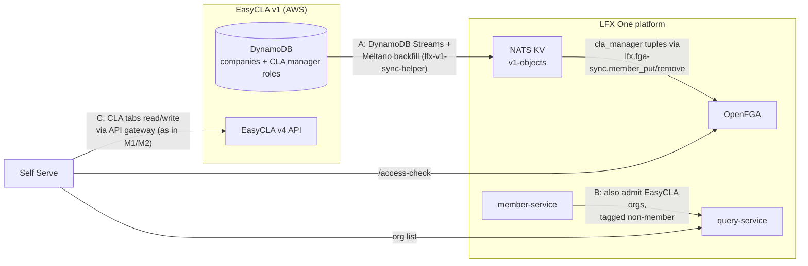

<!-- Copyright The Linux Foundation and each contributor to CommunityBridge. -->
<!-- SPDX-License-Identifier: CC-BY-4.0 -->

# M3: EasyCLA Orgs in the Self Serve Org Lens — Visibility & Access

**Status:** Proposal for architecture call · 2026-09-10
**Problem:** The Self Serve Org Lens only shows LF **member** organizations. Most EasyCLA customers are **not** members — so most CLA managers would open Self Serve and see nothing.

## The gap, quantified (prod data, Snowflake)

| Metric | Count |
|---|---|
| EasyCLA companies with a Salesforce ID (SFID) | 3,531 |
| …visible in Self Serve today (member orgs) | **880 (25%)** |
| …invisible (non-member orgs) | **2,651 (75%)** |
| Orgs with an **active signed CCLA** | 2,277 |
| …of those, invisible in Self Serve | **1,581 (69%)** |

Membership was measured with the exact gate member-service uses: Salesforce `Account` having an `Asset` with `Product2.Family = 'Membership'`.

## Why they are invisible — two independent gates

1. **The org record does not exist.** member-service only ingests Accounts with a Membership Asset, so a non-member org has no `b2b_org` document — nothing to list, search, or attach permissions to.
2. **The user has no grant.** Org Lens eligibility is an OpenFGA `writer`/`auditor` relation on `b2b_org:{sfid}`. EasyCLA CLA-manager roles live in ACS/Org Service scopes — OpenFGA knows nothing about them.

## Proposal

Split into three parts. Only one needs new pipeline work, and that pipeline already exists.

### A. Sync CLA-manager roles → OpenFGA (copy the meetings pattern)

Add a **`cla_manager` relation on `b2b_org:{sfid}`**, fed the same way meetings feeds `host`/`participant`:

- EasyCLA DynamoDB tables → `lfx-v1-sync-helper` (DynamoDB Streams + Meltano backfill → `v1-objects` KV). The repo has a step-by-step guide for onboarding a new table.
- A small event processor publishes `lfx.fga-sync.member_put` / `member_remove` (same contract the meeting service uses).
- One-time backfill: a few thousand tuples.

Self Serve then treats `cla_manager` as lens-eligible (like `auditor`), but it unlocks **only the EasyCLA nav item** — not org profile management, key contacts, or other lens features. CLA managers are mostly *not* org admins, so a distinct narrow relation is safer than granting `auditor`.

### B. Admit EasyCLA orgs into member-service (the policy decision)

Relax the Membership-Asset gate for the ~2,651 Accounts referenced by EasyCLA, tagged so they are clearly distinguishable from member orgs (e.g. `source: easycla`, `is_member: false`). These are all real, curated Salesforce Accounts — EasyCLA v2 has always created companies through the Org Service. Scope stays bounded: only Accounts an EasyCLA company points at, not the whole Account table.

**This is the schedule risk.** It is member-service work plus a trust/policy decision, and no pipeline work routes around it: without a `b2b_org` doc there is nothing to show and nothing to attach tuples to.

### C. CLA screens keep calling EasyCLA v4 (no data replication in M3)

M1/M2 already ship Self Serve server routes → API gateway → EasyCLA v4 in production (Me lens, sign flow). The M3 org-lens tabs are per-org detail views served fine by the same path, with EasyCLA enforcing authorization server-side as it does for the existing consoles. Replicating a dozen DynamoDB tables into OpenSearch buys nothing for these screens and does not fit the timeline. It can be a later milestone if search/list needs emerge.

## Permissions sketch

| EasyCLA role (ACS) | Org Lens effect | FGA relation |
|---|---|---|
| CLA manager | sees org in lens; full EasyCLA tab (approval lists, managers, acknowledgments) | `cla_manager` on `b2b_org` |
| CLA manager designee | sees org in lens; can initiate signing | `cla_manager` (same relation; v4 enforces the difference) |
| CLA signatory | no lens access needed (signs via DocuSign email) | none |
| Org admin (existing) | unchanged | `writer` |

Enforcement stays two-layer: FGA gates what the UI *shows*; every EasyCLA write is enforced by v4/ACS server-side.

## Decisions needed at this call

1. **Admit non-member, EasyCLA-referenced Accounts into member-service?** (owner: member-service; the critical-path item)
2. **New `cla_manager` relation on `b2b_org` in the OpenFGA model?** (owner: platform / fga model in lfx-v2-helm)
3. **Confirm Self Serve → EasyCLA v4 via API gateway remains the approved pattern for M3** (M1/M2 precedent), so no CLA-data replication is in scope.

## Prerequisites already tracked

Data cleanup, needed regardless of the outcome ([parent story](https://github.com/linuxfoundation/lfx-self-serve/issues/2043)):

- [lfx-self-serve#2054](https://github.com/linuxfoundation/lfx-self-serve/issues/2054) — 230 companies with missing/invalid SFID are unreachable under any design
- [lfx-self-serve#2055](https://github.com/linuxfoundation/lfx-self-serve/issues/2055) — legacy `POST /v1/company` still creates companies with no Salesforce link
- [lfx-self-serve#2056](https://github.com/linuxfoundation/lfx-self-serve/issues/2056) — duplicate company rows per SFID break resolution
