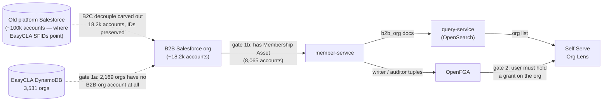
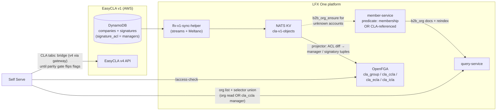

<!-- Copyright The Linux Foundation and each contributor to CommunityBridge. -->
<!-- SPDX-License-Identifier: CC-BY-4.0 -->

# M3: EasyCLA Orgs in the Self Serve Org Lens — Visibility & Access

**Status:** Updated after the 2026-09-10 architecture call · aligned with [`specs/044-lfx-v2-cla-service/`](https://github.com/linuxfoundation/lfx-self-serve/tree/main/specs/044-lfx-v2-cla-service) (rev 5, in the `lfx-self-serve` repo — not in this one)
**Problem:** The Self Serve Org Lens only shows LF **member** organizations. Most EasyCLA customers are **not** members — so most CLA managers would open Self Serve and see nothing.

> **Supersedes the "CLA-in-OpenFGA is M5" decision.** Three companion documents in this repo still record the earlier position that CLA object types enter the platform authorization model only at M5, and gate M3 on the ACS permission bridge instead: [`00-overview-fable.md`](00-overview-fable.md) (§3.3), [`03-milestone-ccla-org-lens-fable.md`](03-milestone-ccla-org-lens-fable.md) (option A recommended, "B deferred into M5"), and [`spec.md`](spec.md) ("Modeling CLA roles natively in the platform's fine-grained-authorization system is deferred to M5 scope"). The epic [lfx-self-serve#1968](https://github.com/linuxfoundation/lfx-self-serve/issues/1968) carries the same statement. The 2026-09-10 architecture call reversed this: the CLA FGA types are needed **in M3**. Those documents and the epic must be updated together with this one — until they are, two incompatible authorization architectures are documented side by side.
>
> Note what does **not** change: FGA governs **lens entry and UI gating**; EasyCLA v4 (via ACS) remains the **enforcement** point for every write through M3. That is two layers, not two systems of record — but see the parity requirement in open item 5.

## The gap, quantified (prod data, Snowflake)

member-service reads the **B2B Salesforce org** (~18.2k accounts, carved out of the old platform Salesforce with record IDs preserved) — not the old platform org (~100k accounts) that EasyCLA's `company_external_id` values point at. Measured against the B2B org:

| Metric | Count |
|---|---|
| EasyCLA companies with a Salesforce ID (SFID) | 3,531 |
| …with an account in the **B2B Salesforce org** | 1,362 (39%) |
| ……of those, member → **visible in Self Serve today** | **1,048 (30%)** |
| ……present in B2B org but non-member | 314 |
| …with **no account in the B2B org at all** | **2,169 (61%)** |
| ……of those, still a live account in the old platform org | 2,082 |
| Orgs with an **active signed CCLA** | 2,278 |
| …visible today (member in B2B org) | 808 (35%) |
| …invisible: present-but-non-member / absent from B2B org | **180 / 1,290 (65% combined)** |

All counts above are **distinct Salesforce IDs**, not EasyCLA company rows: 3,537 company rows with a well-formed SFID collapse to 3,531 distinct SFIDs (the duplicate-row problem tracked in [lfx-self-serve#2056](https://github.com/linuxfoundation/lfx-self-serve/issues/2056) accounts for the difference). Membership uses the exact gate member-service applies: B2B-org `Account` having an `Asset` with `Product2.Family = 'Membership'` (8,065 accounts qualify).

**Reconciled with Eric's published sizing.** Eric's proposal is now published: [Consolidate B2B backend, ingest EasyCLA companies as Salesforce accounts](https://github.com/linuxfoundation/lfx-architecture-scratch/blob/main/2026-09-Consolidate-B2B-Backend/README.md) (method and reproduction in [TECHNICAL.md](https://github.com/linuxfoundation/lfx-architecture-scratch/blob/main/2026-09-Consolidate-B2B-Backend/TECHNICAL.md), tracked in [linuxfoundation/lfx-self-serve-ops#16](https://github.com/linuxfoundation/lfx-self-serve-ops/issues/16)). His numbers and the table above measure different populations with different matching keys — both hold:

| | This doc | Eric's proposal |
|---|---|---|
| Population | 3,531 distinct stored SFIDs | 3,693 CCLA companies; 258 with a missing/broken org reference excluded → 3,435 |
| Matching key | stored SFID **present by ID** in the B2B org | normalized **domain** (EasyCLA → Org Service org → domain; EasyCLA itself stores no domain) against all 18,181 B2B accounts |
| Matches an existing B2B account | 1,362 | 1,725 |
| No B2B account | 2,169 | 1,710 → **1,709 distinct orgs to create** (+9.4% on 18,181) |

The gap between 2,169 and 1,709 is a few hundred orgs whose stored SFID is absent from the B2B org but whose **domain matches an existing B2B account** — those need **linking** to the existing account, not a new record. Consequence for EasyCLA: the SFID remap (open item 4) covers the domain-linked orgs as well as the newly created ones — in both cases the stored `company_external_id` differs from the final B2B account ID. Steady state after the backfill: ~362 new CCLA companies/yr, of which ~196 (~16/month) need a new account.

## Why they are invisible — two independent gates

1. **The org record does not exist** — in two layers. (1a) 61% of EasyCLA orgs have **no account in the B2B Salesforce org** — they were left behind in the old platform org during the B2C decouple. No member-service predicate change can surface them; the accounts must be ingested (Eric's proposal). (1b) The 314 that do exist fail the Membership-Asset gate — the predicate widening covers exactly these.
2. **The user has no grant.** Org Lens eligibility is an OpenFGA relation resolved against `b2b_org` / CLA objects. EasyCLA CLA-manager roles live in ACS/Org Service scopes — OpenFGA knows nothing about them.

> **ID remapping consequence:** accounts newly created in the B2B org get **new SFIDs** (Salesforce cannot create a record with a chosen ID). For those 2,169 orgs — the ~1,709 created *and* the domain-linked remainder — EasyCLA's stored `company_external_id` will no longer resolve; the ingest must produce an old-ID → new-ID map, and EasyCLA (or the CLA service's mapping store) must apply it. The 1,362 already present carried their IDs over and need no remap. Eric's proposal supplies the ongoing mechanism: after import, each CCLA organization gets a foreign key to its Salesforce Account ID and **participates in future account merges** so the key follows the surviving record — in his words, "the part that does not exist today". Where that key lives and who applies it is open item 4.

## Direction agreed on the 2026-09-10 architecture call

**EasyCLA companies are B2B engagements — they become real Salesforce B2B accounts.** There will be no separate "EasyCLA organization" entity, no new B2C org type, and no parallel org catalogue. A CCLA attaches to a B2B account, the same way membership does. Eric's written proposal — [Consolidate B2B backend, ingest EasyCLA companies as Salesforce accounts](https://github.com/linuxfoundation/lfx-architecture-scratch/blob/main/2026-09-Consolidate-B2B-Backend/README.md) — is now published and going to sales ops (Mindy) for approval. **That approval is the critical-path dependency for M3.** If sales ops pushes back, a different approach is needed (explicitly acknowledged on the call).

Points of Eric's proposal that this document depends on:

1. **CCLA signing is a recognized B2B onboarding path** — structurally parallel to member enrollment, minus the financial relationship. This is consistent with his earlier [organization-decoupling proposal](https://github.com/linuxfoundation/lfx-architecture-scratch/blob/main/2024-12%20Decoupling%20orgs%20and%20users/README.md#a-proposal-for-organization-decoupling) (2024-12): B2B org records are created only when a user initiates a B2B flow "like Member Enrollment or Corporate CLA", and the parallel LFX org database keeps being sunset, not extended.
2. **LFX creates the ~1,709 accounts** (staged, reviewable, in tranches); Sales Ops approves the records and field semantics. `IsMember__c` stays **false** — which is exactly why the member-service predicate widening below remains necessary; the ingested accounts would otherwise still fail the Membership-Asset gate.
3. **The 258 companies with a missing/broken org reference are excluded** and remediated in EasyCLA (see prerequisites below) — the likeliest signal being the CLA managers' email domains, since EasyCLA stores no company domain.
4. **Future CCLA onboarding routes through Salesforce account creation at signing time** (end-user UX unchanged). *Which* service creates the account — a new membership-free Apex endpoint keeping matching rules in Salesforce, or LFX calling the standard Account API with its own domain dedupe — is an open governance question for Sales Ops in the proposal, not something this document needs to resolve.

One mechanical note from [TECHNICAL.md](https://github.com/linuxfoundation/lfx-architecture-scratch/blob/main/2026-09-Consolidate-B2B-Backend/TECHNICAL.md) §5: member-service's existing `create-b2b-org` (`POST /b2b_orgs`) **registers** an Account that already exists in Salesforce — it does not create one, and performs no duplicate check. That is the same operation as the `b2b_org_ensure` request below; actual account creation happens upstream, on whichever path point 4 resolves to.

The technical shape converges with the CLA-service plan (spec 044, rev 5):

- **Org catalogue:** member-service widens its `b2b_org` predicate from "has a Membership Asset" to "membership **or** CLA-referenced", plus a `lfx.member.b2b_org_ensure` request so an unknown account can be onboarded on demand; full `b2b_org` reindex afterwards. member-service remains the one Salesforce org service.
- **Permissions:** new FGA types per spec 044 — `cla_group`, `cla_ccla` (`manager`, `signatory`), `cla_ecla`, `cla_icla` — confirmed on the call as needed **in this milestone** regardless of where the data plane lands. Manager grants derive from the signature row's `signature_acl` (the synchronous write), not from ACS; ACS roles feed a dry-run drift report only. Org admin ≠ CLA manager.
- **Lens entry:** the org selector becomes a union — org read (`writer`/`auditor` on `b2b_org`) **or** `manager` on any `cla_ccla` — with a CLA-only view for managers who hold nothing else. Never org-wide read for CLA managers.
  > **Open question — signatories.** Spec 044 models `cla_ccla` with both `manager` and `signatory`, but the selector union above (and rev 5's) admits only `manager`. A user who holds `signatory` and no `b2b_org` grant would be unable to enter the lens at all, which does not square with M3's signatory flow ([`spec.md`](spec.md) FR-030/FR-031). Either the union must include `signatory` — with relation-specific screen permissions so it does not confer manager or org-wide access — or the signatory flow must enter by some other route. Raised for Luis and Eric; not decided here.
- **Console cutover:** hard cut, no parallel operation of the Corporate Console and the Org Lens (agreed on the call). That removes the need for a live ACS↔FGA dual sync; the drift report suffices. The earlier one-time ACS→FGA backfill predates the newly admitted accounts, so a new backfill pass over CLA roles is required (spec 044 story H).

### What changed vs. the earlier version of this proposal

| Earlier proposal (this doc, pre-call) | Now |
|---|---|
| New `cla_manager` relation on `b2b_org` | Superseded: dedicated CLA FGA types (`cla_ccla#manager` etc.), manager from `signature_acl` |
| Admit EasyCLA orgs "tagged non-member" | Confirmed and sharpened: they become real B2B accounts (sales-ops approval pending); member-service predicate widened |
| CLA tabs call v4 via gateway; no replication in M3 | Converges with spec 044's own rollout: pages run on the bridge behind per-env flags and flip to the CLA service only at zero parity differences |

## Open items

1. **Sales-ops approval** — Eric Searcy (LFX architect) → Mindy (sales ops); the blocker for the catalogue change. The proposal is published ([README](https://github.com/linuxfoundation/lfx-architecture-scratch/blob/main/2026-09-Consolidate-B2B-Backend/README.md), tracked in [linuxfoundation/lfx-self-serve-ops#16](https://github.com/linuxfoundation/lfx-self-serve-ops/issues/16)) and Eric is starting the sales-ops conversation with Mindy; Heather Willson is out the week of 2026-09-14, so her involvement follows after. Note the ingest is not only a catalogue change: 61% of EasyCLA orgs need an account **created or domain-linked** in the B2B org (→ EasyCLA `company_external_id` remap required), and only the 314 already-present non-member accounts are covered by predicate widening alone.
2. **Architecture review of spec 044's four ADRs** — CLA FGA types, dedicated `cla-v1-objects` bucket, read-plane-first for an external system of record, catalogue predicate + selector rule. Gates the FGA model bump and member-service PR.
3. **M3 sequencing** — the minimum for M3 is the catalogue change, the FGA model + `cla_ccla` tuple projection/backfill, and the selector union (spec 044 stories A, B, C9, D), with the CLA tabs shipping on the existing bridge. The full read-plane migration (search projections, activity log, My CLAs on the service) follows behind the parity-gated flags and is not an M3 dependency.

4. **SFID remap ordering, and its acceptance check.** The old-ID → new-ID map is not just an artifact to produce — it has a required position in the sequence. For any org whose account is newly created **or domain-linked to an existing account**, the remap must be applied **before** `b2b_org_ensure`, before query-service indexing, and before `cla_ccla` tuple projection. An SFID-scoped API returns an empty result for an unknown company rather than an error, so an unapplied map fails silently: the org simply stays invisible with no signal. Eric's proposal supplies the ongoing half of the mechanism (a foreign key on each CCLA organization to its Salesforce Account ID, updated on account merges), but ownership of producing and applying the map — and whether that key **is** EasyCLA's `company_external_id`, a new EasyCLA field, or the spec-044 mapping store — is unassigned and needs deciding. Acceptance check before selector cutover: an old `company_external_id` resolves to the new SFID, and the org appears in the lens.

5. **Bridge/FGA parity before cutover.** Through M3 the CLA tabs are served by v4 (enforcing via ACS) while lens entry is decided by FGA tuples projected from `signature_acl`. These are different inputs, so they can disagree in both directions — a user passing the FGA selector but failing the v4 ACS check sees an empty or erroring tab; a user passing ACS but missing a tuple never reaches the lens. Spec 044's drift report covers detection; what is still needed is the required parity behavior at cutover (which side wins, and what the acceptable divergence is when the flags flip).

## Prerequisites already tracked

Data cleanup, needed regardless of the outcome ([parent story](https://github.com/linuxfoundation/lfx-self-serve/issues/2043)):

- [lfx-self-serve#2054](https://github.com/linuxfoundation/lfx-self-serve/issues/2054) — 230 companies with missing/invalid SFID are unreachable under any design. This substantially overlaps Eric's 258 excluded companies (168 empty + 90 dangling references; counted against Org Service, hence the different total). His proposal excludes them from the ingest and puts remediation on EasyCLA; the one credible signal is the CLA managers' email domains (`company_acl` / `company_manager_id`), since EasyCLA stores no company domain — a per-record exercise, not a query.
- [lfx-self-serve#2055](https://github.com/linuxfoundation/lfx-self-serve/issues/2055) — legacy `POST /v1/company` still creates companies with no Salesforce link
- [lfx-self-serve#2056](https://github.com/linuxfoundation/lfx-self-serve/issues/2056) — duplicate company rows per SFID break resolution
