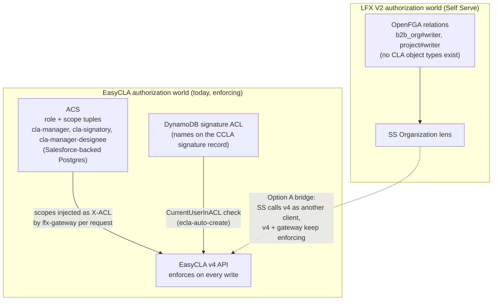
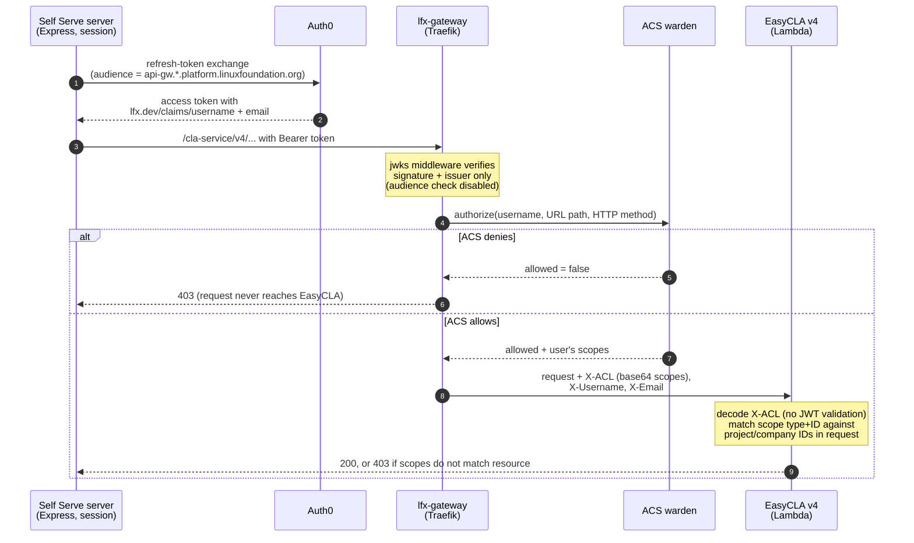
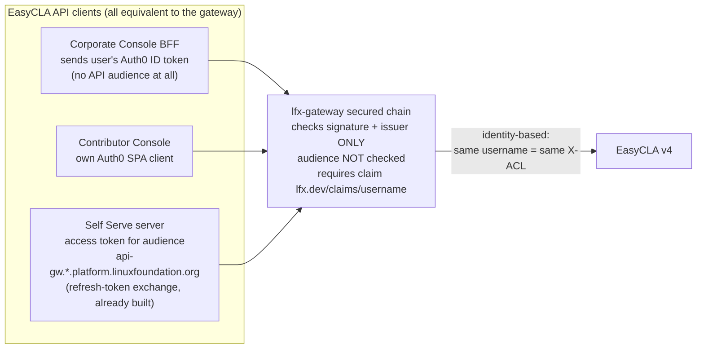
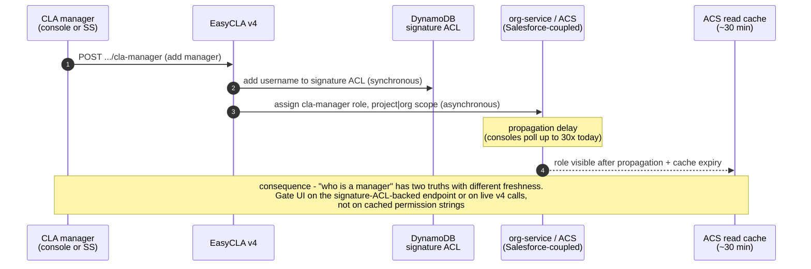

# Roles/Permissions Mapping Feasibility — EasyCLA ↔ LFX Self Serve

**For**: Heather (PM), Kieran (strategy), architecture review | **From**: Michal (engineering) | **Date**: 2026-07-15
**Basis**: [00-overview-fable.md](00-overview-fable.md) §2.4/§3, [04-milestone-ccla-org-lens-fable.md](04-milestone-ccla-org-lens-fable.md) role options; code citations verified 2026-07-15, re-checked 2026-07-20
**Answers**: the open engineering action from the 2026-07-15 leadership review ([spec.md](spec.md) "Program review outcomes")

**How to read**: §0 is the answer. §1–§2 explain how EasyCLA authorization actually works (where most assumptions were wrong). §3–§5 are evidence tables. §6 is the decision. §7 is what to verify next. **[verified]** claims cite `file:line`; **[inferred]** claims are covered by a spike.

---

## 0. Executive answer

**Feasible with conditions — and the conditions are smaller than we assumed.**

Self Serve can call the existing EasyCLA v4 APIs with user-scoped tokens, **without any gateway or EasyCLA changes**, because the entire v4 authorization chain keys on the **user's identity (LF username)** — not on which Auth0 client or audience minted the token:

- The gateway validates token **issuer only**; the audience check is explicitly disabled **[verified]**.
- The gateway resolves the user's ACS permissions per request and injects them as an `X-ACL` header, which v4 trusts wholesale **[verified]**.
- Self Serve **already ships** the needed token machinery: a secondary access token for the `api-gw.*.platform.linuxfoundation.org` audience — exactly the audience Auth0 stamps the required `lfx.dev/claims/username` claim onto **[verified]**.
- The Corporate Console today sends an Auth0 **ID token** and it works — direct evidence that audience is irrelevant **[verified]**.

The milestone-04 recommendation stands: **Option A (bridge) for M4/M5, OpenFGA modeling deferred to M6, org-admin mapping rejected** (§6).

Two conditions to convert into facts before committing M3–M5 staffing — both are one-day curl spikes (§7):

1. ACS's gateway-level path authorization must admit **ordinary users (no CLA role)** to the v4 *read* endpoints M1/M3 need.
2. The refresh-token exchange for the api-gw audience must be **granted to the SS Auth0 client** in each environment.

---

## 1. Background: two authorization worlds

The program bridges two authorization systems that share nothing — different models, stores, and sources of truth:

Key mismatch (from milestone 04): an org-lens admin (`b2b_org#writer`) is **not** a CLA manager, and CLA authority is per **company × project/CLA group** — finer-grained than anything the org lens models. Note also that the EasyCLA side has **two** stores of manager truth (ACS scopes *and* the signature ACL) — this matters for UI gating (§5) and the OpenFGA option (§6).

---

## 2. How an EasyCLA v4 request is authorized today

This is the load-bearing section. Enforcement happens at **two layers, and neither is "v4 checks roles"**:

**Layer 1 — lfx-gateway (coarse allow/deny + scope injection)** **[verified]**. All non-public `/cla-service` paths run the `secured` chain (`lfx-gateway/dynamic/services/cla-service.yaml:45-53`):

- JWT check is **signature + issuer only**; audience validation is commented out ("Skip requiring audience for now") — `dynamic/middleware.yaml:35-36`.
- The ACS authorizer plugin calls ACS warden (`POST /v1/api/warden/subjects/authorize/v2`) with **username, URL path, HTTP method** and **403s at the gateway** if not allowed (`traefik-acs-authorizer-middleware/acs.go:399-401`). A denied request never reaches EasyCLA.
- On allow, it injects the user's scopes as a base64 `X-ACL` header plus `X-Username`/`X-Email` (`acs.go:410-419`). `X-ACL` is a plain JSON blob — not signed, not a token.
- **ACS caches warden authorize responses for 30 minutes** (`acs/middleware/cache.go:39,52-54`) — so the gateway's allow/deny decision, and the injected scopes, can be up to 30 minutes stale after a role grant **or revocation**.
- **Many v4 paths bypass all of this** on a public router — health, `request-individual-signature`, `user-from-token`, `notify-cla-managers`, the designee-check, the cla-group manager list, and more (`cla-service.yaml:4-38`).

**Layer 2 — v4 handlers (fine-grained resource binding)** **[verified]**. v4 does **no JWT validation of its own** on `/v4`: `v2API.LfAuthAuth = lfxAuth.SwaggerAuth` (`cla-backend-go/cmd/server.go:481`) simply base64-decodes `X-ACL` into an `authUser` (`lfx-kit@v0.1.33/auth/handlers.go:76-82`). Handlers then check that the scopes match the **specific project/company SFIDs in the request** — the part the gateway can't do, since ACS only sees the URL. They compare scope **type + ID**; the scope's `Role` field is never consulted (`cla-backend-go/utils/utils_user_auth_lambda.go`; `lfx-kit/auth/user.go:91-127`).

> **Architectural takeaway**: role-specificity lives in **ACS's policy mapping** (which roles produce which scopes for which resource×action), not in EasyCLA code. "Will v4 accept a Self Serve token" is really "will ACS warden authorize this *user* for this *path*" — the same question for every client.

---

## 3. Enforcement map per endpoint group

| Endpoint group | What's checked | Where **[verified]** | Notes |
|---|---|---|---|
| Approval list `PUT …/approval-list` | project\|org tree scope from X-ACL; **staff-admin disallowed** | `v2/signatures/handlers.go:96,121` | Plus gateway warden check |
| CLA manager `POST/DELETE …/cla-manager` | project\|org tree scope; admin disallowed | `v2/cla_manager/handlers.go:64,116` | Write dual-updates signature ACL **and** ACS role (`v2/cla_manager/service.go:242,405`) |
| CLA manager **designee** `POST` | **Nothing** — "anyone create assign a CLA manager designee...no permissions checks" (code comment) | `v2/cla_manager/handlers.go:158,189` | Invite variants also on the public router |
| `POST /request-corporate-signature` | project\|org tree scope; admin disallowed | `v2/sign/handlers.go:123` | |
| `PUT …/ecla-auto-create` | **Signature-ACL membership** (`CurrentUserInACL`), *not* ACS scopes; + persisted sanctions flag | `v2/signatures/handlers.go:1335-1350` | Second source of manager truth |
| CLA group admin ops (project lens) | project / project-tree scope; **staff-admin allowed** | `v2/cla_groups/handlers.go:476,561,588` | |
| `GET /signatures/user/{userID}` | No per-user ownership check | confirmed in M1 research (R3) | SS server must bind userID to session |
| `GET /company/{id}/cla-group/{g}/cla-managers` | **No auth at all** (`security: []`; public router) | `v2/company/handlers.go:162-164`; `swagger/cla.v2.yaml:3829-3836` | Useful zero-auth read path (§5) |

Two consequences worth naming plainly:

1. **Enforcement is uneven.** Designee creation is unauthenticated-by-design; `ecla-auto-create` checks a different store (signature ACL) than approval-list edits (ACS scopes); staff admins can administer CLA groups but *cannot* touch approval lists or managers. **SS should mirror v4's decisions rather than re-derive them** — otherwise SS and the backend will disagree at exactly these seams.
2. **v4 trusts `X-ACL` unconditionally.** No authorizer or API-key requirement exists on the v4 stack itself (`cla-backend-go/serverless.yml`; the Corporate Console BFF's `X-API-KEY` header is required by nothing in this repo). Whether the Lambda's non-gateway URL is reachable with a forged X-ACL is **[inferred/unverified]** — spike 4; a hardening item independent of this program.

---

## 4. Token path: Self Serve already has what it needs

There is no canonical "EasyCLA client token" to imitate — each console authenticates as its own Auth0 client, and the gateway doesn't care:

The verified chain, link by link:

- The Corporate Console's permission strings (`signature_approval_list:update:project|organization:…`) are **not token claims** — its BFF fetches them at runtime from user-service (`GET …/me/permissions`, checks via `POST …/me/permissions/checks`; `lfx-corp-cla-console/backend/src/data/user-api.ts:27-44,160-164`) and calls v4 with the user's raw Auth0 **ID token** (`backend/src/data/cla-api.ts:29-30`) — proof the current system relies on the audience check being disabled. **[verified]**
- The gateway needs the token to carry `http://lfx.dev/claims/username` (exported to the ACS plugin via headers, `middleware.yaml:37-42`; missing username → 403, `acs.go:328-331`). **[verified]**
- Auth0 stamps that claim on **access tokens whose audience matches `https://api-gw.(env.)platform.linuxfoundation.org/`** (`auth0-terraform/src/actions/custom_claims.js:387-395`). **[verified]**
- **Self Serve already mints exactly this token**: `extractApiGatewayToken()` exchanges the session's refresh token for a second, user-scoped access token with audience `API_GW_AUDIENCE` (`lfx-self-serve/apps/lfx-one/src/server/middleware/auth.middleware.ts:230-249`; `.env.example:146`; mechanism `server/utils/refresh-token-exchange.util.ts:20-101`). **[verified]**

**Finding: no token-exchange project is needed — it's already built.** From the gateway's, ACS's, and v4's perspective, a request with SS's token is indistinguishable from the same user arriving via the Corporate Console: same username → same warden answer → same X-ACL → same `authUser`.

Residual unknowns are operational, not architectural **[inferred, spikes 1–2]**: (a) the SS Auth0 client's grant for the api-gw audience per environment (the exchange currently uses `PCC_AUTH0_*` credentials — `auth.middleware.ts:237-241`); (b) whether warden **allows role-less users** on secured v4 read paths (contributors today mostly ride the *public* router, so this is genuinely untested).

---

## 5. Read path: how SS learns "user X has CLA authority over company Y / CLA group Z"

Why freshness varies — manager assignment is a dual write with asymmetric propagation:

Candidate read paths, assessed:

| Candidate | Auth needed | Latency | Staleness | Verdict |
|---|---|---|---|---|
| `GET /v4/company/{id}/cla-group/{g}/cla-managers` | **None** (public router, `security: []`) | 1 DynamoDB read | Signature ACL — updated synchronously; same store `ecla-auto-create` enforces | **Use** for "is user a manager of company × CLA group" |
| `GET /v4/company/{id}/project/{sfid}/cla-managers` | Org scope on the company (`v2/company/handlers.go:144`) | gateway + ACS + DDB | same, but gateway decision cached 30 min | Use where org context established |
| user-service `POST /me/permissions/checks` (console's method) | User's api-gw token | ACS resolution | **Up to ~30 min stale** — ACS caches warden/permission-check responses (`acs/middleware/cache.go:39,52-54`); overlaps badly with the async designee flow | Coarse gating only; never post-assignment confirmation |
| ACS rolescopes APIs (`acs/userrole/transport_http.go:38-43,106-111`) | Service-level (M2M) | Postgres direct | 30-min cache on some routes | Fallback for admin/reporting views |
| `cla-{stage}-user-permissions` DynamoDB table | — | — | — | **Reject**: feeds only the v3 OAuth authorizer (`cla-backend-go/user/repository_dynamo.go:114`, `auth/authorizer.go:148`); not v4 truth |
| Optimistic call-through: attempt the v4 call, treat 403 as "no authority" | User's api-gw token | one round trip | Matches enforcement (including its 30-min gateway cache) | **Primary pattern** for actions |

**Recommendation**: gate SS UI on the two signals enforcement itself uses — the signature-ACL-backed cla-managers endpoint for "manager of company × group" views, and optimistic v4 calls (403 ⇒ hide/disable) for everything scope-based. **Do not build a permission-string evaluator in SS**: the strings are an ACS/console vocabulary, they're cached up to 30 minutes, and v4 doesn't check them — it checks scopes resolved (and cached) at request time.

---

## 6. Options assessment (confirming/overturning milestone 04)

| | A. Bridge | B. Model CLA in OpenFGA now | C. Org-admin = CLA manager |
|---|---|---|---|
| Verdict | **Confirmed — recommended** | Rejected for M3–M5 (revisit at M6) | Rejected — hard technical blocker |
| Cost vs. milestone-04 estimate | **Lower** | Higher (two upstream truths to sync) | Higher (requires rewriting v4 enforcement) |

**A. Bridge — confirmed, cheaper than assumed.** The milestone-04 concern "v4 might not accept SS tokens without gateway changes" is resolved negatively: no gateway change, no EasyCLA auth change, no new token infrastructure (§4). Residual costs: the spikes' outcomes (possibly a small ACS policy addition), and inheriting today's failure modes unchanged — async ACS assignment (server-side retries stay in SS), the documented **one-company-at-a-time role limitation** (the bridge surfaces but cannot fix it), and the enforcement unevenness in §3, which SS must mirror, not mask.

**B. OpenFGA copy now — rejected, evidence strengthened.** The copy would be non-enforcing (v4 checks X-ACL/ACS and signature ACLs; no FGA CLA types exist — `lfx-v2-fga-sync/docs/fga-catalog.md`), and there are *two* upstream truths to sync (§1), doubling the divergence surface. ACS's 30-min cache already causes UI-vs-enforcement drift today; adding a third eventually-consistent copy on top of an async assignment pipeline is the "SS says I can, EasyCLA says I can't" scenario. Model CLA in FGA at M6, when enforcement itself moves.

**C. Org-admin = CLA manager — rejected.** Beyond the legal/product semantics change (who may alter approval lists and sign CCLAs): v4's write paths check **project|organization tuple scopes** with staff-admin explicitly disallowed (§3). `b2b_org#writer` has no project dimension, so the mapping either grants approval-list control per-company-across-all-projects (a semantics change) or requires rewriting v4 enforcement — which is M6, not a UI milestone.

**Net: the role difference is a contained adapter in the SS `cla` server module**, consistent with the program strategy (strangler with v4 as enforcement core until M6).

### 6.1 UX consistency: how the bridge differs from SS-native permission management

Concern raised in review: SS users may expect to manage permissions "the same way" everywhere, while CLA authority is managed through ACS. Assessment: **the storage split is invisible to users, but the *behavioral* differences are real and need explicit M4 design.**

Context **[verified]**: SS permission management is already federated per domain — org admins via member-service (`lfx-self-serve/apps/lfx-one/src/server/services/org-lens-access.service.ts:60-102`), committee seats via committee-service, key contacts via member-service — each publishing OpenFGA tuples over NATS (`lfx-v2-fga-sync/docs/fga-catalog.md`; grants effective near-instantly). There is no unified permissions console. EasyCLA-in-SS follows the same shape (SS UI → domain service owns the grant); ACS is plumbing users never see, like member-service. What *does* leak to users:

| Difference | SS-native modules | CLA module (bridged) | M4 design consequence |
|---|---|---|---|
| Grant latency | Near-instant (sync write + NATS) | **Async** (org-service → ACS → Salesforce; console polls 30×; 30-min warden cache — affects revocations too) | Honest **pending states** — no other SS module needs them |
| Role model | `writer`/`auditor` per org | `cla-manager`/`signatory`/`designee` per **company × project/CLA group** | Own screens; can't reuse the Access tab |
| org-admin ≠ CLA-manager | Adding a `writer` grants org-wide abilities | Grants **no** CLA authority | Explicit UX copy in both places — the likeliest user surprise |
| People views | Access tab lists org roles | CLA managers invisible there | Decide: surface CLA roles read-only in People (cheap — the cla-managers endpoint is public, §5) or keep them in the CLA module |
| Eligibility/limits | none comparable | LF SSO required for new managers; one-company-at-a-time role; staff-admin disallowed on CLA writes | Support docs + error copy |
| Support runbook | SS → member-service → FGA | SS → v4 → org-service → ACS → Salesforce | Feeds M4's exit criterion "role-bridge behavior documented for support" |

Mitigating fact: all of this is the **status quo** — the Corporate Console behaves this way today. The new risk is contrast, not regression: SS-native modules set a faster baseline that makes the bridged CLA module look worse unless its pending/error states are deliberately designed.

---

## 7. Spike list (dev environment, curl-level; each ≤ half a day)

1. **SS token → secured v4 read.** Exchange a dev SS session's refresh token for the api-gw audience, then `GET /cla-service/v4/company/{id}/project/{sfid}/cla-managers` as a known CLA manager. **Expected**: 200 — decodes the whole chain (claims → gateway → warden → X-ACL → v4 scope check). A gateway 403 means an ACS policy/grant gap; capture the warden request/response.
2. **Role-less user → M1 read path.** Same exchange for a user with no ACS roles; `GET /cla-service/v4/signatures/user/{their-userID}`. **Outcome unknown — this is the decision point**: 200 ⇒ M1 uses user tokens as designed; 403 ⇒ file the ACS policy addition or fall back to M2M + server-side subject binding.
3. **Write path end-to-end.** As a dev CLA manager with an SS-minted token, `PUT …/approval-list` adding a test email → expect 200. Repeat as a non-manager → expect 403 **at the gateway** (not v4), confirming where denial surfaces for UX copy.
4. **X-ACL forgery check (hardening).** Call the v4 Lambda's non-gateway URL (us-east-2 execute-api / `api.lfcla.*` domain) with a hand-crafted `X-ACL`. **Expected**: blocked by a layer we haven't identified; if it succeeds, file a security issue immediately (independent of this program).
5. **Designee propagation clock.** `POST …/cla-manager-designee` for a test user, then poll user-service `me/permissions/checks` **and** the cla-managers endpoint, timestamping when each turns positive. Include a revocation timing check (the 30-min warden cache means removals may also linger). The numbers calibrate SS's retry budget and "pending" UX for M3/M4.

---

## Appendix — verification ledger

**Verified in code (2026-07-15, re-checked 2026-07-20)**
Gateway routing/middleware: `lfx-gateway/dynamic/services/cla-service.yaml:3-53`, `dynamic/middleware.yaml:21-70` · ACS plugin deny + header injection: `traefik-acs-authorizer-middleware/acs.go:328-331,378,399-419` · ACS warden/permission-check 30-min response cache: `acs/middleware/cache.go:39,52-54` · v4 auth wiring: `cla-backend-go/cmd/server.go:480-481` · X-ACL decode: `lfx-kit@v0.1.33/auth/handlers.go:55-82` · scope-not-role checks: `cla-backend-go/utils/utils_user_auth_lambda.go:33-268`, `lfx-kit/auth/user.go:91-269` · per-endpoint checks as tabled in §3 · dual manager bookkeeping: `v2/cla_manager/service.go:242,405` (+ auto-assigned `contact` role, `service.go:417-427`) · Auth0 claim gating by audience: `auth0-terraform/src/actions/custom_claims.js:387-395` · SS secondary token: `lfx-self-serve/apps/lfx-one/src/server/middleware/auth.middleware.ts:230-249`, `server/utils/refresh-token-exchange.util.ts:20-101`, `apps/lfx-one/.env.example:146` · console BFF token/permissions: `lfx-corp-cla-console/backend/src/data/cla-api.ts:23-32`, `backend/src/data/user-api.ts:27-44,160-164` · ACS roles hardcoded + read APIs: `acs/userrole/repository.go:101-102`, `acs/userrole/transport_http.go:38-43,106-111` · v3-only permissions table: `cla-backend-go/user/repository_dynamo.go:114`, `auth/authorizer.go:143-166` · SS-native grant paths: `org-lens-access.service.ts:60-102`, `lfx-v2-fga-sync/docs/fga-catalog.md`.

**Inferred (flagged in text, each covered by a spike)**
Warden's answer for role-less users on secured v4 read paths (spike 2) · SS Auth0 client's api-gw audience grant per environment (spike 1) · reachability of v4 without the gateway (spike 4) · exact end-to-end staleness of the designee flow (spike 5) · the console BFF's `X-API-KEY` was not found to be enforced anywhere in `cla-backend-go` — treated as vestigial pending spike 4.
